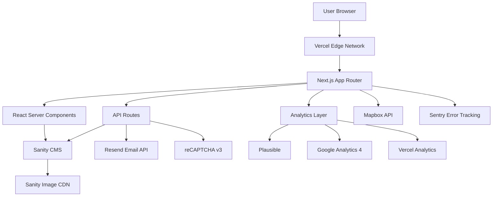

# Design Document - Afrexia Website Redesign

## Overview

This design document outlines the technical architecture and implementation approach for the Afrexia B2B website redesign. The solution leverages Next.js 15+ with App Router, TypeScript, Tailwind CSS, shadcn/ui, and Sanity CMS to create a high-performance, SEO-optimized, image-rich website that generates qualified B2B leads.

### Key Design Principles

1. **Performance First**: Optimize for Core Web Vitals (LCP < 2.5s, FID < 100ms, CLS < 0.1)
2. **Image-Centric**: Leverage Next.js Image optimization with WebP/AVIF formats
3. **SEO-Driven**: Implement comprehensive international SEO with hreflang and Schema.org
4. **B2B Conversion**: Design clear conversion paths (Product → RFQ, Quality → Partnership)
5. **Accessibility**: WCAG 2.1 Level AA compliance throughout
6. **Scalability**: Modular component architecture with clear separation of concerns

### Technology Stack

- **Frontend Framework**: Next.js 15+ (App Router, React Server Components)
- **Language**: TypeScript 5+
- **Styling**: Tailwind CSS 3+ with custom brand configuration
- **UI Components**: shadcn/ui (Radix UI primitives)
- **CMS**: Sanity.io with GROQ queries
- **Animations**: GSAP 3+ with ScrollTrigger, Framer Motion, SplitType (free alternative to SplitText), Lenis smooth scroll
- **Maps**: Mapbox GL JS with react-map-gl
- **Forms**: React Hook Form with Zod validation
- **Email**: Resend with React Email templates
- **Analytics**: Plausible Analytics, Google Analytics 4, Vercel Analytics
- **Monitoring**: Sentry for error tracking
- **Rate Limiting**: Vercel KV (Redis)
- **Deployment**: Vercel with Edge Functions

## Brand System

### Color Palette

**Primary Colors**:
- Primary: `#194424` - Main brand color (dark green)
- Secondary: `#337A49` - Supporting green
- Accent: `#655E2C` - Gold/brown accent

**Supporting Colors**:
- Light: `#E9EBE5` - Light background
- Support: `#80996F` - Muted green
- Neutral: `#B0BCA4` - Neutral gray-green

**Semantic Colors**:
- Success: `#10B981` - Green for success states
- Warning: `#F59E0B` - Amber for warnings
- Error: `#EF4444` - Red for errors
- Info: `#3B82F6` - Blue for informational messages

**Tailwind Configuration**:
```typescript
// tailwind.config.ts
export default {
  theme: {
    extend: {
      colors: {
        primary: {
          DEFAULT: '#194424',
          dark: '#0F2916',
          light: '#2D6B3F',
        },
        secondary: {
          DEFAULT: '#337A49',
          dark: '#265A36',
          light: '#4A9A62',
        },
        accent: {
          DEFAULT: '#655E2C',
          dark: '#4A441F',
          light: '#8A7F3D',
        },
        light: '#E9EBE5',
        support: '#80996F',
        neutral: '#B0BCA4',
      },
    },
  },
};
```

### Typography

**Font Families**:
- **Headings**: Inter (sans-serif) - Clean, modern, professional
- **Body**: Inter (sans-serif) - Consistent with headings for simplicity

**Type Scale**:
```typescript
// Tailwind typography configuration
{
  fontSize: {
    'xs': ['0.75rem', { lineHeight: '1rem' }],      // 12px
    'sm': ['0.875rem', { lineHeight: '1.25rem' }],  // 14px
    'base': ['1rem', { lineHeight: '1.5rem' }],     // 16px
    'lg': ['1.125rem', { lineHeight: '1.75rem' }],  // 18px
    'xl': ['1.25rem', { lineHeight: '1.75rem' }],   // 20px
    '2xl': ['1.5rem', { lineHeight: '2rem' }],      // 24px
    '3xl': ['1.875rem', { lineHeight: '2.25rem' }], // 30px
    '4xl': ['2.25rem', { lineHeight: '2.5rem' }],   // 36px
    '5xl': ['3rem', { lineHeight: '1' }],           // 48px
    '6xl': ['3.75rem', { lineHeight: '1' }],        // 60px
  },
}
```

**Usage Rules**:
- H1: `text-5xl md:text-6xl font-bold` - Page titles
- H2: `text-3xl md:text-4xl font-bold` - Section titles
- H3: `text-2xl md:text-3xl font-semibold` - Subsection titles
- H4: `text-xl md:text-2xl font-semibold` - Card titles
- Body: `text-base md:text-lg` - Main content
- Small: `text-sm` - Captions, labels

### UI Component Patterns

**Buttons**:
```typescript
// Primary CTA
className="bg-primary hover:bg-primary-dark text-white px-6 py-3 rounded-lg font-semibold transition-colors"

// Secondary button
className="bg-white hover:bg-light text-primary border-2 border-primary px-6 py-3 rounded-lg font-semibold transition-colors"

// Ghost button
className="text-primary hover:bg-light px-6 py-3 rounded-lg font-semibold transition-colors"
```

**Cards**:
```typescript
// Product card
className="bg-white rounded-xl shadow-md hover:shadow-xl transition-shadow overflow-hidden"

// Content card
className="bg-light rounded-lg p-6 border border-neutral"
```

**Certification Badges**:
```typescript
// Badge container
className="inline-flex items-center gap-2 bg-white rounded-full px-4 py-2 shadow-sm border border-neutral"

// Badge image
className="w-8 h-8 object-contain"
```

**Image Galleries**:
```typescript
// Main image container
className="aspect-[4/3] relative overflow-hidden rounded-lg"

// Thumbnail grid
className="grid grid-cols-4 gap-2 mt-4"

// Lightbox overlay
className="fixed inset-0 bg-black/90 z-50 flex items-center justify-center"
```

### Spacing System

Use Tailwind's default spacing scale (4px base unit):
- `gap-2` (8px) - Tight spacing within components
- `gap-4` (16px) - Standard spacing between elements
- `gap-6` (24px) - Spacing between sections
- `gap-8` (32px) - Large spacing between major sections
- `gap-12` (48px) - Extra large spacing for page sections

### Security Headers

**HTTP Security Headers Configuration**:

```typescript
// next.config.js
const securityHeaders = [
  {
    key: 'Content-Security-Policy',
    value: [
      "default-src 'self'",
      "script-src 'self' 'unsafe-eval' 'unsafe-inline' https://www.googletagmanager.com https://www.google.com https://plausible.io",
      "style-src 'self' 'unsafe-inline'",
      "img-src 'self' data: https: blob:",
      "font-src 'self' data:",
      "connect-src 'self' https://cdn.sanity.io https://*.sanity.io https://api.mapbox.com https://events.mapbox.com https://plausible.io https://www.google-analytics.com",
      "frame-src 'self' https://www.google.com",
      "media-src 'self' https://cdn.sanity.io",
    ].join('; '),
  },
  {
    key: 'X-Frame-Options',
    value: 'SAMEORIGIN',
  },
  {
    key: 'X-Content-Type-Options',
    value: 'nosniff',
  },
  {
    key: 'Referrer-Policy',
    value: 'strict-origin-when-cross-origin',
  },
  {
    key: 'Permissions-Policy',
    value: 'camera=(), microphone=(), geolocation=()',
  },
  {
    key: 'Strict-Transport-Security',
    value: 'max-age=31536000; includeSubDomains',
  },
];

module.exports = {
  async headers() {
    return [
      {
        source: '/:path*',
        headers: securityHeaders,
      },
    ];
  },
};
```

### Blog Search Implementation

**Client-Side Search with Fuse.js**:

```typescript
// components/blog/BlogSearch.tsx
'use client';
import { useState, useMemo } from 'react';
import Fuse from 'fuse.js';
import { BlogPost } from '@/types';

interface BlogSearchProps {
  posts: BlogPost[];
  locale: Locale;
}

export function BlogSearch({ posts, locale }: BlogSearchProps) {
  const [query, setQuery] = useState('');

  const fuse = useMemo(() => {
    return new Fuse(posts, {
      keys: [
        `title.${locale}`,
        `excerpt.${locale}`,
        'tags',
      ],
      threshold: 0.3,
      includeScore: true,
    });
  }, [posts, locale]);

  const results = query.length > 0 
    ? fuse.search(query).map(result => result.item)
    : posts;

  return (
    <div>
      <input
        type="search"
        value={query}
        onChange={(e) => setQuery(e.target.value)}
        placeholder="Search articles..."
        className="w-full px-4 py-2 border border-neutral rounded-lg"
      />
      <div className="mt-6 grid gap-6">
        {results.map(post => (
          <BlogPostCard key={post._id} post={post} locale={locale} />
        ))}
      </div>
    </div>
  );
}
```

### Resource Download Tracking

```typescript
// app/api/resources/[slug]/download/route.ts
import { NextRequest, NextResponse } from 'next/server';
import { getResourceBySlug } from '@/lib/sanity/queries';
import { trackEvent } from '@/lib/analytics/events';

export async function GET(
  request: NextRequest,
  { params }: { params: { slug: string } }
) {
  const resource = await getResourceBySlug(params.slug);

  if (!resource || !resource.file) {
    return NextResponse.json({ error: 'Resource not found' }, { status: 404 });
  }

  // Track download event
  trackEvent.resourceDownload(resource._id, resource.title);

  // Redirect to Sanity CDN file URL
  const fileUrl = resource.file.asset.url;
  return NextResponse.redirect(fileUrl);
}
```

### Multi-Step RFQ Form

```typescript
// components/forms/RFQFormMultiStep.tsx
'use client';
import { useState } from 'react';
import { useForm } from 'react-hook-form';

type Step = 'product' | 'logistics' | 'contact';

export function RFQFormMultiStep({ products, locale, translations }: RFQFormProps) {
  const [currentStep, setCurrentStep] = useState<Step>('product');
  const { register, handleSubmit, watch, formState: { errors } } = useForm<RFQFormData>();

  const steps: Step[] = ['product', 'logistics', 'contact'];
  const currentStepIndex = steps.indexOf(currentStep);

  const nextStep = () => {
    const nextIndex = currentStepIndex + 1;
    if (nextIndex < steps.length) {
      setCurrentStep(steps[nextIndex]);
    }
  };

  const prevStep = () => {
    const prevIndex = currentStepIndex - 1;
    if (prevIndex >= 0) {
      setCurrentStep(steps[prevIndex]);
    }
  };

  return (
    <form onSubmit={handleSubmit(onSubmit)} className="space-y-6">
      {/* Progress indicator */}
      <div className="flex items-center justify-between mb-8">
        {steps.map((step, index) => (
          <div
            key={step}
            className={`flex-1 ${index < currentStepIndex ? 'text-primary' : index === currentStepIndex ? 'text-primary font-bold' : 'text-gray-400'}`}
          >
            <div className="flex items-center">
              <div className={`w-8 h-8 rounded-full flex items-center justify-center ${index <= currentStepIndex ? 'bg-primary text-white' : 'bg-gray-200'}`}>
                {index + 1}
              </div>
              {index < steps.length - 1 && (
                <div className={`flex-1 h-1 mx-2 ${index < currentStepIndex ? 'bg-primary' : 'bg-gray-200'}`} />
              )}
            </div>
          </div>
        ))}
      </div>

      {/* Step 1: Product Selection */}
      {currentStep === 'product' && (
        <div className="space-y-4">
          <h3 className="text-2xl font-bold">Select Product & Quantity</h3>
          {/* Product selection fields */}
          <button type="button" onClick={nextStep} className="btn-primary">
            Next
          </button>
        </div>
      )}

      {/* Step 2: Logistics */}
      {currentStep === 'logistics' && (
        <div className="space-y-4">
          <h3 className="text-2xl font-bold">Delivery Details</h3>
          {/* Logistics fields */}
          <div className="flex gap-4">
            <button type="button" onClick={prevStep} className="btn-secondary">
              Back
            </button>
            <button type="button" onClick={nextStep} className="btn-primary">
              Next
            </button>
          </div>
        </div>
      )}

      {/* Step 3: Contact Information */}
      {currentStep === 'contact' && (
        <div className="space-y-4">
          <h3 className="text-2xl font-bold">Your Information</h3>
          {/* Contact fields */}
          <div className="flex gap-4">
            <button type="button" onClick={prevStep} className="btn-secondary">
              Back
            </button>
            <button type="submit" className="btn-primary">
              Submit Request
            </button>
          </div>
        </div>
      )}
    </form>
  );
}
```

### Sanity Webhook Revalidation

```typescript
// app/api/revalidate/route.ts
import { NextRequest, NextResponse } from 'next/server';
import { revalidatePath, revalidateTag } from 'next/cache';
import { createHmac } from 'crypto';

function verifySignature(body: string, signature: string): boolean {
  const secret = process.env.SANITY_WEBHOOK_SECRET!;
  const hash = createHmac('sha256', secret).update(body).digest('hex');
  return `sha256=${hash}` === signature;
}

export async function POST(request: NextRequest) {
  try {
    const body = await request.text();
    const signature = request.headers.get('sanity-webhook-signature');

    // Verify webhook signature
    if (!signature || !verifySignature(body, signature)) {
      return NextResponse.json({ error: 'Invalid signature' }, { status: 401 });
    }

    const payload = JSON.parse(body);
    const { _type, slug } = payload;

    // Revalidate based on content type
    switch (_type) {
      case 'product':
        revalidatePath(`/[locale]/products/${slug.current}`);
        revalidatePath('/[locale]/products');
        break;
      case 'blogPost':
        revalidatePath(`/[locale]/blog/${slug.current}`);
        revalidatePath('/[locale]/blog');
        break;
      case 'page':
        revalidatePath(`/[locale]/${slug.current}`);
        break;
      default:
        revalidatePath('/[locale]');
    }

    return NextResponse.json({ revalidated: true, now: Date.now() });
  } catch (error) {
    console.error('Revalidation error:', error);
    return NextResponse.json({ error: 'Revalidation failed' }, { status: 500 });
  }
}
```

## Architecture

### High-Level Architecture




### Application Structure

The application follows Next.js 15 App Router conventions with a clear separation between server and client components:

```
afrexia-website/
├── app/
│   ├── [locale]/                    # Internationalized routes
│   │   ├── layout.tsx               # Root layout with providers
│   │   ├── page.tsx                 # Homepage
│   │   ├── products/
│   │   │   ├── page.tsx             # Products listing
│   │   │   └── [slug]/
│   │   │       └── page.tsx         # Individual product page
│   │   ├── solutions/
│   │   ├── quality/
│   │   ├── traceability/
│   │   ├── about/
│   │   ├── resources/
│   │   ├── blog/
│   │   ├── contact/
│   │   └── rfq/
│   ├── api/
│   │   ├── rfq/route.ts             # RFQ form submission
│   │   ├── contact/route.ts         # Contact form submission
│   │   ├── revalidate/route.ts      # ISR revalidation webhook
│   │   └── draft/route.ts           # Draft mode for CMS preview
│   └── sitemap.ts                   # Dynamic sitemap generation
├── components/
│   ├── ui/                          # shadcn/ui components
│   ├── layout/                      # Layout components (Header, Footer, Nav)
│   ├── sections/                    # Page sections (Hero, Features, CTA)
│   ├── product/                     # Product-specific components
│   ├── forms/                       # Form components
│   ├── animations/                  # Animation wrappers
│   └── maps/                        # Map components
├── lib/
│   ├── sanity/                      # Sanity client and queries
│   ├── i18n/                        # Internationalization utilities
│   ├── analytics/                   # Analytics tracking functions
│   ├── email/                       # Email templates and sending
│   └── utils/                       # Shared utilities
├── sanity/
│   ├── schemas/                     # Sanity schema definitions
│   ├── lib/                         # Sanity utilities
│   └── sanity.config.ts             # Sanity Studio configuration
└── public/
    ├── locales/                     # Translation files
    └── assets/                      # Static assets
```

### Routing Strategy

**Internationalized Routing**: Use Next.js middleware to handle locale detection and routing:

- Default locale: `fr` (French)
- Supported locales: `fr`, `en`
- URL structure: `/{locale}/{page}` (e.g., `/fr/products`, `/en/products`)
- Automatic locale detection based on `Accept-Language` header
- Locale persistence via cookie (`NEXT_LOCALE`)

**Dynamic Routes**:
- Products: `/[locale]/products/[slug]`
- Blog posts: `/[locale]/blog/[slug]`
- Resources: `/[locale]/resources/[category]/[slug]`

**Static Routes**:
- Homepage: `/[locale]`
- Solutions: `/[locale]/solutions`
- Quality: `/[locale]/quality`
- Traceability: `/[locale]/traceability`
- About: `/[locale]/about`
- Contact: `/[locale]/contact`
- RFQ: `/[locale]/rfq`

### Data Fetching Strategy

**Server Components (Default)**:
- Fetch data directly in Server Components using Sanity client
- Leverage React Server Components for zero client-side JavaScript
- Use Next.js caching with `revalidate` option for ISR

**Incremental Static Regeneration (ISR)**:
- Revalidate product pages every 60 seconds
- Revalidate blog posts every 300 seconds (5 minutes)
- Revalidate homepage every 3600 seconds (1 hour)
- On-demand revalidation via webhook from Sanity

**Client Components**:
- Use only for interactive features (forms, animations, maps)
- Minimize client-side JavaScript bundle
- Implement code splitting for heavy components

## Components and Interfaces

### Core Component Categories


#### 1. Layout Components

**Header Component** (Server Component with Client Island):
```typescript
interface HeaderProps {
  locale: Locale;
  translations: HeaderTranslations;
  currentPath: string;
}

// Server Component wrapper
export function Header({ locale, translations, currentPath }: HeaderProps) {
  return (
    <header className="sticky top-0 z-50 bg-white/95 backdrop-blur">
      <Navigation locale={locale} translations={translations} currentPath={currentPath} />
      <LanguageSwitcher locale={locale} currentPath={currentPath} />
    </header>
  );
}

// Client Component for interactive navigation
'use client';
export function Navigation({ locale, translations, currentPath }: NavigationProps) {
  // Mobile menu state, active link highlighting
}
```

**Footer Component** (Server Component):
```typescript
interface FooterProps {
  locale: Locale;
  translations: FooterTranslations;
  contactInfo: ContactInfo;
  socialLinks: SocialLink[];
}

export function Footer({ locale, translations, contactInfo, socialLinks }: FooterProps) {
  // Newsletter signup, sitemap links, social media, certifications
}
```

#### 2. Product Components

**ProductCard Component**:
```typescript
interface ProductCardProps {
  product: {
    name: string;
    slug: string;
    category: string;
    description: string;
    image: SanityImageSource;
    certifications: string[];
    originCountries: string[];
  };
  locale: Locale;
}

export function ProductCard({ product, locale }: ProductCardProps) {
  // Image, title, description, certifications badges, CTA
}
```

**ProductGallery Component** (Client Component):
```typescript
'use client';
interface ProductGalleryProps {
  images: SanityImageSource[];
  productName: string;
}

export function ProductGallery({ images, productName }: ProductGalleryProps) {
  // Main image, thumbnails, lightbox modal with keyboard navigation
}
```

**ProductSpecifications Component**:
```typescript
interface ProductSpecificationsProps {
  specifications: {
    grading: GradingInfo[];
    packaging: PackagingOption[];
    moq: string;
    incoterms: string[];
    hsCode: string;
    harvestSeason: string;
    shelfLife: string;
  };
  locale: Locale;
}

export function ProductSpecifications({ specifications, locale }: ProductSpecificationsProps) {
  // Tabbed interface: Grading, Packaging, Logistics, Compliance
}
```

**ProductOriginMap Component** (Client Component):
```typescript
'use client';
interface ProductOriginMapProps {
  origins: {
    region: string;
    coordinates: [number, number];
    description: string;
  }[];
  productName: string;
}

export function ProductOriginMap({ origins, productName }: ProductOriginMapProps) {
  // Mapbox map with custom markers, popups, zoom controls
}
```

#### 3. Form Components

**RFQForm Component** (Client Component):
```typescript
'use client';
interface RFQFormProps {
  products: ProductOption[];
  locale: Locale;
  translations: RFQTranslations;
}

interface RFQFormData {
  // Contact information
  firstName: string;
  lastName: string;
  email: string;
  phone: string;
  company: string;
  country: string;
  
  // Order details
  productId: string;
  quantity: number;
  quantityUnit: 'kg' | 'mt' | 'container';
  incoterm: string;
  destinationPort: string;
  targetDate: string;
  
  // Additional information
  message: string;
  
  // Consent
  gdprConsent: boolean;
}

export function RFQForm({ products, locale, translations }: RFQFormProps) {
  // React Hook Form + Zod validation
  // LocalStorage draft saving
  // reCAPTCHA v3 integration
  // Multi-step form with progress indicator
}
```

**ContactForm Component** (Client Component):
```typescript
'use client';
interface ContactFormProps {
  locale: Locale;
  translations: ContactTranslations;
}

interface ContactFormData {
  name: string;
  email: string;
  phone?: string;
  company?: string;
  subject: string;
  message: string;
}

export function ContactForm({ locale, translations }: ContactFormProps) {
  // React Hook Form + Zod validation
  // reCAPTCHA v3 integration
}
```

#### 4. Animation Components

**ScrollReveal Component** (Client Component):
```typescript
'use client';
interface ScrollRevealProps {
  children: React.ReactNode;
  animation?: 'fade' | 'slide-up' | 'slide-left' | 'scale';
  delay?: number;
  threshold?: number;
}

export function ScrollReveal({ children, animation = 'fade', delay = 0, threshold = 0.2 }: ScrollRevealProps) {
  // GSAP ScrollTrigger integration
  // Respect prefers-reduced-motion
}
```

**CounterAnimation Component** (Client Component):
```typescript
'use client';
interface CounterAnimationProps {
  value: number;
  suffix?: string;
  duration?: number;
}

export function CounterAnimation({ value, suffix = '', duration = 2 }: CounterAnimationProps) {
  // Animated number counter using GSAP
  // Triggers when element enters viewport
}
```

**SupplyChainAnimation Component** (Client Component):
```typescript
'use client';
interface SupplyChainAnimationProps {
  steps: {
    title: string;
    description: string;
    location: string;
    coordinates: [number, number];
  }[];
  locale: Locale;
}

export function SupplyChainAnimation({ steps, locale }: SupplyChainAnimationProps) {
  // Animated map showing product journey
  // GSAP timeline with ScrollTrigger
  // Mapbox integration
}
```

#### 5. SEO Components

**SEOHead Component** (Server Component):
```typescript
interface SEOHeadProps {
  title: string;
  description: string;
  canonical: string;
  locale: Locale;
  alternateLocales: { locale: Locale; url: string }[];
  ogImage?: string;
  schema?: Record<string, any>;
}

export function SEOHead({ title, description, canonical, locale, alternateLocales, ogImage, schema }: SEOHeadProps) {
  return (
    <>
      <title>{title}</title>
      <meta name="description" content={description} />
      <link rel="canonical" href={canonical} />
      {alternateLocales.map(alt => (
        <link key={alt.locale} rel="alternate" hrefLang={alt.locale} href={alt.url} />
      ))}
      <meta property="og:title" content={title} />
      <meta property="og:description" content={description} />
      {ogImage && <meta property="og:image" content={ogImage} />}
      {schema && (
        <script type="application/ld+json" dangerouslySetInnerHTML={{ __html: JSON.stringify(schema) }} />
      )}
    </>
  );
}
```

## Data Models

### Sanity CMS Schemas


#### Product Schema

```typescript
export const productSchema = {
  name: 'product',
  title: 'Product',
  type: 'document',
  fields: [
    {
      name: 'name',
      title: 'Product Name',
      type: 'object',
      fields: [
        { name: 'fr', type: 'string', title: 'French' },
        { name: 'en', type: 'string', title: 'English' }
      ],
      validation: Rule => Rule.required()
    },
    {
      name: 'slug',
      title: 'Slug',
      type: 'object',
      fields: [
        { name: 'fr', type: 'slug', title: 'French Slug', options: { source: 'name.fr' } },
        { name: 'en', type: 'slug', title: 'English Slug', options: { source: 'name.en' } }
      ],
      validation: Rule => Rule.required()
    },
    {
      name: 'i18nId',
      title: 'Translation ID',
      type: 'string',
      description: 'Unique ID to link FR and EN versions',
      validation: Rule => Rule.required()
    },
    {
      name: 'category',
      title: 'Category',
      type: 'string',
      options: {
        list: [
          { title: 'Cocoa', value: 'cocoa' },
          { title: 'Coffee', value: 'coffee' },
          { title: 'Pepper', value: 'pepper' },
          { title: 'Wood', value: 'wood' },
          { title: 'Corn', value: 'corn' }
        ]
      },
      validation: Rule => Rule.required()
    },
    {
      name: 'description',
      title: 'Description',
      type: 'object',
      fields: [
        { name: 'fr', type: 'blockContent', title: 'French' },
        { name: 'en', type: 'blockContent', title: 'English' }
      ]
    },
    {
      name: 'gallery',
      title: 'Image Gallery',
      type: 'array',
      of: [
        {
          type: 'image',
          options: { hotspot: true },
          fields: [
            { name: 'alt', type: 'string', title: 'Alt Text' },
            { name: 'caption', type: 'object', fields: [
              { name: 'fr', type: 'string', title: 'French' },
              { name: 'en', type: 'string', title: 'English' }
            ]}
          ]
        }
      ],
      validation: Rule => Rule.required().min(1)
    },
    {
      name: 'originRegions',
      title: 'Origin Regions',
      type: 'array',
      of: [
        {
          type: 'object',
          fields: [
            { name: 'region', type: 'string', title: 'Region Name' },
            { name: 'coordinates', type: 'geopoint', title: 'Coordinates' },
            { name: 'description', type: 'object', fields: [
              { name: 'fr', type: 'text', title: 'French' },
              { name: 'en', type: 'text', title: 'English' }
            ]}
          ]
        }
      ]
    },
    {
      name: 'harvestSeason',
      title: 'Harvest Season',
      type: 'string'
    },
    {
      name: 'packagingOptions',
      title: 'Packaging Options',
      type: 'array',
      of: [
        {
          type: 'object',
          fields: [
            { name: 'type', type: 'string', title: 'Packaging Type' },
            { name: 'weight', type: 'string', title: 'Weight/Volume' },
            { name: 'description', type: 'object', fields: [
              { name: 'fr', type: 'text', title: 'French' },
              { name: 'en', type: 'text', title: 'English' }
            ]}
          ]
        }
      ]
    },
    {
      name: 'moq',
      title: 'Minimum Order Quantity',
      type: 'string'
    },
    {
      name: 'incoterms',
      title: 'Available Incoterms',
      type: 'array',
      of: [{ type: 'string' }],
      options: {
        list: [
          { title: 'FOB', value: 'FOB' },
          { title: 'CIF', value: 'CIF' },
          { title: 'CFR', value: 'CFR' },
          { title: 'EXW', value: 'EXW' },
          { title: 'FCA', value: 'FCA' }
        ]
      }
    },
    {
      name: 'certifications',
      title: 'Certifications',
      type: 'array',
      of: [{ type: 'reference', to: [{ type: 'certification' }] }]
    },
    {
      name: 'specificationPDF',
      title: 'Specification Sheet PDF',
      type: 'file',
      options: {
        accept: 'application/pdf'
      }
    },
    {
      name: 'qaMetrics',
      title: 'Quality Assurance Metrics',
      type: 'array',
      of: [
        {
          type: 'object',
          fields: [
            { name: 'metric', type: 'string', title: 'Metric Name' },
            { name: 'value', type: 'string', title: 'Value/Range' },
            { name: 'standard', type: 'string', title: 'Standard Reference' }
          ]
        }
      ]
    },
    {
      name: 'hsCode',
      title: 'HS Code',
      type: 'string'
    },
    {
      name: 'availability',
      title: 'Availability Status',
      type: 'string',
      options: {
        list: [
          { title: 'In Stock', value: 'in_stock' },
          { title: 'Pre-Order', value: 'pre_order' },
          { title: 'Seasonal', value: 'seasonal' },
          { title: 'Out of Stock', value: 'out_of_stock' }
        ]
      }
    },
    {
      name: 'targetMarkets',
      title: 'Target Markets',
      type: 'array',
      of: [{ type: 'string' }]
    },
    {
      name: 'seo',
      title: 'SEO',
      type: 'object',
      fields: [
        {
          name: 'metaTitle',
          type: 'object',
          fields: [
            { name: 'fr', type: 'string', title: 'French' },
            { name: 'en', type: 'string', title: 'English' }
          ]
        },
        {
          name: 'metaDescription',
          type: 'object',
          fields: [
            { name: 'fr', type: 'text', title: 'French' },
            { name: 'en', type: 'text', title: 'English' }
          ]
        }
      ]
    }
  ],
  preview: {
    select: {
      title: 'name.en',
      subtitle: 'category',
      media: 'gallery.0'
    }
  }
};
```

#### Certification Schema

```typescript
export const certificationSchema = {
  name: 'certification',
  title: 'Certification',
  type: 'document',
  fields: [
    {
      name: 'name',
      title: 'Certification Name',
      type: 'string',
      validation: Rule => Rule.required()
    },
    {
      name: 'logo',
      title: 'Logo',
      type: 'image',
      options: { hotspot: true }
    },
    {
      name: 'description',
      title: 'Description',
      type: 'object',
      fields: [
        { name: 'fr', type: 'text', title: 'French' },
        { name: 'en', type: 'text', title: 'English' }
      ]
    },
    {
      name: 'issuingBody',
      title: 'Issuing Body',
      type: 'string'
    },
    {
      name: 'validUntil',
      title: 'Valid Until',
      type: 'date'
    },
    {
      name: 'certificateDocument',
      title: 'Certificate Document',
      type: 'file',
      options: { accept: 'application/pdf' }
    }
  ]
};
```

#### Blog Post Schema

```typescript
export const blogPostSchema = {
  name: 'blogPost',
  title: 'Blog Post',
  type: 'document',
  fields: [
    {
      name: 'title',
      title: 'Title',
      type: 'object',
      fields: [
        { name: 'fr', type: 'string', title: 'French' },
        { name: 'en', type: 'string', title: 'English' }
      ],
      validation: Rule => Rule.required()
    },
    {
      name: 'slug',
      title: 'Slug',
      type: 'object',
      fields: [
        { name: 'fr', type: 'slug', title: 'French Slug', options: { source: 'title.fr' } },
        { name: 'en', type: 'slug', title: 'English Slug', options: { source: 'title.en' } }
      ],
      validation: Rule => Rule.required()
    },
    {
      name: 'i18nId',
      title: 'Translation ID',
      type: 'string',
      validation: Rule => Rule.required()
    },
    {
      name: 'excerpt',
      title: 'Excerpt',
      type: 'object',
      fields: [
        { name: 'fr', type: 'text', title: 'French' },
        { name: 'en', type: 'text', title: 'English' }
      ]
    },
    {
      name: 'content',
      title: 'Content',
      type: 'object',
      fields: [
        { name: 'fr', type: 'blockContent', title: 'French' },
        { name: 'en', type: 'blockContent', title: 'English' }
      ]
    },
    {
      name: 'featuredImage',
      title: 'Featured Image',
      type: 'image',
      options: { hotspot: true },
      fields: [
        { name: 'alt', type: 'string', title: 'Alt Text' }
      ]
    },
    {
      name: 'author',
      title: 'Author',
      type: 'reference',
      to: [{ type: 'teamMember' }]
    },
    {
      name: 'publishedAt',
      title: 'Published At',
      type: 'datetime',
      validation: Rule => Rule.required()
    },
    {
      name: 'categories',
      title: 'Categories',
      type: 'array',
      of: [{ type: 'reference', to: [{ type: 'blogCategory' }] }]
    },
    {
      name: 'tags',
      title: 'Tags',
      type: 'array',
      of: [{ type: 'string' }]
    },
    {
      name: 'seo',
      title: 'SEO',
      type: 'object',
      fields: [
        {
          name: 'metaTitle',
          type: 'object',
          fields: [
            { name: 'fr', type: 'string', title: 'French' },
            { name: 'en', type: 'string', title: 'English' }
          ]
        },
        {
          name: 'metaDescription',
          type: 'object',
          fields: [
            { name: 'fr', type: 'text', title: 'French' },
            { name: 'en', type: 'text', title: 'English' }
          ]
        }
      ]
    }
  ],
  preview: {
    select: {
      title: 'title.en',
      author: 'author.name',
      media: 'featuredImage'
    }
  }
};
```

### TypeScript Interfaces


```typescript
// Core types
export type Locale = 'fr' | 'en';

export interface LocalizedString {
  fr: string;
  en: string;
}

export interface LocalizedText {
  fr: string | PortableTextBlock[];
  en: string | PortableTextBlock[];
}

// Product types
export interface Product {
  _id: string;
  _type: 'product';
  name: LocalizedString;
  slug: { fr: { current: string }; en: { current: string } };
  i18nId: string;
  category: 'cocoa' | 'coffee' | 'pepper' | 'wood' | 'corn';
  description: LocalizedText;
  gallery: SanityImage[];
  originRegions: OriginRegion[];
  harvestSeason?: string;
  packagingOptions: PackagingOption[];
  moq?: string;
  incoterms: string[];
  certifications: Certification[];
  specificationPDF?: SanityFile;
  qaMetrics: QAMetric[];
  hsCode?: string;
  availability: 'in_stock' | 'pre_order' | 'seasonal' | 'out_of_stock';
  targetMarkets: string[];
  seo?: SEOMetadata;
}

export interface OriginRegion {
  region: string;
  coordinates: { lat: number; lng: number };
  description: LocalizedString;
}

export interface PackagingOption {
  type: string;
  weight: string;
  description: LocalizedString;
}

export interface QAMetric {
  metric: string;
  value: string;
  standard?: string;
}

// Certification types
export interface Certification {
  _id: string;
  _type: 'certification';
  name: string;
  logo?: SanityImage;
  description: LocalizedString;
  issuingBody?: string;
  validUntil?: string;
  certificateDocument?: SanityFile;
}

// Blog types
export interface BlogPost {
  _id: string;
  _type: 'blogPost';
  title: LocalizedString;
  slug: { fr: { current: string }; en: { current: string } };
  i18nId: string;
  excerpt: LocalizedString;
  content: LocalizedText;
  featuredImage: SanityImage;
  author: TeamMember;
  publishedAt: string;
  categories: BlogCategory[];
  tags: string[];
  seo?: SEOMetadata;
}

export interface TeamMember {
  _id: string;
  name: string;
  role: LocalizedString;
  bio: LocalizedText;
  photo?: SanityImage;
}

// SEO types
export interface SEOMetadata {
  metaTitle?: LocalizedString;
  metaDescription?: LocalizedString;
}

// Sanity image types
export interface SanityImage {
  _type: 'image';
  asset: {
    _ref: string;
    _type: 'reference';
  };
  hotspot?: {
    x: number;
    y: number;
    height: number;
    width: number;
  };
  alt?: string;
  caption?: LocalizedString;
}

export interface SanityFile {
  _type: 'file';
  asset: {
    _ref: string;
    _type: 'reference';
  };
}
```

## Internationalization (i18n) System

### Implementation Approach

Use Next.js middleware for locale detection and routing:

```typescript
// middleware.ts
import { NextRequest, NextResponse } from 'next/server';
import { match } from '@formatjs/intl-localematcher';
import Negotiator from 'negotiator';

const locales = ['fr', 'en'];
const defaultLocale = 'fr';

function getLocale(request: NextRequest): string {
  // Check if locale is in cookie
  const localeCookie = request.cookies.get('NEXT_LOCALE')?.value;
  if (localeCookie && locales.includes(localeCookie)) {
    return localeCookie;
  }

  // Check Accept-Language header
  const headers = { 'accept-language': request.headers.get('accept-language') || '' };
  const languages = new Negotiator({ headers }).languages();
  
  try {
    return match(languages, locales, defaultLocale);
  } catch {
    return defaultLocale;
  }
}

export function middleware(request: NextRequest) {
  const pathname = request.nextUrl.pathname;
  
  // Check if pathname already has a locale
  const pathnameHasLocale = locales.some(
    locale => pathname.startsWith(`/${locale}/`) || pathname === `/${locale}`
  );

  if (pathnameHasLocale) return;

  // Redirect to locale-prefixed URL
  const locale = getLocale(request);
  request.nextUrl.pathname = `/${locale}${pathname}`;
  
  const response = NextResponse.redirect(request.nextUrl);
  response.cookies.set('NEXT_LOCALE', locale, { maxAge: 31536000 }); // 1 year
  
  return response;
}

export const config = {
  matcher: [
    '/((?!api|_next/static|_next/image|favicon.ico|assets|sitemap.xml|robots.txt|.*\\.xml|.*\\.txt).*)',
  ],
};
```

### Translation Management

Store translations in JSON files:

```typescript
// lib/i18n/translations.ts
export const translations = {
  fr: {
    nav: {
      home: 'Accueil',
      products: 'Produits',
      solutions: 'Solutions',
      quality: 'Qualité & Conformité',
      traceability: 'Traçabilité',
      about: 'À Propos',
      resources: 'Ressources',
      blog: 'Blog',
      contact: 'Contact',
      rfq: 'Demande de Devis'
    },
    common: {
      learnMore: 'En savoir plus',
      downloadPDF: 'Télécharger le PDF',
      requestQuote: 'Demander un devis',
      contactUs: 'Nous contacter'
    },
    // ... more translations
  },
  en: {
    nav: {
      home: 'Home',
      products: 'Products',
      solutions: 'Solutions',
      quality: 'Quality & Compliance',
      traceability: 'Traceability',
      about: 'About',
      resources: 'Resources',
      blog: 'Blog',
      contact: 'Contact',
      rfq: 'Request for Quote'
    },
    common: {
      learnMore: 'Learn More',
      downloadPDF: 'Download PDF',
      requestQuote: 'Request a Quote',
      contactUs: 'Contact Us'
    },
    // ... more translations
  }
};

export function getTranslations(locale: Locale) {
  return translations[locale];
}
```

### Language Switcher Component

```typescript
'use client';
import { usePathname, useRouter } from 'next/navigation';
import { Locale } from '@/lib/i18n/types';

interface LanguageSwitcherProps {
  locale: Locale;
  alternateUrls: Record<Locale, string>;
}

export function LanguageSwitcher({ locale, alternateUrls }: LanguageSwitcherProps) {
  const router = useRouter();
  const pathname = usePathname();

  const switchLanguage = (newLocale: Locale) => {
    // Use alternate URL if available (from i18nId mapping)
    const targetUrl = alternateUrls[newLocale] || `/${newLocale}`;
    
    // Set cookie
    document.cookie = `NEXT_LOCALE=${newLocale}; path=/; max-age=31536000`;
    
    // Navigate
    router.push(targetUrl);
  };

  return (
    <div className="flex gap-2">
      <button
        onClick={() => switchLanguage('fr')}
        className={locale === 'fr' ? 'font-bold' : ''}
        aria-label="Français"
      >
        FR
      </button>
      <span>/</span>
      <button
        onClick={() => switchLanguage('en')}
        className={locale === 'en' ? 'font-bold' : ''}
        aria-label="English"
      >
        EN
      </button>
    </div>
  );
}
```

## Image Optimization Strategy

### Next.js Image Component Configuration

```typescript
// next.config.js
module.exports = {
  images: {
    formats: ['image/avif', 'image/webp'],
    deviceSizes: [640, 750, 828, 1080, 1200, 1920, 2048, 3840],
    imageSizes: [16, 32, 48, 64, 96, 128, 256, 384],
    remotePatterns: [
      {
        protocol: 'https',
        hostname: 'cdn.sanity.io',
        pathname: '/images/**',
      },
    ],
    minimumCacheTTL: 31536000, // 1 year
  },
};
```

### Slug Validation and Redirection

```typescript
// lib/sanity/slug-validation.ts
import { redirect } from 'next/navigation';
import { Locale } from '@/lib/i18n/types';

export async function validateProductSlug(slug: string, locale: Locale) {
  const product = await getProductBySlug(slug, locale);
  
  if (!product) {
    // Check if slug exists in alternate language
    const alternateLocale = locale === 'fr' ? 'en' : 'fr';
    const alternateProduct = await getProductBySlug(slug, alternateLocale);
    
    if (alternateProduct) {
      // Redirect to correct language version
      const correctSlug = alternateProduct.slug[locale].current;
      redirect(`/${locale}/products/${correctSlug}`);
    }
    
    // Slug doesn't exist in any language
    return null;
  }
  
  return product;
}
```

### Sanity Image URL Builder

```typescript
// lib/sanity/image.ts
import imageUrlBuilder from '@sanity/image-url';
import { SanityImageSource } from '@sanity/image-url/lib/types/types';
import { client } from './client';

const builder = imageUrlBuilder(client);

export function urlFor(source: SanityImageSource) {
  return builder.image(source);
}

// Helper for responsive images
export function getImageProps(
  source: SanityImageSource,
  options: {
    width?: number;
    height?: number;
    quality?: number;
    format?: 'webp' | 'avif' | 'jpg';
  } = {}
) {
  const { width = 1920, height, quality = 85, format = 'webp' } = options;
  
  let url = urlFor(source).width(width).quality(quality).format(format);
  
  if (height) {
    url = url.height(height);
  }
  
  return {
    src: url.url(),
    width,
    height,
  };
}
```

### Optimized Image Component

```typescript
// components/ui/OptimizedImage.tsx
import Image from 'next/image';
import { SanityImageSource } from '@sanity/image-url/lib/types/types';
import { urlFor } from '@/lib/sanity/image';

interface OptimizedImageProps {
  image: SanityImageSource;
  alt: string;
  width?: number;
  height?: number;
  priority?: boolean;
  className?: string;
  sizes?: string;
}

export function OptimizedImage({
  image,
  alt,
  width = 1920,
  height,
  priority = false,
  className,
  sizes = '100vw'
}: OptimizedImageProps) {
  const imageUrl = urlFor(image).width(width).quality(85).format('webp').url();
  
  return (
    <Image
      src={imageUrl}
      alt={alt}
      width={width}
      height={height || width}
      priority={priority}
      className={className}
      sizes={sizes}
      loading={priority ? 'eager' : 'lazy'}
    />
  );
}
```

## Animation System


### GSAP Configuration

```typescript
// lib/animations/gsap-config.ts
import { gsap } from 'gsap';
import { ScrollTrigger } from 'gsap/ScrollTrigger';
import { SplitText } from 'gsap/SplitText';

// Register plugins
if (typeof window !== 'undefined') {
  gsap.registerPlugin(ScrollTrigger, SplitText);
}

// Default animation settings
export const defaultAnimationConfig = {
  duration: 0.8,
  ease: 'power3.out',
  stagger: 0.1,
};

// Respect reduced motion preference
export function shouldReduceMotion(): boolean {
  if (typeof window === 'undefined') return false;
  return window.matchMedia('(prefers-reduced-motion: reduce)').matches;
}

// Create scroll trigger with reduced motion support
export function createScrollTrigger(
  trigger: string | Element,
  animation: gsap.core.Timeline | gsap.core.Tween,
  options: ScrollTrigger.Vars = {}
) {
  if (shouldReduceMotion()) {
    // Skip animation, just show content
    gsap.set(animation.targets(), { opacity: 1, y: 0, x: 0, scale: 1 });
    return null;
  }

  return ScrollTrigger.create({
    trigger,
    start: 'top 80%',
    end: 'bottom 20%',
    toggleActions: 'play none none reverse',
    ...options,
    animation,
  });
}
```

### Animation Presets

```typescript
// lib/animations/presets.ts
import { gsap } from 'gsap';
import { defaultAnimationConfig } from './gsap-config';

export const animationPresets = {
  fadeIn: (element: gsap.TweenTarget) => {
    return gsap.from(element, {
      ...defaultAnimationConfig,
      opacity: 0,
      y: 30,
    });
  },

  slideInLeft: (element: gsap.TweenTarget) => {
    return gsap.from(element, {
      ...defaultAnimationConfig,
      opacity: 0,
      x: -50,
    });
  },

  slideInRight: (element: gsap.TweenTarget) => {
    return gsap.from(element, {
      ...defaultAnimationConfig,
      opacity: 0,
      x: 50,
    });
  },

  scaleIn: (element: gsap.TweenTarget) => {
    return gsap.from(element, {
      ...defaultAnimationConfig,
      opacity: 0,
      scale: 0.8,
    });
  },

  staggerFadeIn: (elements: gsap.TweenTarget) => {
    return gsap.from(elements, {
      ...defaultAnimationConfig,
      opacity: 0,
      y: 30,
      stagger: 0.1,
    });
  },

  counterAnimation: (element: HTMLElement, endValue: number, duration = 2) => {
    const obj = { value: 0 };
    return gsap.to(obj, {
      value: endValue,
      duration,
      ease: 'power2.out',
      onUpdate: () => {
        element.textContent = Math.round(obj.value).toLocaleString();
      },
    });
  },
};
```

### Smooth Scroll with Lenis

```typescript
// lib/animations/smooth-scroll.ts
'use client';
import Lenis from '@studio-freight/lenis';
import { useEffect } from 'react';
import { gsap } from 'gsap';
import { ScrollTrigger } from 'gsap/ScrollTrigger';

export function useSmoothScroll() {
  useEffect(() => {
    // Skip on mobile or if reduced motion is preferred
    if (window.innerWidth < 1024 || window.matchMedia('(prefers-reduced-motion: reduce)').matches) {
      return;
    }

    const lenis = new Lenis({
      duration: 1.2,
      easing: (t) => Math.min(1, 1.001 - Math.pow(2, -10 * t)),
      orientation: 'vertical',
      gestureOrientation: 'vertical',
      smoothWheel: true,
      wheelMultiplier: 1,
      smoothTouch: false,
      touchMultiplier: 2,
      infinite: false,
    });

    // Sync Lenis with GSAP ScrollTrigger
    lenis.on('scroll', ScrollTrigger.update);

    gsap.ticker.add((time) => {
      lenis.raf(time * 1000);
    });

    gsap.ticker.lagSmoothing(0);

    return () => {
      lenis.destroy();
      gsap.ticker.remove(lenis.raf);
    };
  }, []);
}
```

### Performance Monitoring for Animations

```typescript
// lib/animations/performance.ts
export class AnimationPerformanceMonitor {
  private frameCount = 0;
  private lastTime = performance.now();
  private fps = 60;
  private fpsThreshold = 30; // Minimum acceptable FPS

  startMonitoring(onLowPerformance: () => void) {
    const checkPerformance = () => {
      this.frameCount++;
      const currentTime = performance.now();
      const elapsed = currentTime - this.lastTime;

      if (elapsed >= 1000) {
        this.fps = Math.round((this.frameCount * 1000) / elapsed);
        this.frameCount = 0;
        this.lastTime = currentTime;

        if (this.fps < this.fpsThreshold) {
          onLowPerformance();
        }
      }

      requestAnimationFrame(checkPerformance);
    };

    requestAnimationFrame(checkPerformance);
  }

  getFPS(): number {
    return this.fps;
  }
}
```

## Form Handling

### RFQ Form Implementation

```typescript
// components/forms/RFQForm.tsx
'use client';
import { useForm } from 'react-hook-form';
import { zodResolver } from '@hookform/resolvers/zod';
import { z } from 'zod';
import { useEffect } from 'react';
import { useGoogleReCaptcha } from 'react-google-recaptcha-v3';

const rfqSchema = z.object({
  firstName: z.string().min(2, 'First name must be at least 2 characters'),
  lastName: z.string().min(2, 'Last name must be at least 2 characters'),
  email: z.string().email('Invalid email address'),
  phone: z.string().min(8, 'Invalid phone number'),
  company: z.string().min(2, 'Company name is required'),
  country: z.string().min(2, 'Country is required'),
  productId: z.string().min(1, 'Please select a product'),
  quantity: z.number().positive('Quantity must be positive'),
  quantityUnit: z.enum(['kg', 'mt', 'container']),
  incoterm: z.string().min(1, 'Please select an Incoterm'),
  destinationPort: z.string().min(2, 'Destination port is required'),
  targetDate: z.string().min(1, 'Target date is required'),
  message: z.string().optional(),
  gdprConsent: z.boolean().refine(val => val === true, 'You must accept the privacy policy'),
});

type RFQFormData = z.infer<typeof rfqSchema>;

const STORAGE_KEY = 'afrexia_rfq_draft';
const STORAGE_TTL = 7 * 24 * 60 * 60 * 1000; // 7 days

export function RFQForm({ products, locale, translations }: RFQFormProps) {
  const { executeRecaptcha } = useGoogleReCaptcha();
  const {
    register,
    handleSubmit,
    watch,
    setValue,
    formState: { errors, isSubmitting },
  } = useForm<RFQFormData>({
    resolver: zodResolver(rfqSchema),
  });

  // Load draft from localStorage
  useEffect(() => {
    const stored = localStorage.getItem(STORAGE_KEY);
    if (stored) {
      try {
        const { data, timestamp } = JSON.parse(stored);
        if (Date.now() - timestamp < STORAGE_TTL) {
          Object.entries(data).forEach(([key, value]) => {
            setValue(key as keyof RFQFormData, value);
          });
        } else {
          localStorage.removeItem(STORAGE_KEY);
        }
      } catch (error) {
        console.error('Failed to load draft:', error);
      }
    }
  }, [setValue]);

  // Save draft to localStorage (debounced)
  useEffect(() => {
    const subscription = watch((data) => {
      // Don't save sensitive data
      const { message, ...safeData } = data;
      const draft = {
        data: safeData,
        timestamp: Date.now(),
      };
      localStorage.setItem(STORAGE_KEY, JSON.stringify(draft));
    });

    return () => subscription.unsubscribe();
  }, [watch]);

  const onSubmit = async (data: RFQFormData) => {
    if (!executeRecaptcha) {
      console.error('reCAPTCHA not loaded');
      return;
    }

    try {
      // Get reCAPTCHA token
      const recaptchaToken = await executeRecaptcha('rfq_submit');

      // Submit form
      const response = await fetch('/api/rfq', {
        method: 'POST',
        headers: { 'Content-Type': 'application/json' },
        body: JSON.stringify({
          ...data,
          recaptchaToken,
          locale,
        }),
      });

      if (!response.ok) {
        throw new Error('Submission failed');
      }

      // Clear draft
      localStorage.removeItem(STORAGE_KEY);

      // Show success message
      // Redirect or show confirmation
    } catch (error) {
      console.error('Form submission error:', error);
      // Show error message
    }
  };

  const clearDraft = () => {
    localStorage.removeItem(STORAGE_KEY);
    window.location.reload();
  };

  return (
    <form onSubmit={handleSubmit(onSubmit)} className="space-y-6">
      {/* Form fields */}
      <button type="button" onClick={clearDraft} className="text-sm text-gray-500">
        {translations.clearDraft}
      </button>
      <button type="submit" disabled={isSubmitting}>
        {isSubmitting ? translations.submitting : translations.submit}
      </button>
    </form>
  );
}
```

### API Route for RFQ Submission

```typescript
// app/api/rfq/route.ts
import { NextRequest, NextResponse } from 'next/server';
import { z } from 'zod';
import { Resend } from 'resend';
import { RFQEmail } from '@/emails/RFQEmail';
import { rateLimit } from '@/lib/rate-limit';

const resend = new Resend(process.env.RESEND_API_KEY);

const rfqSchema = z.object({
  firstName: z.string(),
  lastName: z.string(),
  email: z.string().email(),
  phone: z.string(),
  company: z.string(),
  country: z.string(),
  productId: z.string(),
  quantity: z.number(),
  quantityUnit: z.enum(['kg', 'mt', 'container']),
  incoterm: z.string(),
  destinationPort: z.string(),
  targetDate: z.string(),
  message: z.string().optional(),
  gdprConsent: z.boolean(),
  recaptchaToken: z.string(),
  locale: z.enum(['fr', 'en']),
});

async function verifyRecaptcha(token: string, expectedAction: string): Promise<boolean> {
  const response = await fetch('https://www.google.com/recaptcha/api/siteverify', {
    method: 'POST',
    headers: { 'Content-Type': 'application/x-www-form-urlencoded' },
    body: `secret=${process.env.RECAPTCHA_SECRET_KEY}&response=${token}`,
  });

  const data = await response.json();
  
  // Verify score, action, and hostname
  return (
    data.success &&
    data.score >= 0.5 &&
    data.action === expectedAction &&
    data.hostname === new URL(process.env.NEXT_PUBLIC_SITE_URL!).hostname
  );
}

export async function POST(request: NextRequest) {
  try {
    // Rate limiting: 5 requests per minute per IP
    const ip = request.ip || request.headers.get('x-forwarded-for') || 'unknown';
    const rateLimitResult = await rateLimit(ip, 'rfq', 5, 60);
    
    if (!rateLimitResult.success) {
      return NextResponse.json(
        { error: 'Too many requests. Please try again later.' },
        { status: 429 }
      );
    }

    const body = await request.json();
    const data = rfqSchema.parse(body);

    // Verify reCAPTCHA with action and hostname validation
    const isHuman = await verifyRecaptcha(data.recaptchaToken, 'rfq_submit');
    if (!isHuman) {
      return NextResponse.json({ error: 'reCAPTCHA verification failed' }, { status: 400 });
    }

    // Send email to sales team
    await resend.emails.send({
      from: 'RFQ <rfq@afrexia.com>',
      to: ['sales@afrexia.com'],
      subject: `New RFQ from ${data.company}`,
      react: RFQEmail({ data }),
    });

    // Send confirmation email to customer
    await resend.emails.send({
      from: 'Afrexia <noreply@afrexia.com>',
      to: [data.email],
      subject: data.locale === 'fr' ? 'Confirmation de votre demande' : 'RFQ Confirmation',
      react: RFQConfirmationEmail({ data, locale: data.locale }),
    });

    return NextResponse.json({ success: true });
  } catch (error) {
    console.error('RFQ submission error:', error);
    return NextResponse.json({ error: 'Submission failed' }, { status: 500 });
  }
}
```

### Rate Limiting Implementation

```typescript
// lib/rate-limit.ts
import { kv } from '@vercel/kv';

export async function rateLimit(
  identifier: string,
  endpoint: string,
  limit: number,
  windowSeconds: number
): Promise<{ success: boolean; remaining: number }> {
  const key = `rate_limit:${endpoint}:${identifier}`;
  
  const current = await kv.incr(key);
  
  if (current === 1) {
    // First request, set expiration
    await kv.expire(key, windowSeconds);
  }
  
  const remaining = Math.max(0, limit - current);
  
  return {
    success: current <= limit,
    remaining,
  };
}
```

## SEO Implementation


### Metadata Generation

```typescript
// app/[locale]/products/[slug]/page.tsx
import { Metadata } from 'next';
import { getProduct } from '@/lib/sanity/queries';
import { Locale } from '@/lib/i18n/types';

interface PageProps {
  params: { locale: Locale; slug: string };
}

export async function generateMetadata({ params }: PageProps): Promise<Metadata> {
  const product = await getProduct(params.slug, params.locale);

  if (!product) {
    return {
      title: 'Product Not Found',
    };
  }

  const title = product.seo?.metaTitle?.[params.locale] || product.name[params.locale];
  const description = product.seo?.metaDescription?.[params.locale] || 
    (typeof product.description[params.locale] === 'string' 
      ? product.description[params.locale] 
      : 'Premium African agricultural commodities');

  const canonicalUrl = `https://afrexia.com/${params.locale}/products/${params.slug}`;
  const alternateUrls = {
    fr: `https://afrexia.com/fr/products/${product.slug.fr.current}`,
    en: `https://afrexia.com/en/products/${product.slug.en.current}`,
  };

  const ogImage = product.gallery[0] 
    ? urlFor(product.gallery[0]).width(1200).height(630).url()
    : '/og-default.jpg';

  return {
    title,
    description,
    alternates: {
      canonical: canonicalUrl,
      languages: alternateUrls,
    },
    openGraph: {
      title,
      description,
      url: canonicalUrl,
      siteName: 'Afrexia',
      images: [
        {
          url: ogImage,
          width: 1200,
          height: 630,
          alt: product.name[params.locale],
        },
      ],
      locale: params.locale === 'fr' ? 'fr_FR' : 'en_US',
      type: 'website',
    },
    twitter: {
      card: 'summary_large_image',
      title,
      description,
      images: [ogImage],
    },
  };
}
```

### Schema.org Structured Data

```typescript
// lib/seo/schema.ts
import { Product, BlogPost, Locale } from '@/types';

export function generateProductSchema(product: Product, locale: Locale) {
  return {
    '@context': 'https://schema.org',
    '@type': 'Product',
    name: product.name[locale],
    description: typeof product.description[locale] === 'string' 
      ? product.description[locale] 
      : '',
    image: product.gallery.map(img => urlFor(img).width(800).url()),
    brand: {
      '@type': 'Organization',
      name: 'Afrexia',
    },
    category: product.category,
    manufacturer: {
      '@type': 'Organization',
      name: 'Afrexia',
    },
    additionalProperty: [
      {
        '@type': 'PropertyValue',
        name: 'Minimum Order Quantity',
        value: product.moq,
      },
      {
        '@type': 'PropertyValue',
        name: 'HS Code',
        value: product.hsCode,
      },
      ...product.incoterms.map(term => ({
        '@type': 'PropertyValue',
        name: 'Incoterm',
        value: term,
      })),
    ],
    // Note: No price/offers for B2B lead-gen model (RFQ-based)
  };
}

export function generateOrganizationSchema() {
  return {
    '@context': 'https://schema.org',
    '@type': 'Organization',
    name: 'Afrexia',
    url: 'https://afrexia.com',
    logo: 'https://afrexia.com/logo.png',
    description: 'Premium African agricultural commodities exporter',
    address: {
      '@type': 'PostalAddress',
      addressCountry: 'CM',
      addressLocality: 'Douala',
    },
    contactPoint: {
      '@type': 'ContactPoint',
      telephone: '+237-XXX-XXX-XXX',
      contactType: 'Sales',
      availableLanguage: ['French', 'English'],
    },
    sameAs: [
      'https://linkedin.com/company/afrexia',
      'https://twitter.com/afrexia',
    ],
  };
}

export function generateBlogPostSchema(post: BlogPost, locale: Locale) {
  return {
    '@context': 'https://schema.org',
    '@type': 'BlogPosting',
    headline: post.title[locale],
    description: post.excerpt[locale],
    image: urlFor(post.featuredImage).width(1200).url(),
    datePublished: post.publishedAt,
    dateModified: post._updatedAt || post.publishedAt,
    author: {
      '@type': 'Person',
      name: post.author.name,
    },
    publisher: {
      '@type': 'Organization',
      name: 'Afrexia',
      logo: {
        '@type': 'ImageObject',
        url: 'https://afrexia.com/logo.png',
      },
    },
  };
}

export function generateBreadcrumbSchema(items: { name: string; url: string }[]) {
  return {
    '@context': 'https://schema.org',
    '@type': 'BreadcrumbList',
    itemListElement: items.map((item, index) => ({
      '@type': 'ListItem',
      position: index + 1,
      name: item.name,
      item: item.url,
    })),
  };
}
```

### Sitemap Generation

```typescript
// app/sitemap.ts
import { MetadataRoute } from 'next';
import { getAllProducts, getAllBlogPosts } from '@/lib/sanity/queries';

export default async function sitemap(): Promise<MetadataRoute.Sitemap> {
  const baseUrl = 'https://afrexia.com';
  const locales: Locale[] = ['fr', 'en'];

  // Static pages
  const staticPages = [
    '',
    '/products',
    '/solutions',
    '/quality',
    '/traceability',
    '/about',
    '/resources',
    '/blog',
    '/contact',
    '/rfq',
  ];

  const staticUrls = staticPages.flatMap(page =>
    locales.map(locale => ({
      url: `${baseUrl}/${locale}${page}`,
      lastModified: new Date(),
      changeFrequency: 'weekly' as const,
      priority: page === '' ? 1 : 0.8,
    }))
  );

  // Product pages
  const products = await getAllProducts();
  const productUrls = products.flatMap(product =>
    locales.map(locale => ({
      url: `${baseUrl}/${locale}/products/${product.slug[locale].current}`,
      lastModified: new Date(product._updatedAt || Date.now()),
      changeFrequency: 'monthly' as const,
      priority: 0.7,
    }))
  );

  // Blog posts
  const posts = await getAllBlogPosts();
  const blogUrls = posts.flatMap(post =>
    locales.map(locale => ({
      url: `${baseUrl}/${locale}/blog/${post.slug[locale].current}`,
      lastModified: new Date(post._updatedAt || post.publishedAt),
      changeFrequency: 'monthly' as const,
      priority: 0.6,
    }))
  );

  return [...staticUrls, ...productUrls, ...blogUrls];
}
```

### Robots.txt

```typescript
// app/robots.ts
import { MetadataRoute } from 'next';

export default function robots(): MetadataRoute.Robots {
  return {
    rules: {
      userAgent: '*',
      allow: '/',
      disallow: ['/api/', '/admin/', '/_next/'],
    },
    sitemap: 'https://afrexia.com/sitemap.xml',
  };
}
```

## Analytics and Tracking

### Analytics Provider

```typescript
// components/providers/AnalyticsProvider.tsx
'use client';
import { useEffect, useState } from 'react';
import { usePathname, useSearchParams } from 'next/navigation';
import Script from 'next/script';
import Plausible from 'plausible-tracker';

const plausible = Plausible({
  domain: 'afrexia.com',
  apiHost: 'https://plausible.io',
});

export function AnalyticsProvider({ children }: { children: React.ReactNode }) {
  const pathname = usePathname();
  const searchParams = useSearchParams();
  const [cookieConsent, setCookieConsent] = useState<boolean | null>(null);
  const [doNotTrack, setDoNotTrack] = useState(false);

  useEffect(() => {
    // Check Do Not Track
    const dnt = navigator.doNotTrack === '1' || 
                window.doNotTrack === '1' || 
                (navigator as any).msDoNotTrack === '1';
    setDoNotTrack(dnt);

    // Check cookie consent
    const consent = localStorage.getItem('cookie_consent');
    setCookieConsent(consent === 'true');

    // Track page views with Plausible (privacy-friendly, no consent needed)
    if (!dnt) {
      plausible.trackPageview();
    }
  }, [pathname, searchParams]);

  const shouldLoadGA4 = cookieConsent && !doNotTrack;

  return (
    <>
      {children}
      
      {/* Google Analytics 4 - Only with consent */}
      {shouldLoadGA4 && (
        <>
          <Script
            src={`https://www.googletagmanager.com/gtag/js?id=${process.env.NEXT_PUBLIC_GA_ID}`}
            strategy="afterInteractive"
          />
          <Script id="google-analytics" strategy="afterInteractive">
            {`
              window.dataLayer = window.dataLayer || [];
              function gtag(){dataLayer.push(arguments);}
              gtag('js', new Date());
              gtag('config', '${process.env.NEXT_PUBLIC_GA_ID}', {
                anonymize_ip: true,
                cookie_flags: 'SameSite=None;Secure'
              });
            `}
          </Script>
        </>
      )}

      {/* Vercel Analytics - Always load (privacy-friendly) */}
      <Script src="/_vercel/insights/script.js" strategy="afterInteractive" />
    </>
  );
}
```

### Cookie Consent Banner

```typescript
// components/CookieConsent.tsx
'use client';
import { useState, useEffect } from 'react';

export function CookieConsent() {
  const [showBanner, setShowBanner] = useState(false);

  useEffect(() => {
    const consent = localStorage.getItem('cookie_consent');
    if (consent === null) {
      setShowBanner(true);
    }
  }, []);

  const acceptCookies = () => {
    localStorage.setItem('cookie_consent', 'true');
    setShowBanner(false);
    window.location.reload(); // Reload to load GA4
  };

  const rejectCookies = () => {
    localStorage.setItem('cookie_consent', 'false');
    setShowBanner(false);
  };

  if (!showBanner) return null;

  return (
    <div className="fixed bottom-0 left-0 right-0 bg-white border-t border-gray-200 p-4 shadow-lg z-50">
      <div className="container mx-auto flex flex-col md:flex-row items-center justify-between gap-4">
        <p className="text-sm text-gray-700">
          We use cookies to improve your experience. Essential cookies are always active. 
          Analytics cookies require your consent.
        </p>
        <div className="flex gap-2">
          <button
            onClick={rejectCookies}
            className="px-4 py-2 text-sm border border-gray-300 rounded hover:bg-gray-50"
          >
            Essential Only
          </button>
          <button
            onClick={acceptCookies}
            className="px-4 py-2 text-sm bg-primary text-white rounded hover:bg-primary-dark"
          >
            Accept All
          </button>
        </div>
      </div>
    </div>
  );
}
```

### Event Tracking

```typescript
// lib/analytics/events.ts
import Plausible from 'plausible-tracker';

const plausible = Plausible({ domain: 'afrexia.com' });

export const trackEvent = {
  rfqSubmit: (productId: string) => {
    plausible.trackEvent('RFQ Submit', { props: { productId } });
    
    if (typeof window !== 'undefined' && window.gtag) {
      window.gtag('event', 'rfq_submit', {
        product_id: productId,
      });
    }
  },

  contactSubmit: () => {
    plausible.trackEvent('Contact Submit');
    
    if (typeof window !== 'undefined' && window.gtag) {
      window.gtag('event', 'contact_submit');
    }
  },

  resourceDownload: (resourceId: string, resourceName: string) => {
    plausible.trackEvent('Resource Download', { 
      props: { resourceId, resourceName } 
    });
    
    if (typeof window !== 'undefined' && window.gtag) {
      window.gtag('event', 'resource_download', {
        resource_id: resourceId,
        resource_name: resourceName,
      });
    }
  },

  productView: (productId: string, productName: string) => {
    plausible.trackEvent('Product View', { 
      props: { productId, productName } 
    });
    
    if (typeof window !== 'undefined' && window.gtag) {
      window.gtag('event', 'view_item', {
        items: [{
          item_id: productId,
          item_name: productName,
        }],
      });
    }
  },

  ctaClick: (ctaName: string, ctaLocation: string) => {
    plausible.trackEvent('CTA Click', { 
      props: { ctaName, ctaLocation } 
    });
  },
};
```

## Error Handling

### Error Boundaries

```typescript
// components/ErrorBoundary.tsx
'use client';
import { Component, ReactNode } from 'react';
import * as Sentry from '@sentry/nextjs';

interface Props {
  children: ReactNode;
  fallback?: ReactNode;
}

interface State {
  hasError: boolean;
}

export class ErrorBoundary extends Component<Props, State> {
  constructor(props: Props) {
    super(props);
    this.state = { hasError: false };
  }

  static getDerivedStateFromError(): State {
    return { hasError: true };
  }

  componentDidCatch(error: Error, errorInfo: React.ErrorInfo) {
    Sentry.captureException(error, { contexts: { react: { componentStack: errorInfo.componentStack } } });
  }

  render() {
    if (this.state.hasError) {
      return this.props.fallback || (
        <div className="min-h-screen flex items-center justify-center">
          <div className="text-center">
            <h2 className="text-2xl font-bold mb-4">Something went wrong</h2>
            <button
              onClick={() => this.setState({ hasError: false })}
              className="btn-primary"
            >
              Try again
            </button>
          </div>
        </div>
      );
    }

    return this.props.children;
  }
}
```

### API Error Handling

```typescript
// lib/api/error-handler.ts
import { NextResponse } from 'next/server';
import * as Sentry from '@sentry/nextjs';

export class APIError extends Error {
  constructor(
    public statusCode: number,
    message: string,
    public code?: string
  ) {
    super(message);
    this.name = 'APIError';
  }
}

export function handleAPIError(error: unknown) {
  console.error('API Error:', error);

  if (error instanceof APIError) {
    return NextResponse.json(
      { error: error.message, code: error.code },
      { status: error.statusCode }
    );
  }

  // Log unexpected errors to Sentry
  Sentry.captureException(error);

  return NextResponse.json(
    { error: 'Internal server error' },
    { status: 500 }
  );
}
```

## Testing Strategy


### Testing Approach

The Afrexia website will use a dual testing strategy combining unit tests and property-based tests:

**Unit Tests**: Focus on specific examples, edge cases, and integration points
- Component rendering with specific props
- API endpoint responses with known inputs
- Error handling scenarios
- CMS schema validation
- Email template rendering

**Property-Based Tests**: Verify universal properties across all inputs
- Form validation across all possible inputs
- Image optimization across all formats and sizes
- SEO metadata completeness across all pages
- Accessibility compliance across all components
- Performance metrics across all pages

**Testing Tools**:
- **Unit Testing**: Vitest + React Testing Library
- **Property-Based Testing**: fast-check (JavaScript property testing library)
- **E2E Testing**: Playwright for critical user journeys
- **Performance Testing**: Lighthouse CI in GitHub Actions
- **Accessibility Testing**: axe-core automated checks

**Property Test Configuration**:
- Minimum 100 iterations per property test
- Each test tagged with: `Feature: afrexia-website-redesign, Property {number}: {description}`
- Tests run in CI/CD pipeline before deployment

## Correctness Properties

*A property is a characteristic or behavior that should hold true across all valid executions of a system—essentially, a formal statement about what the system should do. Properties serve as the bridge between human-readable specifications and machine-verifiable correctness guarantees.*

### Navigation and Routing Properties

**Property 1: Language switching preserves page context**
*For any* page with translations (linked via i18nId), when a user switches language, the system should navigate to the equivalent translated page rather than the homepage, and the URL should reflect the new language prefix.
**Validates: Requirements 1.2, 1.4, 10.4, 10.8**

**Property 2: Language preference persistence**
*For any* sequence of page navigations after selecting a language, the selected language should remain active and be stored in a cookie with 1-year expiration.
**Validates: Requirements 1.4, 10.5**

**Property 3: Navigation consistency**
*For any* page in the site, the navigation component should be present with all primary navigation links and visual indication of the current page.
**Validates: Requirements 1.3**

**Property 4: URL structure correctness**
*For any* page, the URL should follow the pattern `/{locale}/{page-path}` where locale is either 'fr' or 'en', and all slugs should be SEO-friendly (lowercase, hyphenated).
**Validates: Requirements 10.6, 6.7**

### Product Page Properties

**Property 5: Product page completeness**
*For any* product, the product page should display all required sections: gallery, origin map, specifications, grading, packaging, MOQ, Incoterms, certifications, QA metrics, and CTA buttons.
**Validates: Requirements 2.1, 2.5**

**Property 6: Product image interactions**
*For any* product image in the gallery, clicking should open a lightbox with full-resolution image, keyboard navigation support, and proper alt text.
**Validates: Requirements 2.3**

**Property 7: Product origin map display**
*For any* product with origin regions data, the product page should display an interactive Mapbox map with custom markers at the specified coordinates, and clicking markers should show region information.
**Validates: Requirements 2.4, 8.2, 8.4**

**Property 8: Product specification downloads**
*For any* product with a specification PDF, clicking the download button should initiate a PDF download and track the event in analytics.
**Validates: Requirements 2.2, 12.2, 12.3**

### Form Validation and Submission Properties

**Property 9: RFQ form validation**
*For any* RFQ form submission, if any required field is missing or invalid (email format, phone format, quantity <= 0), the form should display specific error messages for each invalid field and prevent submission.
**Validates: Requirements 3.3**

**Property 10: RFQ form submission with valid data**
*For any* valid RFQ form data with reCAPTCHA score >= 0.5, submission should succeed, send formatted emails to both sales team and customer, display confirmation message, and clear the LocalStorage draft.
**Validates: Requirements 3.1, 3.2, 19.1, 19.3, 19.4**

**Property 11: Form draft persistence**
*For any* RFQ form input, non-sensitive data should be saved to LocalStorage with a timestamp, and should be restored on page reload if less than 7 days old, otherwise cleared.
**Validates: Requirements 3.6, 3.8**

**Property 12: Spam prevention**
*For any* form submission with reCAPTCHA score < 0.5, the submission should be rejected with an appropriate error message.
**Validates: Requirements 3.5**

**Property 13: Contact form validation and submission**
*For any* contact form submission, validation rules should apply (email format, required fields), and valid submissions should send formatted email and display confirmation.
**Validates: Requirements 14.1, 14.3, 14.4, 19.2**

### CMS and Content Management Properties

**Property 14: Content update propagation**
*For any* content update in Sanity CMS, the changes should be visible on the frontend within 60 seconds via Incremental Static Regeneration.
**Validates: Requirements 4.2**

**Property 15: Required field validation**
*For any* content document in Sanity, attempting to publish without required fields (name, slug, category for products) should be blocked with validation errors.
**Validates: Requirements 4.5, 21.2**

**Property 16: Image optimization**
*For any* image uploaded to Sanity, the system should automatically generate optimized versions in WebP and AVIF formats with multiple sizes for responsive serving.
**Validates: Requirements 4.4**

**Property 17: Content audit logging**
*For any* content change in the CMS, an audit log entry should be created with user attribution, timestamp, and change details.
**Validates: Requirements 22.6**

### Image Optimization Properties

**Property 18: Responsive image format selection**
*For any* image request, the Image_Optimizer should serve AVIF to browsers supporting it, WebP to browsers supporting WebP but not AVIF, and JPEG as fallback, based on the Accept header.
**Validates: Requirements 5.1**

**Property 19: Lazy loading implementation**
*For any* image not in the initial viewport (below the fold), the loading attribute should be set to "lazy" to defer loading until the image approaches the viewport.
**Validates: Requirements 5.2**

**Property 20: Responsive image sizing**
*For any* image and viewport size, the Image_Optimizer should serve an appropriately sized image based on the viewport width, using Next.js Image component's srcset generation.
**Validates: Requirements 5.3, 5.5**

### SEO Properties

**Property 21: Meta tags completeness**
*For any* page, the HTML head should contain complete meta tags including title, description, canonical URL, Open Graph tags (title, description, image, url), Twitter Card tags, and hreflang tags linking to all language versions.
**Validates: Requirements 6.1, 6.2, 6.5**

**Property 22: Schema.org structured data**
*For any* page, appropriate Schema.org structured data should be present: Product schema for product pages, Article schema for blog posts, Organization schema on homepage, and BreadcrumbList for navigation.
**Validates: Requirements 6.4, 13.7**

**Property 23: Semantic HTML hierarchy**
*For any* page, the heading structure should follow proper hierarchy (single h1, h2 under h1, h3 under h2, etc.) with no skipped levels.
**Validates: Requirements 6.6**

### Performance Properties

**Property 24: Core Web Vitals compliance**
*For any* page on 4G connection, Largest Contentful Paint should be under 2.5 seconds, Interaction to Next Paint under 200ms, and Cumulative Layout Shift under 0.1.
**Validates: Requirements 5.4, 9.2, 9.3, 9.4**

**Property 25: Lighthouse performance scores**
*For any* page, Lighthouse performance score should be 90+ on mobile and 95+ on desktop.
**Validates: Requirements 9.1**

**Property 26: Code splitting effectiveness**
*For any* page, only the JavaScript bundles required for that specific page should be loaded, with shared dependencies in a common chunk.
**Validates: Requirements 9.5**

### Animation Properties

**Property 27: Reduced motion respect**
*For any* animation, when the user has prefers-reduced-motion enabled, animations should be disabled or replaced with instant transitions.
**Validates: Requirements 7.5**

**Property 28: Animation performance on desktop**
*For any* scroll-based animation on desktop, the frame rate should maintain 60fps during animation execution.
**Validates: Requirements 7.3**

**Property 29: Animation performance on mobile**
*For any* scroll-based animation on mobile, if frame rate drops below 30fps, the animation should fall back to a simpler effect or be disabled.
**Validates: Requirements 7.4**

### Accessibility Properties

**Property 30: Color contrast compliance**
*For any* text element, the color contrast ratio should be at least 4.5:1 for normal text and 3:1 for large text (18pt+ or 14pt+ bold).
**Validates: Requirements 16.2**

**Property 31: ARIA labels completeness**
*For any* interactive element (buttons, links, form inputs, custom controls), proper ARIA labels or aria-label attributes should be present for screen reader accessibility.
**Validates: Requirements 16.3**

**Property 32: Image alt text**
*For any* content image (not decorative), an alt attribute with descriptive text should be present.
**Validates: Requirements 16.5**

**Property 33: Form label association**
*For any* form input, a visible label should be associated via htmlFor/id or aria-labelledby.
**Validates: Requirements 16.7**

**Property 34: Keyboard navigation**
*For any* interactive feature (forms, modals, galleries, maps), all functionality should be accessible via keyboard alone with visible focus indicators.
**Validates: Requirements 16.4**

**Property 35: WCAG AA compliance**
*For any* page, automated accessibility testing with axe-core should pass all WCAG 2.1 Level AA rules.
**Validates: Requirements 16.1**

### Internationalization Properties

**Property 36: Browser language detection**
*For any* first visit without a language cookie, the system should detect the browser's Accept-Language header and redirect to the appropriate language version (fr or en), defaulting to fr if neither is preferred.
**Validates: Requirements 10.2**

**Property 37: Language switcher availability**
*For any* page, a language switcher component should be present and functional, allowing users to switch between French and English.
**Validates: Requirements 10.3**

### Analytics and Tracking Properties

**Property 38: Conversion event tracking**
*For any* conversion event (RFQ submission, contact submission, resource download, product view), tracking events should fire to all configured analytics services (Plausible, GA4 if enabled, Vercel Analytics).
**Validates: Requirements 15.4, 24.4**

**Property 39: Do Not Track respect**
*For any* user with Do Not Track enabled in their browser, analytics tracking should be disabled or limited to privacy-preserving analytics only (Plausible).
**Validates: Requirements 15.8**

### Security Properties

**Property 40: Input sanitization**
*For any* user input (form fields, query parameters), the input should be validated against expected format and sanitized to prevent XSS and injection attacks before processing or storage.
**Validates: Requirements 20.2**

**Property 41: Rate limiting**
*For any* form submission endpoint, more than 5 submissions from the same IP within 1 minute should be rate-limited with a 429 Too Many Requests response.
**Validates: Requirements 20.3**

### Responsive Design Properties

**Property 42: Viewport adaptation**
*For any* viewport width (320px to 3840px), the layout should adapt appropriately with no horizontal scrolling and all content remaining accessible.
**Validates: Requirements 18.1**

**Property 43: Mobile navigation adaptation**
*For any* viewport width under 768px, the navigation should switch to a mobile-friendly pattern (hamburger menu or drawer) with touch-friendly targets.
**Validates: Requirements 18.2**

**Property 44: Touch target sizing**
*For any* interactive element on mobile viewports (< 768px), the touch target should be at least 44x44 pixels to ensure easy tapping.
**Validates: Requirements 18.3**

**Property 45: Mobile form optimization**
*For any* form input on mobile, appropriate input types should be used (type="email", type="tel", type="number") to trigger correct mobile keyboards.
**Validates: Requirements 18.6**

### Brand Consistency Properties

**Property 46: Color palette adherence**
*For any* color used in the UI, it should match one of the defined brand colors (Primary #194424, Secondary #337A49, Accent #655E2C, Light #E9EBE5, Support #80996F, Neutral #B0BCA4) or be a semantic color (error, success, warning).
**Validates: Requirements 17.1**

**Property 47: Design token consistency**
*For any* spacing, sizing, or typography value, it should use defined Tailwind design tokens rather than arbitrary values.
**Validates: Requirements 17.3, 17.5**

### Content Display Properties

**Property 48: Blog post metadata display**
*For any* blog post in the listing view, the display should include featured image, title, excerpt, author name, publication date, and reading time estimate.
**Validates: Requirements 13.2**

**Property 49: Related articles suggestion**
*For any* blog post detail page, at least 3 related articles (based on shared categories or tags) should be suggested at the end of the content.
**Validates: Requirements 13.5**

**Property 50: Resource metadata display**
*For any* downloadable resource, the display should show file name, description, file size, and format (PDF, etc.).
**Validates: Requirements 12.5**

**Property 51: Product-specific resources**
*For any* product page, if related resources exist (spec sheets, certificates, guides), they should be displayed in a dedicated resources section.
**Validates: Requirements 12.6**

**Property 52: Traceability information display**
*For any* product page, traceability information (origin regions, supply chain steps, compliance measures) should be displayed in a dedicated section.
**Validates: Requirements 23.6**

### Email Notification Properties

**Property 53: Email delivery and error handling**
*For any* form submission that triggers email sending, if email delivery fails, the error should be logged to Sentry, and the user should receive an appropriate error message.
**Validates: Requirements 19.6**

### Map Interaction Properties

**Property 54: Map performance optimization**
*For any* page with a Mapbox map, the map should load asynchronously without blocking page render, and Core Web Vitals should not be negatively impacted.
**Validates: Requirements 8.6**

### Error Monitoring Properties

**Property 55: Critical error alerting**
*For any* critical error (500 errors, unhandled exceptions, failed API calls), an error report should be sent to Sentry with full context (user, page, stack trace).
**Validates: Requirements 25.3**


## Error Handling

### Error Handling Strategy

The application implements a comprehensive error handling strategy across all layers:

#### Client-Side Error Handling

**React Error Boundaries**:
- Wrap page components in ErrorBoundary to catch rendering errors
- Display user-friendly error messages instead of blank screens
- Log errors to Sentry with component stack traces
- Provide "Try again" action to reset error state

**Form Validation Errors**:
- Display inline validation errors next to form fields
- Show field-specific error messages (e.g., "Invalid email format")
- Prevent submission until all validation passes
- Preserve user input when validation fails

**API Request Errors**:
- Handle network errors with retry logic (exponential backoff)
- Display user-friendly error messages for different error types:
  - 400: "Invalid request. Please check your input."
  - 401/403: "Authentication required. Please log in."
  - 404: "Resource not found."
  - 429: "Too many requests. Please try again later."
  - 500: "Server error. Please try again."
- Log errors to Sentry for monitoring

**Image Loading Errors**:
- Provide fallback images when image loading fails
- Use Next.js Image component's onError handler
- Log persistent image loading failures

#### Server-Side Error Handling

**API Route Error Handling**:
```typescript
// Centralized error handler
export async function handleAPIRequest(
  handler: () => Promise<Response>
): Promise<Response> {
  try {
    return await handler();
  } catch (error) {
    if (error instanceof APIError) {
      return NextResponse.json(
        { error: error.message, code: error.code },
        { status: error.statusCode }
      );
    }

    // Log unexpected errors
    Sentry.captureException(error);
    console.error('Unexpected API error:', error);

    return NextResponse.json(
      { error: 'Internal server error' },
      { status: 500 }
    );
  }
}
```

**Data Fetching Errors**:
- Implement retry logic for Sanity queries (3 retries with exponential backoff)
- Cache successful responses to serve stale data if fetch fails
- Log persistent fetch failures to Sentry
- Return fallback data or show error state to user

**Email Sending Errors**:
- Retry failed email sends (up to 3 attempts)
- Log all email failures to Sentry with full context
- Queue failed emails for manual review
- Show user-friendly error message if email fails after retries

#### Error Monitoring and Alerting

**Sentry Configuration**:
```typescript
// sentry.client.config.ts
import * as Sentry from '@sentry/nextjs';

Sentry.init({
  dsn: process.env.NEXT_PUBLIC_SENTRY_DSN,
  environment: process.env.NODE_ENV,
  tracesSampleRate: 0.1, // 10% of transactions
  beforeSend(event, hint) {
    // Filter out known non-critical errors
    if (event.exception?.values?.[0]?.type === 'ChunkLoadError') {
      return null; // Don't send chunk load errors
    }
    return event;
  },
  integrations: [
    new Sentry.BrowserTracing(),
    new Sentry.Replay({
      maskAllText: true,
      blockAllMedia: true,
    }),
  ],
});
```

**Error Severity Levels**:
- **Critical**: Payment failures, data loss, security breaches → Immediate alert
- **High**: Form submission failures, email delivery failures → Alert within 1 hour
- **Medium**: Image loading failures, API timeouts → Daily digest
- **Low**: Client-side validation errors, expected 404s → Logged only

**Alert Channels**:
- Critical errors: Sentry → Slack → Email → SMS
- High errors: Sentry → Slack → Email
- Medium/Low errors: Sentry dashboard only

### Graceful Degradation

**Graceful Degradation**:
- Core functionality works with JavaScript disabled where possible (static content, navigation)
- Forms require JavaScript for validation and reCAPTCHA v3 (this is a known limitation for spam prevention)
- Enhanced features require JavaScript (animations, real-time validation, interactive maps)
- Fallbacks for unsupported browsers:
  - AVIF → WebP → JPEG for images
  - CSS Grid → Flexbox → Float for layouts
  - Modern JS → Transpiled ES5 for older browsers

**Note on Progressive Enhancement**: While we aim for progressive enhancement, certain features like reCAPTCHA v3 and interactive forms require JavaScript. For users without JavaScript, we display a message directing them to contact via email or phone.

**Feature Detection**:
```typescript
// Detect and adapt to browser capabilities
const features = {
  webp: checkWebPSupport(),
  avif: checkAVIFSupport(),
  intersectionObserver: 'IntersectionObserver' in window,
  smoothScroll: 'scrollBehavior' in document.documentElement.style,
};

// Use appropriate implementation based on support
if (features.intersectionObserver) {
  // Use IntersectionObserver for lazy loading
} else {
  // Fallback to scroll event listener
}
```

## Testing Strategy

### Testing Pyramid

The testing strategy follows the testing pyramid principle:

```
        /\
       /E2E\          ← Few, critical user journeys
      /------\
     /  API   \       ← Integration tests for API routes
    /----------\
   / Component  \     ← Unit tests for components
  /--------------\
 / Property-Based \   ← Property tests for universal rules
/------------------\
```

### Unit Testing

**Tools**: Vitest + React Testing Library

**Coverage Goals**:
- Components: 80% coverage
- Utilities: 90% coverage
- API routes: 85% coverage

**Unit Test Examples**:

```typescript
// components/ProductCard.test.tsx
import { render, screen } from '@testing-library/react';
import { ProductCard } from './ProductCard';

describe('ProductCard', () => {
  it('displays product name and description', () => {
    const product = {
      name: { en: 'Premium Cocoa', fr: 'Cacao Premium' },
      description: { en: 'High quality cocoa', fr: 'Cacao de haute qualité' },
      // ... other fields
    };

    render(<ProductCard product={product} locale="en" />);

    expect(screen.getByText('Premium Cocoa')).toBeInTheDocument();
    expect(screen.getByText('High quality cocoa')).toBeInTheDocument();
  });

  it('displays certification badges', () => {
    const product = {
      // ... product fields
      certifications: [
        { name: 'Fair Trade', logo: { asset: { _ref: 'image-123' } } },
        { name: 'Organic', logo: { asset: { _ref: 'image-456' } } },
      ],
    };

    render(<ProductCard product={product} locale="en" />);

    expect(screen.getByAltText('Fair Trade')).toBeInTheDocument();
    expect(screen.getByAltText('Organic')).toBeInTheDocument();
  });

  it('renders CTA button with correct link', () => {
    const product = {
      slug: { en: { current: 'premium-cocoa' } },
      // ... other fields
    };

    render(<ProductCard product={product} locale="en" />);

    const ctaButton = screen.getByRole('link', { name: /request quote/i });
    expect(ctaButton).toHaveAttribute('href', '/en/rfq?product=premium-cocoa');
  });
});
```

### Property-Based Testing

**Tools**: fast-check

**Configuration**: Minimum 100 iterations per property test

**Property Test Examples**:

```typescript
// lib/i18n/language-switching.property.test.ts
import fc from 'fast-check';
import { getAlternateUrl } from './language-switching';

describe('Property: Language switching preserves page context', () => {
  it('Feature: afrexia-website-redesign, Property 1: For any page with translations, switching language navigates to equivalent page', () => {
    fc.assert(
      fc.property(
        fc.record({
          i18nId: fc.uuid(),
          slugFr: fc.string({ minLength: 3, maxLength: 50 }).map(s => s.toLowerCase().replace(/\s/g, '-')),
          slugEn: fc.string({ minLength: 3, maxLength: 50 }).map(s => s.toLowerCase().replace(/\s/g, '-')),
          currentLocale: fc.constantFrom('fr', 'en'),
          targetLocale: fc.constantFrom('fr', 'en'),
        }),
        ({ i18nId, slugFr, slugEn, currentLocale, targetLocale }) => {
          const pages = {
            fr: { i18nId, slug: slugFr, locale: 'fr' },
            en: { i18nId, slug: slugEn, locale: 'en' },
          };

          const alternateUrl = getAlternateUrl(pages[currentLocale], targetLocale, pages);

          // Property: Alternate URL should use target locale and correct slug
          expect(alternateUrl).toContain(`/${targetLocale}/`);
          expect(alternateUrl).toContain(pages[targetLocale].slug);
        }
      ),
      { numRuns: 100 }
    );
  });
});

// lib/forms/validation.property.test.ts
describe('Property: RFQ form validation', () => {
  it('Feature: afrexia-website-redesign, Property 9: For any invalid input, validation should fail with specific errors', () => {
    fc.assert(
      fc.property(
        fc.record({
          firstName: fc.string({ maxLength: 1 }), // Too short
          lastName: fc.string({ maxLength: 1 }),
          email: fc.string().filter(s => !s.includes('@')), // Invalid email
          phone: fc.string({ maxLength: 5 }), // Too short
          quantity: fc.integer({ max: 0 }), // Invalid quantity
        }),
        (invalidData) => {
          const result = validateRFQForm(invalidData);

          // Property: Validation should fail
          expect(result.success).toBe(false);

          // Property: Specific errors should be present for each invalid field
          expect(result.errors).toHaveProperty('firstName');
          expect(result.errors).toHaveProperty('lastName');
          expect(result.errors).toHaveProperty('email');
          expect(result.errors).toHaveProperty('phone');
          expect(result.errors).toHaveProperty('quantity');
        }
      ),
      { numRuns: 100 }
    );
  });
});

// lib/seo/meta-tags.property.test.ts
describe('Property: Meta tags completeness', () => {
  it('Feature: afrexia-website-redesign, Property 21: For any page, all required meta tags should be present', () => {
    fc.assert(
      fc.property(
        fc.record({
          title: fc.string({ minLength: 10, maxLength: 60 }),
          description: fc.string({ minLength: 50, maxLength: 160 }),
          locale: fc.constantFrom('fr', 'en'),
          slug: fc.string({ minLength: 3, maxLength: 50 }),
        }),
        (pageData) => {
          const metaTags = generateMetaTags(pageData);

          // Property: All required tags should be present
          expect(metaTags).toHaveProperty('title');
          expect(metaTags).toHaveProperty('description');
          expect(metaTags).toHaveProperty('canonical');
          expect(metaTags).toHaveProperty('openGraph');
          expect(metaTags.openGraph).toHaveProperty('title');
          expect(metaTags.openGraph).toHaveProperty('description');
          expect(metaTags.openGraph).toHaveProperty('url');
          expect(metaTags).toHaveProperty('alternates');
          expect(metaTags.alternates).toHaveProperty('languages');
        }
      ),
      { numRuns: 100 }
    );
  });
});
```

### Integration Testing

**API Route Tests**:
```typescript
// app/api/rfq/route.test.ts
import { POST } from './route';
import { NextRequest } from 'next/server';

describe('RFQ API Route', () => {
  it('sends email and returns success for valid submission', async () => {
    const validData = {
      firstName: 'John',
      lastName: 'Doe',
      email: 'john@example.com',
      phone: '+1234567890',
      company: 'Acme Corp',
      country: 'US',
      productId: 'cocoa-123',
      quantity: 1000,
      quantityUnit: 'kg',
      incoterm: 'FOB',
      destinationPort: 'New York',
      targetDate: '2024-06-01',
      message: 'Interested in premium cocoa',
      gdprConsent: true,
      recaptchaToken: 'valid-token',
      locale: 'en',
    };

    const request = new NextRequest('http://localhost:3000/api/rfq', {
      method: 'POST',
      body: JSON.stringify(validData),
    });

    const response = await POST(request);
    const data = await response.json();

    expect(response.status).toBe(200);
    expect(data.success).toBe(true);
  });

  it('returns 400 for invalid reCAPTCHA', async () => {
    const dataWithBadRecaptcha = {
      // ... valid data
      recaptchaToken: 'invalid-token',
    };

    const request = new NextRequest('http://localhost:3000/api/rfq', {
      method: 'POST',
      body: JSON.stringify(dataWithBadRecaptcha),
    });

    const response = await POST(request);

    expect(response.status).toBe(400);
  });
});
```

### End-to-End Testing

**Tools**: Playwright

**Critical User Journeys**:

1. **Buyer Journey**: Homepage → Products → Product Detail → RFQ → Confirmation
2. **Institutional Journey**: Homepage → Traceability → Quality → Contact → Confirmation
3. **Language Switching**: Any page → Switch language → Verify translated content
4. **Resource Download**: Resources page → Download PDF → Verify file
5. **Blog Reading**: Blog listing → Article → Related articles

**E2E Test Example**:
```typescript
// e2e/buyer-journey.spec.ts
import { test, expect } from '@playwright/test';

test('complete buyer journey from product to RFQ submission', async ({ page }) => {
  // Start on homepage
  await page.goto('/en');
  await expect(page).toHaveTitle(/Afrexia/);

  // Navigate to products
  await page.click('text=Products');
  await expect(page).toHaveURL(/\/en\/products/);

  // Click on first product
  await page.click('[data-testid="product-card"]').first();
  await expect(page).toHaveURL(/\/en\/products\/.+/);

  // Verify product page elements
  await expect(page.locator('[data-testid="product-gallery"]')).toBeVisible();
  await expect(page.locator('[data-testid="product-specs"]')).toBeVisible();
  await expect(page.locator('[data-testid="origin-map"]')).toBeVisible();

  // Click RFQ button
  await page.click('text=Request a Quote');
  await expect(page).toHaveURL(/\/en\/rfq/);

  // Fill RFQ form
  await page.fill('[name="firstName"]', 'John');
  await page.fill('[name="lastName"]', 'Doe');
  await page.fill('[name="email"]', 'john@example.com');
  await page.fill('[name="phone"]', '+1234567890');
  await page.fill('[name="company"]', 'Acme Corp');
  await page.fill('[name="country"]', 'United States');
  await page.fill('[name="quantity"]', '1000');
  await page.selectOption('[name="quantityUnit"]', 'kg');
  await page.selectOption('[name="incoterm"]', 'FOB');
  await page.fill('[name="destinationPort"]', 'New York');
  await page.fill('[name="targetDate"]', '2024-06-01');
  await page.check('[name="gdprConsent"]');

  // Submit form
  await page.click('button[type="submit"]');

  // Verify confirmation
  await expect(page.locator('text=Thank you')).toBeVisible();
  await expect(page.locator('text=confirmation email')).toBeVisible();
});
```

### Performance Testing

**Tools**: Lighthouse CI

**CI/CD Integration**:
```yaml
# .github/workflows/lighthouse.yml
name: Lighthouse CI
on: [pull_request]

jobs:
  lighthouse:
    runs-on: ubuntu-latest
    steps:
      - uses: actions/checkout@v3
      - uses: actions/setup-node@v3
      - run: npm ci
      - run: npm run build
      - run: npm run start &
      - uses: treosh/lighthouse-ci-action@v9
        with:
          urls: |
            http://localhost:3000/en
            http://localhost:3000/en/products
            http://localhost:3000/en/products/cocoa
          uploadArtifacts: true
          temporaryPublicStorage: true
```

**Performance Budgets**:
- Mobile Performance Score: >= 90
- Desktop Performance Score: >= 95
- LCP: < 2.5s
- INP: < 200ms (replaces FID in Core Web Vitals)
- CLS: < 0.1
- Total Bundle Size: < 300KB (gzipped)
- First Load JS: < 200KB (excluding heavy libraries like Mapbox loaded on-demand)

**Bundle Optimization Strategy**:
- Load Mapbox only on pages with maps using dynamic imports with `ssr: false`
- Load GSAP only in animation wrappers
- On mobile: disable Lenis smooth scroll and reduce ScrollTrigger usage
- Code split by route using Next.js automatic code splitting

### Accessibility Testing

**Tools**: axe-core + jest-axe

**Automated Accessibility Tests**:
```typescript
// components/ProductCard.a11y.test.tsx
import { render } from '@testing-library/react';
import { axe, toHaveNoViolations } from 'jest-axe';
import { ProductCard } from './ProductCard';

expect.extend(toHaveNoViolations);

describe('ProductCard Accessibility', () => {
  it('should have no accessibility violations', async () => {
    const { container } = render(<ProductCard product={mockProduct} locale="en" />);
    const results = await axe(container);
    expect(results).toHaveNoViolations();
  });
});
```

### Visual Regression Testing

**Tools**: Playwright + Percy

**Visual Test Coverage**:
- Homepage (desktop, tablet, mobile)
- Product pages (all products)
- Forms (empty, filled, error states)
- Navigation (open, closed, mobile menu)
- Modals and overlays

### Test Execution Strategy

**Local Development**:
- Unit tests: Run on file save (watch mode)
- Property tests: Run before commit (git hook)
- Integration tests: Run before push

**CI/CD Pipeline**:
1. **PR Creation**: Unit + Property + Integration tests
2. **PR Update**: All tests + Lighthouse CI
3. **Pre-Merge**: All tests + E2E tests + Visual regression
4. **Post-Deploy**: Smoke tests + Performance monitoring

**Test Data Management**:
- Use factories for generating test data
- Mock external services (Sanity, Resend, Mapbox) in tests
- Use test database for integration tests
- Reset test data between test runs

### Monitoring and Observability

**Production Monitoring**:
- **Sentry**: Error tracking and performance monitoring
- **Vercel Analytics**: Core Web Vitals and page performance
- **Plausible**: Privacy-friendly user analytics
- **Google Analytics 4**: Detailed behavior analysis
- **Uptime Robot**: Uptime monitoring and alerts

**Key Metrics to Monitor**:
- Error rate (< 0.1%)
- API response time (p95 < 500ms)
- Page load time (p95 < 3s)
- Form submission success rate (> 95%)
- Email delivery success rate (> 99%)
- Uptime (> 99.9%)

**Alerting Thresholds**:
- Critical: Error rate > 1%, Uptime < 99%, Email delivery < 95%
- Warning: Error rate > 0.5%, API p95 > 1s, Page load p95 > 5s

