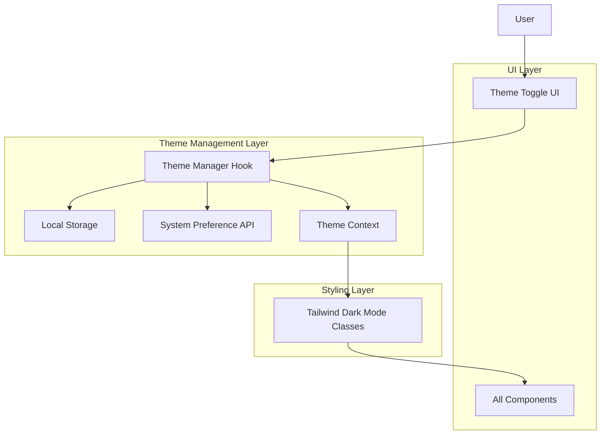

# Design Document: Dark Mode Implementation

## Overview

This design document outlines the implementation of a dark mode feature for the Afrexia B2B agricultural commodities export website. The solution leverages Next.js 15's capabilities, Tailwind CSS's dark mode utilities, and React hooks to provide a seamless theme switching experience that respects user preferences, maintains brand identity, and meets accessibility standards.

The implementation follows a three-layer architecture:
1. **Theme Management Layer**: Handles theme state, persistence, and system preference detection
2. **UI Component Layer**: Provides the theme toggle control and visual feedback
3. **Styling Layer**: Defines dark mode color palettes and applies theme-specific styles

## Architecture

### System Architecture



### Theme State Management

The theme system uses React Context API to provide theme state throughout the application:

- **ThemeProvider**: Wraps the application and provides theme context
- **useTheme hook**: Custom hook for accessing and modifying theme state
- **Theme persistence**: Stores user preference in localStorage with key `afrexia-theme`
- **System preference detection**: Uses `window.matchMedia('(prefers-color-scheme: dark)')` API

### Theme Application Flow

1. **Initial Load**:
   - Check localStorage for saved preference
   - If no saved preference, detect system preference
   - Apply theme before first paint to prevent FOUC
   - Add/remove `dark` class on `<html>` element

2. **User Toggle**:
   - User clicks theme toggle button
   - Update theme state in context
   - Save preference to localStorage
   - Apply CSS transition classes
   - Toggle `dark` class on `<html>` element

3. **System Preference Change**:
   - Listen for `prefers-color-scheme` media query changes
   - Only update if user has no explicit preference
   - Apply new theme smoothly

## Components and Interfaces

### 1. ThemeProvider Component

**Purpose**: Provides theme context to the entire application and manages theme state.

**Location**: `components/providers/ThemeProvider.tsx`

**Interface**:
```typescript
interface ThemeContextValue {
  theme: 'light' | 'dark';
  setTheme: (theme: 'light' | 'dark') => void;
  toggleTheme: () => void;
}

interface ThemeProviderProps {
  children: React.ReactNode;
  defaultTheme?: 'light' | 'dark';
  storageKey?: string;
}
```

**Responsibilities**:
- Initialize theme from localStorage or system preference
- Provide theme state and setter functions via context
- Handle theme persistence to localStorage
- Listen for system preference changes
- Apply theme class to document root

### 2. useTheme Hook

**Purpose**: Custom hook for accessing theme context in components.

**Location**: `hooks/useTheme.ts`

**Interface**:
```typescript
function useTheme(): ThemeContextValue {
  theme: 'light' | 'dark';
  setTheme: (theme: 'light' | 'dark') => void;
  toggleTheme: () => void;
}
```

**Usage Example**:
```typescript
const { theme, toggleTheme } = useTheme();
```

### 3. ThemeToggle Component

**Purpose**: UI control for switching between light and dark modes.

**Location**: `components/ui/ThemeToggle.tsx`

**Interface**:
```typescript
interface ThemeToggleProps {
  className?: string;
}
```

**Visual Design**:
- Icon button with sun/moon icons
- Sun icon for light mode, moon icon for dark mode
- Smooth icon transition animation
- Accessible with keyboard navigation
- ARIA labels for screen readers
- Hover and focus states

### 4. Theme Initialization Script

**Purpose**: Prevents flash of unstyled content by applying theme before React hydration.

**Location**: Inline script in `app/layout.tsx`

**Implementation**:
```typescript
const themeScript = `
  (function() {
    const storageKey = 'afrexia-theme';
    const theme = localStorage.getItem(storageKey) || 
                  (window.matchMedia('(prefers-color-scheme: dark)').matches ? 'dark' : 'light');
    document.documentElement.classList.toggle('dark', theme === 'dark');
  })();
`;
```

**Placement**: In `<head>` before any content renders

## Data Models

### Theme Type

```typescript
type Theme = 'light' | 'dark';
```

### Theme Context State

```typescript
interface ThemeState {
  theme: Theme;
  systemPreference: Theme;
  userPreference: Theme | null;
}
```

### Storage Schema

**localStorage key**: `afrexia-theme`

**Stored value**: `"light"` | `"dark"`

## Dark Mode Color Palette

### Design Principles

1. **Brand Consistency**: Maintain recognizable Afrexia green identity
2. **Reduced Luminance**: Lower overall brightness for eye comfort
3. **Sufficient Contrast**: Meet WCAG AA standards (4.5:1 for text)
4. **Hierarchy Preservation**: Maintain visual importance through contrast

### Color Mappings

#### Background Colors

| Element | Light Mode | Dark Mode | Rationale |
|---------|-----------|-----------|-----------|
| Page Background | `#FFFFFF` | `#0A1410` | Deep green-tinted dark background |
| Card Background | `#F5E6D3` (sand) | `#1A2820` | Elevated surface with green tint |
| Section Alt Background | `#E9EBE5` (light) | `#141D18` | Subtle variation for sections |
| Header Background | `#FFFFFF/95` | `#0A1410/95` | Maintains transparency |

#### Text Colors

| Element | Light Mode | Dark Mode | Rationale |
|---------|-----------|-----------|-----------|
| Primary Text | `#0F2916` | `#E8F5E9` | High contrast readable text |
| Secondary Text | `#194424` | `#B0D4B8` | Slightly muted for hierarchy |
| Muted Text | `#80996F` | `#80996F` | Support green works in both |

#### Brand Colors (Dark Mode Variants)

| Color | Light Mode | Dark Mode | Usage |
|-------|-----------|-----------|-------|
| Primary Green | `#194424` | `#2D6B3F` | Buttons, links, accents |
| Secondary Green | `#337A49` | `#4A9A62` | Secondary actions |
| Accent Gold | `#655E2C` | `#A89858` | Highlights, badges |
| Sand Beige | `#F5E6D3` | `#3A4A3E` | Cards, surfaces |
| Support Green | `#80996F` | `#9AB08A` | Icons, borders |

#### UI Component Colors

| Component | Light Mode | Dark Mode |
|-----------|-----------|-----------|
| Border | `#B0BCA4/20` | `#80996F/30` |
| Input Background | `#FFFFFF` | `#1A2820` |
| Input Border | `#B0BCA4` | `#4A5A4E` |
| Button Primary | `#194424` | `#2D6B3F` |
| Button Hover | `#0F2916` | `#3D7B4F` |

### Tailwind Configuration

Update `tailwind.config.ts` to include dark mode variants:

```typescript
theme: {
  extend: {
    colors: {
      // Add dark mode specific colors
      dark: {
        bg: {
          primary: '#0A1410',
          secondary: '#1A2820',
          tertiary: '#141D18',
        },
        text: {
          primary: '#E8F5E9',
          secondary: '#B0D4B8',
          muted: '#80996F',
        },
        border: '#4A5A4E',
      }
    }
  }
}
```

### CSS Custom Properties Approach

Define theme colors as CSS variables for dynamic switching:

```css
:root {
  --color-bg-primary: 255 255 255;
  --color-bg-secondary: 245 230 211;
  --color-text-primary: 15 41 22;
  --color-text-secondary: 25 68 36;
}

.dark {
  --color-bg-primary: 10 20 16;
  --color-bg-secondary: 26 40 32;
  --color-text-primary: 232 245 233;
  --color-text-secondary: 176 212 184;
}
```

## Transition Animations

### CSS Transition Configuration

Apply smooth transitions to color properties:

```css
* {
  transition-property: background-color, border-color, color, fill, stroke;
  transition-timing-function: cubic-bezier(0.4, 0, 0.2, 1);
  transition-duration: 300ms;
}
```

### Preventing Layout Shift

- Use `transition-property` to only animate colors
- Avoid animating `width`, `height`, or `transform` during theme change
- Ensure images have fixed dimensions

### Reduced Motion Support

Respect user's motion preferences:

```css
@media (prefers-reduced-motion: reduce) {
  * {
    transition-duration: 0ms !important;
  }
}
```

## Image and Logo Handling

### Logo Variants

Provide separate logo files for light and dark modes:

- Light mode: `/assets/logo.png` (dark logo on light background)
- Dark mode: `/assets/logo-dark.png` (light logo on dark background)

### Implementation

```typescript
<Image
  src={theme === 'dark' ? '/assets/logo-dark.png' : '/assets/logo.png'}
  alt="Afrexia"
  width={180}
  height={63}
/>
```

### Product Images

- Use transparent PNGs where possible
- Add subtle borders in dark mode for definition
- Consider image filters for better dark mode integration

```css
.dark img {
  border: 1px solid rgba(128, 153, 111, 0.2);
}
```

## Accessibility Considerations

### Contrast Ratios

All color combinations must meet WCAG AA standards:

- **Normal text** (< 18pt): 4.5:1 minimum contrast ratio
- **Large text** (≥ 18pt or 14pt bold): 3:1 minimum contrast ratio
- **UI components**: 3:1 minimum contrast ratio

### Keyboard Navigation

- Theme toggle must be keyboard accessible (Tab, Enter, Space)
- Focus indicators must be visible in both themes
- Focus ring colors: `ring-primary` in light, `ring-primary-light` in dark

### Screen Reader Support

```typescript
<button
  onClick={toggleTheme}
  aria-label={theme === 'dark' ? 'Switch to light mode' : 'Switch to dark mode'}
  aria-pressed={theme === 'dark'}
>
  {/* Icon */}
</button>
```

### Focus Management

Ensure focus indicators are visible in both modes:

```css
.focus-visible:focus {
  outline: 2px solid var(--color-primary);
  outline-offset: 2px;
}

.dark .focus-visible:focus {
  outline-color: var(--color-primary-light);
}
```

## Performance Optimization

### Preventing FOUC

1. **Inline Script**: Execute theme detection before React hydration
2. **Blocking Script**: Place in `<head>` to run synchronously
3. **CSS Variables**: Use for instant theme switching without re-render

### Lazy Loading

- Theme toggle component can be lazy loaded (not critical for initial render)
- Theme provider must be loaded immediately

### Bundle Size

- Use Tailwind's dark mode utilities (no additional CSS)
- Tree-shake unused theme utilities
- Estimated overhead: < 2KB gzipped

## Integration Points

### Header Component

Add ThemeToggle to Header between LanguageSwitcher and RFQ button:

```typescript
<div className="flex items-center gap-2 sm:gap-4">
  <LanguageSwitcher locale={locale} />
  <ThemeToggle />
  <Link href={`/${locale}/rfq`} ...>
    {rfqLabel}
  </Link>
</div>
```

### Root Layout

Wrap application with ThemeProvider:

```typescript
export default function RootLayout({ children }: { children: React.ReactNode }) {
  return (
    <html lang="en" suppressHydrationWarning>
      <head>
        <script dangerouslySetInnerHTML={{ __html: themeScript }} />
      </head>
      <body>
        <ThemeProvider>
          {children}
        </ThemeProvider>
      </body>
    </html>
  );
}
```

### Component Updates

All components must use theme-aware Tailwind classes:

```typescript
// Before
<div className="bg-white text-primary">

// After
<div className="bg-white dark:bg-dark-bg-primary text-primary dark:text-dark-text-primary">
```


## Correctness Properties

*A property is a characteristic or behavior that should hold true across all valid executions of a system—essentially, a formal statement about what the system should do. Properties serve as the bridge between human-readable specifications and machine-verifiable correctness guarantees.*

### Property 1: Theme Toggle State Transition

*For any* initial theme state (light or dark), when the toggle function is called, the resulting theme state should be the opposite of the initial state, and the `dark` class on the document root should match the new state.

**Validates: Requirements 1.2, 3.1**

### Property 2: Theme Persistence Round Trip

*For any* valid theme value (light or dark), when that theme is set and stored to localStorage, then retrieved and applied on initialization, the resulting theme should equal the originally stored theme.

**Validates: Requirements 4.1, 4.2**

### Property 3: System Preference Detection

*For any* system preference value (light or dark), when no stored user preference exists and the theme manager initializes, the applied theme should match the system preference.

**Validates: Requirements 5.1**

### Property 4: User Preference Priority

*For any* combination of stored user preference and system preference, when both exist, the theme manager should always apply the stored user preference, ignoring the system preference.

**Validates: Requirements 5.4**

### Property 5: System Preference Change Response

*For any* system preference change event, when no explicit user preference is stored, the theme should update to match the new system preference.

**Validates: Requirements 5.5**

### Property 6: Logo Variant Selection

*For any* theme state, the displayed logo source should correspond to that theme (light theme uses standard logo, dark theme uses dark variant logo).

**Validates: Requirements 3.6**

### Property 7: Icon State Correspondence

*For any* theme state, the theme toggle should display the icon corresponding to the current theme (sun icon for light mode, moon icon for dark mode).

**Validates: Requirements 1.4**

### Property 8: WCAG Contrast Compliance

*For all* text/background color combinations defined in the dark mode palette, the contrast ratio should meet or exceed WCAG AA standards (4.5:1 for normal text, 3:1 for large text and UI components).

**Validates: Requirements 7.1, 7.2, 7.3**

## Error Handling

### localStorage Unavailability

**Scenario**: localStorage is blocked, unavailable, or throws errors (private browsing, storage quota exceeded)

**Handling**:
- Wrap all localStorage operations in try-catch blocks
- Fall back to in-memory state management
- Continue functioning without persistence
- Log errors for monitoring

```typescript
function saveTheme(theme: Theme) {
  try {
    localStorage.setItem(STORAGE_KEY, theme);
  } catch (error) {
    console.warn('Failed to save theme preference:', error);
    // Continue without persistence
  }
}
```

### System Preference API Unavailable

**Scenario**: `window.matchMedia` is not supported (older browsers)

**Handling**:
- Check for API availability before use
- Default to light theme if unavailable
- Provide graceful degradation

```typescript
function getSystemPreference(): Theme {
  if (typeof window === 'undefined' || !window.matchMedia) {
    return 'light';
  }
  return window.matchMedia('(prefers-color-scheme: dark)').matches ? 'dark' : 'light';
}
```

### Missing Logo Variants

**Scenario**: Dark mode logo file is missing or fails to load

**Handling**:
- Provide fallback to standard logo
- Use CSS filters as backup (invert colors)
- Log missing asset errors

```typescript
<Image
  src={theme === 'dark' ? '/assets/logo-dark.png' : '/assets/logo.png'}
  alt="Afrexia"
  onError={(e) => {
    e.currentTarget.src = '/assets/logo.png';
  }}
/>
```

### Hydration Mismatch

**Scenario**: Server-rendered theme doesn't match client preference

**Handling**:
- Use `suppressHydrationWarning` on html element
- Apply theme before React hydration via inline script
- Ensure consistent theme detection logic

```typescript
<html lang="en" suppressHydrationWarning>
```

### Race Conditions

**Scenario**: Multiple rapid theme toggles before state updates complete

**Handling**:
- Use React's state batching (automatic in React 18+)
- Debounce localStorage writes if necessary
- Ensure state updates are atomic

## Testing Strategy

### Dual Testing Approach

This feature requires both unit tests and property-based tests to ensure comprehensive coverage:

- **Unit tests**: Verify specific examples, edge cases, and error conditions
- **Property tests**: Verify universal properties across all inputs

### Unit Testing

Unit tests should focus on:

1. **Specific Examples**:
   - Theme toggle switches from light to dark
   - Theme toggle switches from dark to light
   - System preference detection with dark preference
   - System preference detection with light preference
   - Theme initialization script applies correct theme

2. **Edge Cases**:
   - localStorage unavailable (throws error)
   - localStorage quota exceeded
   - Missing logo variant files
   - System preference API unavailable

3. **Integration Points**:
   - ThemeProvider wraps application correctly
   - ThemeToggle renders in Header
   - Theme context is accessible in components

4. **Accessibility**:
   - Theme toggle has proper ARIA labels
   - Theme toggle is keyboard accessible
   - Focus indicators are visible

5. **Error Conditions**:
   - localStorage errors are caught and handled
   - Missing assets fall back gracefully
   - Invalid stored theme values default to light

### Property-Based Testing

Property tests should verify universal correctness properties using a property-based testing library (fast-check for TypeScript/JavaScript).

**Configuration**:
- Minimum 100 iterations per property test
- Each test must reference its design document property
- Tag format: `Feature: dark-mode-implementation, Property {number}: {property_text}`

**Property Test Cases**:

1. **Property 1: Theme Toggle State Transition**
   - Generate random initial theme states
   - Verify toggle always produces opposite state
   - Verify DOM class matches new state
   - Tag: `Feature: dark-mode-implementation, Property 1: Theme Toggle State Transition`

2. **Property 2: Theme Persistence Round Trip**
   - Generate random theme values
   - Store to localStorage, retrieve, and verify equality
   - Tag: `Feature: dark-mode-implementation, Property 2: Theme Persistence Round Trip`

3. **Property 3: System Preference Detection**
   - Generate random system preference values
   - Mock matchMedia API
   - Verify theme matches system preference when no stored preference
   - Tag: `Feature: dark-mode-implementation, Property 3: System Preference Detection`

4. **Property 4: User Preference Priority**
   - Generate random combinations of user and system preferences
   - Verify user preference always wins
   - Tag: `Feature: dark-mode-implementation, Property 4: User Preference Priority`

5. **Property 5: System Preference Change Response**
   - Generate random system preference changes
   - Verify theme updates when no user preference exists
   - Tag: `Feature: dark-mode-implementation, Property 5: System Preference Change Response`

6. **Property 6: Logo Variant Selection**
   - Generate random theme states
   - Verify correct logo path for each theme
   - Tag: `Feature: dark-mode-implementation, Property 6: Logo Variant Selection`

7. **Property 7: Icon State Correspondence**
   - Generate random theme states
   - Verify correct icon displayed for each theme
   - Tag: `Feature: dark-mode-implementation, Property 7: Icon State Correspondence`

8. **Property 8: WCAG Contrast Compliance**
   - Generate all text/background color combinations from palette
   - Calculate contrast ratios using WCAG formula
   - Verify all combinations meet minimum thresholds
   - Tag: `Feature: dark-mode-implementation, Property 8: WCAG Contrast Compliance`

### Testing Tools

- **Unit Testing**: Jest + React Testing Library
- **Property-Based Testing**: fast-check
- **Contrast Calculation**: color-contrast-checker or custom WCAG formula implementation
- **E2E Testing**: Playwright (for visual regression and FOUC prevention)

### Test Coverage Goals

- **Unit Test Coverage**: 90%+ for theme management logic
- **Property Test Coverage**: All 8 correctness properties implemented
- **Integration Test Coverage**: All component integration points
- **Accessibility Test Coverage**: All WCAG requirements validated

### Example Property Test Structure

```typescript
import fc from 'fast-check';

describe('Feature: dark-mode-implementation, Property 1: Theme Toggle State Transition', () => {
  it('should toggle to opposite theme state', () => {
    fc.assert(
      fc.property(
        fc.constantFrom('light' as const, 'dark' as const),
        (initialTheme) => {
          const { result } = renderHook(() => useTheme(), {
            wrapper: ({ children }) => (
              <ThemeProvider defaultTheme={initialTheme}>
                {children}
              </ThemeProvider>
            ),
          });
          
          act(() => {
            result.current.toggleTheme();
          });
          
          const expectedTheme = initialTheme === 'light' ? 'dark' : 'light';
          expect(result.current.theme).toBe(expectedTheme);
          expect(document.documentElement.classList.contains('dark')).toBe(
            expectedTheme === 'dark'
          );
        }
      ),
      { numRuns: 100 }
    );
  });
});
```
