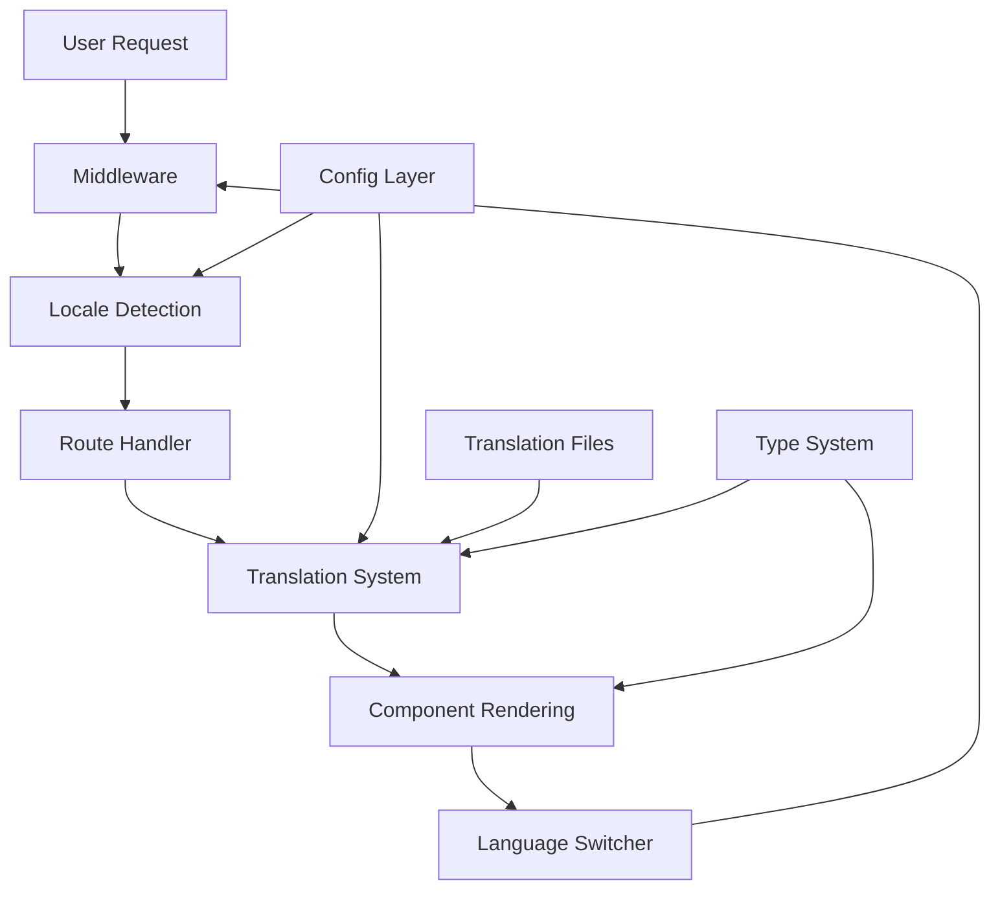

# Design Document: Multilingual Expansion

## Overview

This design document outlines the technical approach for expanding the Afrexia website from two languages (French and English) to five languages by adding Spanish (es), German (de), and Russian (ru). The expansion builds upon the existing i18n infrastructure while maintaining backward compatibility and system performance.

The design follows a systematic approach:
1. **Configuration Layer**: Extend locale definitions and type system
2. **Translation Layer**: Add comprehensive translations for three new languages
3. **UI Layer**: Enhance the language switcher from a toggle to a dropdown
4. **Routing Layer**: Update middleware to handle five locales
5. **SEO Layer**: Generate proper hreflang tags for all language variants
6. **Testing Layer**: Validate functionality across all locales

Key design principles:
- **Backward Compatibility**: Existing French and English functionality remains unchanged
- **Scalability**: Architecture supports future language additions
- **Performance**: No significant impact on page load times
- **Accessibility**: Language switcher follows WCAG guidelines
- **Cultural Sensitivity**: Translations respect regional conventions

## Architecture

### System Components

The multilingual system consists of five main components:



### Component Interactions

1. **Middleware** intercepts all requests and determines the appropriate locale
2. **Config Layer** provides locale definitions, validation, and metadata
3. **Translation System** retrieves and interpolates translated strings
4. **Type System** ensures type safety across all locale operations
5. **Language Switcher** provides UI for locale selection and persistence

### Data Flow

```
Request → Middleware → Locale Detection (Cookie → Header → Default) 
→ Redirect/Continue → Page Render → Translation Lookup → Display
```

When a user switches languages:
```
User Click → Language Switcher → Set Cookie → Navigate to New Locale Path 
→ Middleware Updates Cookie → Page Renders in New Locale
```

## Components and Interfaces

### 1. Locale Configuration (`lib/i18n/config.ts`)

**Current State:**
- Supports 2 locales: ['fr', 'en']
- Binary toggle between languages
- Simple getAlternateLocale() function

**Updated Design:**

```typescript
// Expanded locale array
export const locales = ['fr', 'en', 'es', 'de', 'ru'] as const;
export const defaultLocale: Locale = 'fr';

// Locale metadata
export const localeNames: Record<Locale, string> = {
  fr: 'Français',
  en: 'English',
  es: 'Español',
  de: 'Deutsch',
  ru: 'Русский',
};

export const localeFlags: Record<Locale, string> = {
  fr: '🇫🇷',
  en: '🇬🇧',
  es: '🇪🇸',
  de: '🇩🇪',
  ru: '🇷🇺',
};

// Remove getAlternateLocale() - no longer applicable with 5 languages
// Keep isValidLocale() and getValidLocale() - still needed
```

**Rationale**: The getAlternateLocale() function assumes binary choice and must be removed. The language switcher will handle multi-option selection differently.

### 2. Type System (`types/index.ts`)

**Current State:**
```typescript
export type Locale = 'fr' | 'en';

export interface MultilingualString {
  fr: string;
  en: string;
}
```

**Updated Design:**

```typescript
export type Locale = 'fr' | 'en' | 'es' | 'de' | 'ru';

export interface MultilingualString {
  fr: string;
  en: string;
  es: string;
  de: string;
  ru: string;
}

export interface MultilingualText {
  fr: string;
  en: string;
  es: string;
  de: string;
  ru: string;
}
```

**Impact Analysis**: This change affects all CMS content types (BlogPost, TeamMember, etc.). Existing content will need migration to include empty strings for new locales initially.

### 3. Translation System (`lib/i18n/translations.ts`)

**Current State:**
- Inline TypeScript object with nested structure
- ~50 translation keys per locale
- Variable interpolation support ({{year}})

**Updated Design:**

The translation object will be extended to include Spanish, German, and Russian translations for all existing keys. Structure remains the same:

```typescript
export const translations = {
  fr: { /* existing French translations */ },
  en: { /* existing English translations */ },
  es: {
    navigation: {
      home: 'Inicio',
      products: 'Productos',
      solutions: 'Soluciones',
      quality: 'Calidad y Cumplimiento',
      traceability: 'Trazabilidad',
      about: 'Acerca de',
      resources: 'Recursos',
      blog: 'Blog',
      contact: 'Contacto',
      rfq: 'Solicitud de Cotización',
    },
    common: {
      learnMore: 'Más información',
      downloadPDF: 'Descargar PDF',
      requestQuote: 'Solicitar cotización',
      contactUs: 'Contáctenos',
      viewDetails: 'Ver detalles',
      readMore: 'Leer más',
      backToHome: 'Volver al inicio',
      loading: 'Cargando...',
      error: 'Ocurrió un error',
    },
    products: {
      title: 'Nuestros Productos',
      subtitle: 'Productos agrícolas africanos de primera calidad',
      allProducts: 'Todos los productos',
      noProducts: 'No hay productos disponibles en este momento.',
      viewProduct: 'Ver producto',
      specifications: 'Especificaciones',
      certifications: 'Certificaciones',
      origin: 'Origen',
      packaging: 'Embalaje',
    },
    footer: {
      tagline: 'Su socio de confianza para productos agrícolas africanos',
      products: 'Productos',
      company: 'Empresa',
      quickLinks: 'Enlaces Rápidos',
      legal: 'Legal',
      followUs: 'Síguenos',
      copyright: '© {{year}} Afrexia. Todos los derechos reservados.',
      privacyPolicy: 'Política de Privacidad',
      termsOfService: 'Términos de Servicio',
    },
  },
  de: {
    navigation: {
      home: 'Startseite',
      products: 'Produkte',
      solutions: 'Lösungen',
      quality: 'Qualität & Compliance',
      traceability: 'Rückverfolgbarkeit',
      about: 'Über uns',
      resources: 'Ressourcen',
      blog: 'Blog',
      contact: 'Kontakt',
      rfq: 'Angebotsanfrage',
    },
    common: {
      learnMore: 'Mehr erfahren',
      downloadPDF: 'PDF herunterladen',
      requestQuote: 'Angebot anfordern',
      contactUs: 'Kontaktieren Sie uns',
      viewDetails: 'Details anzeigen',
      readMore: 'Weiterlesen',
      backToHome: 'Zurück zur Startseite',
      loading: 'Wird geladen...',
      error: 'Ein Fehler ist aufgetreten',
    },
    products: {
      title: 'Unsere Produkte',
      subtitle: 'Hochwertige afrikanische Agrarprodukte',
      allProducts: 'Alle Produkte',
      noProducts: 'Derzeit sind keine Produkte verfügbar.',
      viewProduct: 'Produkt ansehen',
      specifications: 'Spezifikationen',
      certifications: 'Zertifizierungen',
      origin: 'Herkunft',
      packaging: 'Verpackung',
    },
    footer: {
      tagline: 'Ihr vertrauenswürdiger Partner für afrikanische Agrarprodukte',
      products: 'Produkte',
      company: 'Unternehmen',
      quickLinks: 'Schnelllinks',
      legal: 'Rechtliches',
      followUs: 'Folgen Sie uns',
      copyright: '© {{year}} Afrexia. Alle Rechte vorbehalten.',
      privacyPolicy: 'Datenschutzrichtlinie',
      termsOfService: 'Nutzungsbedingungen',
    },
  },
  ru: {
    navigation: {
      home: 'Главная',
      products: 'Продукты',
      solutions: 'Решения',
      quality: 'Качество и соответствие',
      traceability: 'Отслеживаемость',
      about: 'О нас',
      resources: 'Ресурсы',
      blog: 'Блог',
      contact: 'Контакты',
      rfq: 'Запрос предложения',
    },
    common: {
      learnMore: 'Узнать больше',
      downloadPDF: 'Скачать PDF',
      requestQuote: 'Запросить предложение',
      contactUs: 'Свяжитесь с нами',
      viewDetails: 'Посмотреть детали',
      readMore: 'Читать далее',
      backToHome: 'Вернуться на главную',
      loading: 'Загрузка...',
      error: 'Произошла ошибка',
    },
    products: {
      title: 'Наши продукты',
      subtitle: 'Высококачественные африканские сельскохозяйственные товары',
      allProducts: 'Все продукты',
      noProducts: 'В настоящее время продукты недоступны.',
      viewProduct: 'Посмотреть продукт',
      specifications: 'Спецификации',
      certifications: 'Сертификаты',
      origin: 'Происхождение',
      packaging: 'Упаковка',
    },
    footer: {
      tagline: 'Ваш надежный партнер по африканским сельскохозяйственным товарам',
      products: 'Продукты',
      company: 'Компания',
      quickLinks: 'Быстрые ссылки',
      legal: 'Правовая информация',
      followUs: 'Подписывайтесь на нас',
      copyright: '© {{year}} Afrexia. Все права защищены.',
      privacyPolicy: 'Политика конфиденциальности',
      termsOfService: 'Условия использования',
    },
  },
};
```

**Translation Guidelines:**
- Use formal register for business context (usted in Spanish, Sie in German, Вы in Russian)
- Maintain consistent terminology across related strings
- Preserve placeholder syntax exactly ({{year}})
- Use native quotation marks and punctuation conventions
- Verify special characters render correctly (ñ, ü, ö, ä, Cyrillic)

### 4. Language Switcher Component (`components/layout/LanguageSwitcher.tsx`)

**Current State:**
- Simple button that toggles between FR and EN
- Shows flag and name of alternate language
- Direct navigation on click

**Updated Design:**

The language switcher will be redesigned as a dropdown menu to accommodate five languages:

```typescript
'use client';

import { usePathname, useRouter } from 'next/navigation';
import { useState, useRef, useEffect } from 'react';
import { Locale } from '@/types';
import { locales, localeNames, localeFlags, LOCALE_COOKIE } from '@/lib/i18n/config';

interface LanguageSwitcherProps {
  locale: Locale;
}

export function LanguageSwitcher({ locale }: LanguageSwitcherProps) {
  const [isOpen, setIsOpen] = useState(false);
  const dropdownRef = useRef<HTMLDivElement>(null);
  const pathname = usePathname();
  const router = useRouter();

  // Close dropdown when clicking outside
  useEffect(() => {
    function handleClickOutside(event: MouseEvent) {
      if (dropdownRef.current && !dropdownRef.current.contains(event.target as Node)) {
        setIsOpen(false);
      }
    }
    
    if (isOpen) {
      document.addEventListener('mousedown', handleClickOutside);
      return () => document.removeEventListener('mousedown', handleClickOutside);
    }
  }, [isOpen]);

  // Close dropdown on Escape key
  useEffect(() => {
    function handleEscape(event: KeyboardEvent) {
      if (event.key === 'Escape') {
        setIsOpen(false);
      }
    }
    
    if (isOpen) {
      document.addEventListener('keydown', handleEscape);
      return () => document.removeEventListener('keydown', handleEscape);
    }
  }, [isOpen]);

  const switchLanguage = (newLocale: Locale) => {
    if (newLocale === locale) {
      setIsOpen(false);
      return;
    }
    
    // Remove current locale from pathname
    const pathWithoutLocale = pathname.replace(`/${locale}`, '');
    
    // Build new path with new locale
    const newPath = `/${newLocale}${pathWithoutLocale || ''}`;
    
    // Set cookie
    document.cookie = `${LOCALE_COOKIE}=${newLocale}; path=/; max-age=${60 * 60 * 24 * 365}; SameSite=Lax`;
    
    // Close dropdown
    setIsOpen(false);
    
    // Navigate to new path
    router.push(newPath);
  };

  return (
    <div className="relative" ref={dropdownRef}>
      <button
        onClick={() => setIsOpen(!isOpen)}
        className="flex items-center gap-2 rounded-lg px-3 py-2 text-sm font-medium text-primary transition-colors hover:bg-light dark:text-dark-text-primary dark:hover:bg-dark-bg-secondary"
        aria-label="Select language"
        aria-expanded={isOpen}
        aria-haspopup="true"
      >
        <span className="text-lg" aria-hidden="true">{localeFlags[locale]}</span>
        <span className="hidden sm:inline">{localeNames[locale]}</span>
        <svg
          className={`h-4 w-4 transition-transform ${isOpen ? 'rotate-180' : ''}`}
          fill="none"
          stroke="currentColor"
          viewBox="0 0 24 24"
          aria-hidden="true"
        >
          <path strokeLinecap="round" strokeLinejoin="round" strokeWidth={2} d="M19 9l-7 7-7-7" />
        </svg>
      </button>

      {isOpen && (
        <div
          className="absolute right-0 mt-2 w-48 rounded-lg border border-neutral/20 bg-white shadow-lg dark:border-dark-border dark:bg-dark-bg-secondary"
          role="menu"
          aria-orientation="vertical"
        >
          {locales.map((loc) => (
            <button
              key={loc}
              onClick={() => switchLanguage(loc)}
              className={`flex w-full items-center gap-3 px-4 py-3 text-left text-sm transition-colors hover:bg-light dark:hover:bg-dark-bg-primary ${
                loc === locale
                  ? 'bg-light font-semibold text-primary dark:bg-dark-bg-primary dark:text-dark-primary'
                  : 'text-neutral dark:text-dark-text-secondary'
              }`}
              role="menuitem"
              aria-current={loc === locale ? 'true' : undefined}
            >
              <span className="text-lg" aria-hidden="true">{localeFlags[loc]}</span>
              <span>{localeNames[loc]}</span>
              {loc === locale && (
                <svg
                  className="ml-auto h-4 w-4"
                  fill="currentColor"
                  viewBox="0 0 20 20"
                  aria-hidden="true"
                >
                  <path
                    fillRule="evenodd"
                    d="M16.707 5.293a1 1 0 010 1.414l-8 8a1 1 0 01-1.414 0l-4-4a1 1 0 011.414-1.414L8 12.586l7.293-7.293a1 1 0 011.414 0z"
                    clipRule="evenodd"
                  />
                </svg>
              )}
            </button>
          ))}
        </div>
      )}
    </div>
  );
}
```

**Design Decisions:**

1. **Dropdown Pattern**: Accommodates 5+ languages better than toggle or inline buttons
2. **Current Language Display**: Shows current language in button (flag + name)
3. **Visual Feedback**: Checkmark indicates current selection in dropdown
4. **Accessibility**: 
   - Proper ARIA attributes (aria-expanded, aria-haspopup, role="menu")
   - Keyboard navigation (Escape to close)
   - Click-outside to close
   - Focus management
5. **Responsive**: Flag + name on desktop, flag only on mobile
6. **Dark Mode**: Supports theme switching with appropriate colors

### 5. Middleware (`middleware.ts`)

**Current State:**
- Detects locale from cookie or Accept-Language header
- Redirects non-localized URLs to localized versions
- Supports 2 locales

**Updated Design:**

```typescript
import { NextRequest, NextResponse } from 'next/server';

const locales = ['fr', 'en', 'es', 'de', 'ru'] as const;
const defaultLocale = 'fr' as const;

type Locale = (typeof locales)[number];

const LOCALE_COOKIE = 'NEXT_LOCALE';

// Language code mapping for Accept-Language header
const languageCodeMap: Record<string, Locale> = {
  'fr': 'fr',
  'en': 'en',
  'es': 'es',
  'de': 'de',
  'ru': 'ru',
  // Common variants
  'fr-fr': 'fr',
  'fr-ca': 'fr',
  'en-us': 'en',
  'en-gb': 'en',
  'es-es': 'es',
  'es-mx': 'es',
  'de-de': 'de',
  'de-at': 'de',
  'ru-ru': 'ru',
};

function getLocaleFromAcceptLanguage(acceptLanguage: string | null): Locale | null {
  if (!acceptLanguage) return null;

  const languages = acceptLanguage
    .split(',')
    .map((lang) => {
      const [locale, qValue] = lang.trim().split(';q=');
      const quality = qValue ? parseFloat(qValue) : 1.0;
      const langCode = locale.toLowerCase();
      return { locale: langCode, quality };
    })
    .sort((a, b) => b.quality - a.quality);

  for (const { locale } of languages) {
    const mappedLocale = languageCodeMap[locale];
    if (mappedLocale) {
      return mappedLocale;
    }
  }

  return null;
}

// Rest of middleware remains the same...
```

**Key Changes:**
- Expanded locales array to include 'es', 'de', 'ru'
- Added languageCodeMap for common language variants (es-ES, es-MX, de-DE, de-AT, ru-RU)
- Accept-Language parsing now handles all five languages with equal priority

### 6. SEO and Metadata

**Hreflang Implementation:**

Each page should include hreflang tags in the `<head>` section:

```typescript
// In app/[locale]/layout.tsx or page metadata
export function generateMetadata({ params }: { params: { locale: Locale } }) {
  const baseUrl = 'https://afrexia.com';
  const pathname = /* current path without locale */;
  
  return {
    alternates: {
      canonical: `${baseUrl}/${params.locale}${pathname}`,
      languages: {
        'fr': `${baseUrl}/fr${pathname}`,
        'en': `${baseUrl}/en${pathname}`,
        'es': `${baseUrl}/es${pathname}`,
        'de': `${baseUrl}/de${pathname}`,
        'ru': `${baseUrl}/ru${pathname}`,
        'x-default': `${baseUrl}/fr${pathname}`,
      },
    },
  };
}
```

**URL Structure:**

All five languages follow the same URL pattern:
- French: `/fr/products`, `/fr/about`, `/fr/contact`
- English: `/en/products`, `/en/about`, `/en/contact`
- Spanish: `/es/products`, `/es/about`, `/es/contact`
- German: `/de/products`, `/de/about`, `/de/contact`
- Russian: `/ru/products`, `/ru/about`, `/ru/contact`

Note: URLs use English slugs for consistency and SEO. Translated slugs (e.g., `/es/productos`) are not implemented to avoid complexity and maintain URL consistency across languages.

## Data Models

### Locale Type

```typescript
type Locale = 'fr' | 'en' | 'es' | 'de' | 'ru';
```

### Multilingual Content

```typescript
interface MultilingualString {
  fr: string;
  en: string;
  es: string;
  de: string;
  ru: string;
}

interface MultilingualText {
  fr: string;
  en: string;
  es: string;
  de: string;
  ru: string;
}
```

### Translation Structure

```typescript
interface TranslationSection {
  [key: string]: string | TranslationSection;
}

interface Translations {
  fr: TranslationSection;
  en: TranslationSection;
  es: TranslationSection;
  de: TranslationSection;
  ru: TranslationSection;
}
```

### Locale Metadata

```typescript
interface LocaleMetadata {
  code: Locale;
  name: string;
  flag: string;
  direction: 'ltr' | 'rtl'; // All five languages are LTR
}
```

## Correctness Properties

*A property is a characteristic or behavior that should hold true across all valid executions of a system—essentially, a formal statement about what the system should do. Properties serve as the bridge between human-readable specifications and machine-verifiable correctness guarantees.*


### Property 1: Locale Configuration Completeness

*For any* locale in the set ['fr', 'en', 'es', 'de', 'ru'], the Translation_System should have a corresponding entry in localeNames, localeFlags, and the translations object.

**Validates: Requirements 1.1, 1.3, 1.4**

### Property 2: Locale Validation Correctness

*For any* string input, the isValidLocale function should return true if and only if the string is one of ['fr', 'en', 'es', 'de', 'ru'].

**Validates: Requirements 1.5**

### Property 3: Translation Key Completeness

*For any* translation key that exists in the French translations, the same key path should exist in English, Spanish, German, and Russian translations with a non-empty string value.

**Validates: Requirements 2.1, 2.2, 2.3, 2.5, 2.6, 7.1**

### Property 4: Translation Retrieval Correctness

*For any* valid locale and any valid translation key, calling getTranslation(locale, key) should return a non-empty string that differs from the key itself (unless the key is missing, in which case it returns the key as fallback).

**Validates: Requirements 2.4, 7.2**

### Property 5: Variable Interpolation Preservation

*For any* translation string containing variable placeholders ({{variableName}}), calling getTranslation with appropriate variables should replace all placeholders with the provided values while preserving the surrounding text.

**Validates: Requirements 2.7, 7.5**

### Property 6: Language Switcher Path Preservation

*For any* current locale and any target locale, when switching languages, the path structure should remain identical except for the locale prefix (e.g., /fr/products/cocoa → /es/products/cocoa).

**Validates: Requirements 3.3, 3.8**

### Property 7: Language Switcher Cookie Persistence

*For any* locale selection in the Language_Switcher, the NEXT_LOCALE cookie should be set with the selected locale value and persist for one year.

**Validates: Requirements 3.4**

### Property 8: Middleware Locale Detection Priority

*For any* request, the Middleware should determine locale in this priority order: (1) Locale_Cookie if valid, (2) Accept-Language_Header if it contains a supported locale, (3) default locale 'fr'.

**Validates: Requirements 4.2, 4.3, 4.4, 4.6**

### Property 9: Middleware URL Locale Recognition

*For any* URL path starting with a valid locale prefix (/fr/, /en/, /es/, /de/, /ru/), the Middleware should recognize it as a localized path and set the cookie to match the prefix locale.

**Validates: Requirements 4.1, 4.5**

### Property 10: Accept-Language Parsing Fairness

*For any* Accept-Language header containing multiple supported locales with equal quality values, the Middleware should select the first matching locale without bias toward any particular language.

**Validates: Requirements 4.7**

### Property 11: Hreflang Tag Completeness

*For any* page, the generated metadata should include hreflang tags for all five locales (fr, en, es, de, ru) plus an x-default tag pointing to the French version.

**Validates: Requirements 6.1, 6.2, 6.3, 6.4**

### Property 12: URL Structure Consistency

*For any* page path, the URL structure should be identical across all five locales except for the locale prefix (e.g., /fr/about, /en/about, /es/about, /de/about, /ru/about).

**Validates: Requirements 6.5**

### Property 13: Special Character Handling

*For any* translation string containing special characters (ñ, ü, ö, ä, Cyrillic characters), the Translation_System should store and retrieve the string without corruption or encoding errors.

**Validates: Requirements 7.4**

### Property 14: Backward Compatibility

*For any* existing functionality that worked with locales ['fr', 'en'], the same functionality should continue to work identically after adding ['es', 'de', 'ru'] to the system.

**Validates: Requirements 8.1, 8.2, 8.3**

### Property 15: Text Direction Consistency

*For all* five supported locales, the text direction should be 'ltr' (left-to-right), as none of the languages require RTL support.

**Validates: Requirements 9.5**

### Property 16: Translation Data Loading Efficiency

*For any* page render, only the translation data for the current locale should be loaded into the client bundle, not all five locales.

**Validates: Requirements 10.1**

## Error Handling

### Translation Key Missing

**Scenario**: A translation key is requested but doesn't exist in the current locale.

**Handling**:
```typescript
export function getTranslation(
  locale: Locale,
  key: string,
  variables?: Record<string, string>
): string {
  const keys = key.split('.');
  let value: any = translations[locale];
  
  for (const k of keys) {
    value = value?.[k];
  }
  
  // Fallback: return key if translation not found
  if (typeof value !== 'string') {
    console.warn(`Translation key "${key}" not found for locale "${locale}"`);
    return key;
  }
  
  // ... rest of function
}
```

**Rationale**: Returning the key itself provides a visible indicator of missing translations during development while preventing runtime errors in production.

### Invalid Locale

**Scenario**: A locale string is provided that isn't in the supported list.

**Handling**:
```typescript
export function getValidLocale(locale: string | undefined): Locale {
  if (locale && isValidLocale(locale)) {
    return locale;
  }
  console.warn(`Invalid locale "${locale}", falling back to default "${defaultLocale}"`);
  return defaultLocale;
}
```

**Rationale**: Graceful degradation to the default locale ensures the site remains functional even with invalid locale parameters.

### Accept-Language Parsing Errors

**Scenario**: The Accept-Language header is malformed or contains unexpected values.

**Handling**:
```typescript
function getLocaleFromAcceptLanguage(acceptLanguage: string | null): Locale | null {
  if (!acceptLanguage) return null;

  try {
    const languages = acceptLanguage
      .split(',')
      .map((lang) => {
        const [locale, qValue] = lang.trim().split(';q=');
        const quality = qValue ? parseFloat(qValue) : 1.0;
        const langCode = locale.toLowerCase();
        return { locale: langCode, quality };
      })
      .sort((a, b) => b.quality - a.quality);

    for (const { locale } of languages) {
      const mappedLocale = languageCodeMap[locale];
      if (mappedLocale) {
        return mappedLocale;
      }
    }
  } catch (error) {
    console.error('Error parsing Accept-Language header:', error);
  }

  return null;
}
```

**Rationale**: Try-catch prevents parsing errors from crashing the middleware. Returning null allows fallback to default locale.

### Cookie Corruption

**Scenario**: The NEXT_LOCALE cookie contains an invalid value.

**Handling**:
```typescript
function getLocaleFromCookie(request: NextRequest): Locale | null {
  const cookieLocale = request.cookies.get(LOCALE_COOKIE)?.value;
  if (cookieLocale && locales.includes(cookieLocale as Locale)) {
    return cookieLocale as Locale;
  }
  // Invalid cookie value - ignore and return null
  return null;
}
```

**Rationale**: Validation ensures only supported locales are used. Invalid cookies are ignored, allowing fallback to Accept-Language or default.

### Language Switcher Navigation Errors

**Scenario**: Navigation to a new locale fails due to network or routing issues.

**Handling**:
```typescript
const switchLanguage = (newLocale: Locale) => {
  try {
    // ... cookie setting and path building
    router.push(newPath);
  } catch (error) {
    console.error('Error switching language:', error);
    // Keep dropdown open so user can retry
    // Optionally show error toast
  }
};
```

**Rationale**: Catching navigation errors prevents the UI from breaking. User can retry the operation.

## Testing Strategy

### Dual Testing Approach

The multilingual expansion will be validated through both unit tests and property-based tests:

- **Unit tests**: Verify specific examples, edge cases, and error conditions
- **Property tests**: Verify universal properties across all inputs

Both approaches are complementary and necessary for comprehensive coverage. Unit tests catch concrete bugs in specific scenarios, while property tests verify general correctness across many inputs.

### Property-Based Testing Configuration

**Library Selection**: We will use **fast-check** for TypeScript/JavaScript property-based testing.

**Configuration**:
- Minimum 100 iterations per property test (due to randomization)
- Each property test must reference its design document property
- Tag format: `// Feature: multilingual-expansion, Property {number}: {property_text}`

**Example Property Test**:

```typescript
import fc from 'fast-check';
import { isValidLocale } from '@/lib/i18n/config';

describe('Locale Validation', () => {
  // Feature: multilingual-expansion, Property 2: Locale Validation Correctness
  it('should validate locales correctly for all inputs', () => {
    fc.assert(
      fc.property(fc.string(), (input) => {
        const validLocales = ['fr', 'en', 'es', 'de', 'ru'];
        const result = isValidLocale(input);
        const expected = validLocales.includes(input);
        expect(result).toBe(expected);
      }),
      { numRuns: 100 }
    );
  });
});
```

### Unit Testing Focus

Unit tests should focus on:

1. **Specific Examples**:
   - Test that 'es' is recognized as valid locale
   - Test that Spanish translation for 'navigation.home' returns 'Inicio'
   - Test that switching from /fr/products to 'de' navigates to /de/products

2. **Edge Cases**:
   - Empty string locale validation
   - Missing translation key fallback
   - Malformed Accept-Language headers
   - Cookie with invalid locale value

3. **Integration Points**:
   - Language switcher dropdown opens/closes correctly
   - Middleware redirects work for all five locales
   - Cookie persistence across page navigations

4. **Error Conditions**:
   - Invalid locale in URL returns 404 or redirects
   - Missing translation keys log warnings
   - Navigation errors are caught and handled

### Test Coverage Requirements

The following test files should be created or updated:

1. **`lib/i18n/__tests__/config.test.ts`**:
   - Test locale validation functions
   - Test locale metadata completeness
   - Test default locale configuration

2. **`lib/i18n/__tests__/translations.test.ts`**:
   - Test translation key completeness across all locales
   - Test getTranslation function for all locales
   - Test variable interpolation
   - Test missing key fallback

3. **`middleware.test.ts`**:
   - Test locale detection from cookie
   - Test locale detection from Accept-Language header
   - Test locale detection priority order
   - Test URL redirection for all locales
   - Test cookie setting on locale detection

4. **`components/layout/__tests__/LanguageSwitcher.test.tsx`**:
   - Test dropdown renders all five languages
   - Test current language is highlighted
   - Test language selection navigates correctly
   - Test cookie is set on language selection
   - Test path preservation when switching
   - Test keyboard navigation (Escape key)
   - Test click-outside to close

5. **`app/[locale]/__tests__/metadata.test.ts`**:
   - Test hreflang tags are generated for all locales
   - Test x-default points to French version
   - Test URL structure consistency

### Performance Testing

Performance benchmarks should verify:

1. **Initial Load Time**: Measure page load time with 5 locales vs. 2 locales (should be < 50ms difference)
2. **Language Switch Time**: Measure time from click to page render (should be < 500ms)
3. **Bundle Size**: Verify only one locale's translations are included in client bundle
4. **Cache Effectiveness**: Verify translation data is cached and not refetched

### Accessibility Testing

Accessibility tests should verify:

1. **Keyboard Navigation**: Language switcher can be operated with keyboard only
2. **Screen Reader**: ARIA attributes are correct (aria-expanded, aria-haspopup, role="menu")
3. **Focus Management**: Focus is managed correctly when opening/closing dropdown
4. **Color Contrast**: Dropdown text meets WCAG AA standards in both light and dark modes

### Integration Testing

End-to-end tests should verify:

1. **Full User Journey**: User can browse site, switch languages, and see translated content
2. **Cookie Persistence**: Language preference persists across sessions
3. **SEO**: Search engines can discover all language variants via hreflang tags
4. **Cross-Browser**: Language switcher works in Chrome, Firefox, Safari, Edge

### Backward Compatibility Testing

Run existing test suite to ensure:

1. All existing tests pass without modification
2. French and English functionality is unchanged
3. No breaking changes to API contracts
4. No performance regressions

## Implementation Notes

### Translation Quality Assurance

While not automatically testable, translation quality should be ensured through:

1. **Professional Translation Services**: Consider using professional translators for Spanish, German, and Russian
2. **Native Speaker Review**: Have native speakers review translations for accuracy and cultural appropriateness
3. **Terminology Consistency**: Maintain a glossary of key terms and their translations
4. **Context Preservation**: Ensure translations preserve the intended meaning and tone

### Cultural Adaptations

Consider these cultural factors:

1. **Formality Level**:
   - Spanish: Use "usted" form for business context
   - German: Use "Sie" form for formal business communication
   - Russian: Use "Вы" form for respectful address

2. **Date Formats**:
   - Spanish: DD/MM/YYYY
   - German: DD.MM.YYYY
   - Russian: DD.MM.YYYY

3. **Number Formats**:
   - Spanish: 1.234,56 (period for thousands, comma for decimals)
   - German: 1.234,56 (period for thousands, comma for decimals)
   - Russian: 1 234,56 (space for thousands, comma for decimals)

4. **Currency Display**:
   - Consider target market conventions for currency symbols and placement

### Migration Strategy

For existing CMS content (blog posts, products, team members):

1. **Phase 1**: Add empty strings for new locales to maintain type safety
2. **Phase 2**: Gradually translate content, prioritizing high-traffic pages
3. **Phase 3**: Mark untranslated content with a "Translation pending" indicator
4. **Phase 4**: Complete all translations before public launch

### Deployment Considerations

1. **Feature Flag**: Consider using a feature flag to enable new languages gradually
2. **Monitoring**: Monitor error rates and performance metrics after deployment
3. **Rollback Plan**: Have a rollback plan in case of critical issues
4. **User Communication**: Announce new language support through blog post or newsletter

### Future Extensibility

The architecture supports future language additions:

1. Add new locale to `locales` array
2. Add translations to `translations` object
3. Add metadata to `localeNames` and `localeFlags`
4. Update type definitions
5. Add tests for new locale

No changes to middleware, language switcher, or routing logic are needed for future languages.
