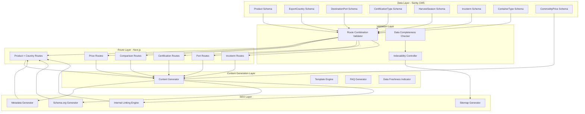
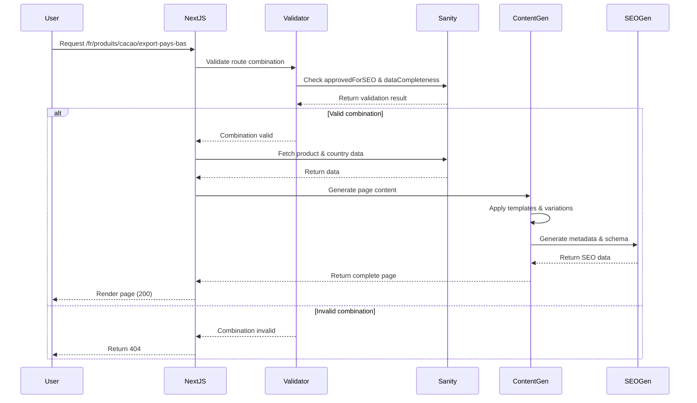

# Design Document - SEO Programmatique Afrexia

## Introduction

Ce document définit l'architecture technique complète pour l'implémentation du système de SEO programmatique sur le site Afrexia. Le système génère automatiquement des pages optimisées pour capter du trafic longue traîne en combinant les données existantes (produits, prix, certifications) avec de nouvelles entités (pays d'export, ports, incoterms, saisonnalité).

**Approche par phases:** L'implémentation suit une stratégie progressive en trois phases (V1, V2, V3) pour garantir une livraison incrémentale de valeur métier tout en maintenant la qualité et la maintenabilité du code.

**Principes directeurs:**
- Génération uniquement des combinaisons validées métier (approvedForSEO = true)
- Contrôle qualité strict avec seuils de complétude (dataCompleteness >= 70%)
- Distinction claire des sources de contenu (Sanity/calculé/template/éditorial)
- Support multilingue complet (FR, EN, ES, DE, RU) avec fallbacks cadrés
- Performance optimale avec ISR et génération statique

## Overview

### Architecture Globale

Le système de SEO programmatique s'articule autour de plusieurs composants clés:

1. **Data Layer (Sanity CMS)**: Schémas étendus pour gérer toutes les entités nécessaires
2. **Route Generation Layer (Next.js App Router)**: Routes dynamiques avec génération statique
3. **Content Generation Layer**: Génération de contenu unique avec templates intelligents
4. **Validation Layer**: Validation des combinaisons et contrôle qualité
5. **SEO Layer**: Métadonnées, schema.org, sitemap, maillage interne
6. **Performance Layer**: ISR, caching, optimisations


### Diagramme d'Architecture



### Flux de Génération de Page




## Architecture

### Composants Principaux

#### 1. Data Layer - Sanity Schemas

Le Data Layer étend les schémas Sanity existants et ajoute de nouvelles entités pour supporter le SEO programmatique.

**Schémas existants à étendre:**
- `product.ts`: Déjà complet avec support multilingue
- `certification.ts`: Déjà complet
- `commodityPrice.ts`: Déjà complet
- `priceHistory.ts`: Déjà complet

**Nouveaux schémas à créer:**
- `exportCountry.ts`: Pays de destination pour l'export
- `destinationPort.ts`: Ports maritimes de destination
- `harvestSeason.ts`: Périodes de récolte par produit
- `incoterm.ts`: Termes commerciaux internationaux
- `containerType.ts`: Types de conteneurs pour le transport

#### 2. Route Generation Layer

Utilise Next.js App Router avec génération statique et ISR pour créer des routes dynamiques performantes.

**Structure des routes:**
```
app/[locale]/
├── produits/[product-slug]/export-[country-slug]/page.tsx    # V1: Produit × Pays
├── prix/[product-slug]-cameroun/page.tsx                      # V1: Prix
├── guide/[comparison-type]/page.tsx                           # V1: Comparaisons
├── certifications/[certification-slug]-[product-slug]/page.tsx # V2: Certification × Produit
├── logistique/export-[product-slug]-port-[port-slug]/page.tsx # V2: Port × Produit
├── recolte/[product-slug]-cameroun-saison-[year]/page.tsx     # V2: Saisonnalité
├── calendrier-recolte/[product-slug]-afrique-ouest/page.tsx   # V2: Calendrier
├── incoterms/[product-slug]-[incoterm]-[port-slug]/page.tsx   # V3: Incoterm × Produit × Port
└── commande/[product-slug]-container-[container-type]/page.tsx # V3: Volume
```

#### 3. Validation Layer

Composants responsables de la validation des combinaisons et du contrôle qualité.

**Route Combination Validator:**
- Vérifie `approvedForSEO = true` dans Sanity
- Vérifie `dataCompleteness >= 70%`
- Valide l'existence d'une intention de recherche
- Exclut les combinaisons redondantes

**Data Completeness Checker:**
- Calcule le pourcentage de complétude des données
- Vérifie la présence des champs obligatoires
- Compte les traductions disponibles

**Indexability Controller:**
- Applique les Quality_Threshold (70% complétude, 500 mots, max 30% fallback)
- Marque les pages avec `noindex, follow` si nécessaire
- Exclut les pages non-indexables du sitemap

#### 4. Content Generation Layer

Génère du contenu unique pour chaque page en combinant templates, données Sanity, et calculs.

**Content Generator:**
- Applique des templates avec variations
- Génère des introductions uniques
- Intègre des données spécifiques (prix, certifications, délais)
- Varie la structure selon le type de page
- Génère des FAQ contextuelles (3-5 questions)
- Garantit minimum 500 mots de contenu unique

**Template Engine:**
- Gère les variations de contenu
- Supporte le multilingue avec fallbacks
- Marque le type de source (Sanity/calculé/template/éditorial)

**FAQ Generator:**
- Génère des FAQ uniques basées sur le contexte
- Varie les questions selon le type de page
- Inclut des réponses détaillées avec données spécifiques

**Data Freshness Indicator:**
- Affiche la date de dernière mise à jour
- Ajoute des disclaimers pour les données estimées
- Indique la source de calcul ou d'estimation

#### 5. SEO Layer

Génère tous les éléments SEO nécessaires pour optimiser le référencement.

**Metadata Generator:**
- Génère des titles uniques (50-60 caractères)
- Génère des descriptions uniques (150-160 caractères)
- Crée les balises hreflang pour toutes les locales
- Génère les balises Open Graph et Twitter Card

**Schema.org Generator:**
- Génère des données structurées Product
- Génère des données structurées Offer avec prix
- Génère des données structurées BreadcrumbList
- Génère des données structurées FAQPage

**Sitemap Generator:**
- Génère un sitemap XML organisé par axe
- Inclut toutes les pages indexables
- Définit des priorités et changefreq appropriées
- Exclut les pages noindex

**Internal Linking Engine:**
- Crée des liens vers des pages connexes
- Varie les anchor texts
- Priorise les liens vers les pages indexables
- Génère une section "Pages connexes" (4-6 liens)

#### 6. Performance Layer

Optimise les performances avec ISR, caching, et optimisations Next.js.

**ISR Configuration:**
- 24h (86400s) pour les pages de prix
- 7 jours (604800s) pour les autres pages
- Régénération en arrière-plan après expiration
- Fallback sur cache en cas d'erreur

**Caching Strategy:**
- Utilise les React Server Components
- Configure les headers Cache-Control et ETag
- Implémente le stale-while-revalidate
- Utilise le edge caching via CDN

**Optimizations:**
- Prefetching des liens internes visibles
- Lazy loading des images avec next/image
- Minimisation du JavaScript côté client
- Streaming HTML pour améliorer le FCP


## Data Models

### Schémas Sanity Détaillés

#### ExportCountry Schema

```typescript
// sanity/schemas/exportCountry.ts
import { defineField, defineType } from 'sanity';

export default defineType({
  name: 'exportCountry',
  title: 'Pays d\'Export',
  type: 'document',
  fields: [
    defineField({
      name: 'name',
      title: 'Nom du Pays',
      type: 'object',
      fields: [
        { name: 'fr', type: 'string', title: 'Français', validation: (Rule) => Rule.required() },
        { name: 'en', type: 'string', title: 'Anglais', validation: (Rule) => Rule.required() },
        { name: 'es', type: 'string', title: 'Espagnol' },
        { name: 'de', type: 'string', title: 'Allemand' },
        { name: 'ru', type: 'string', title: 'Russe' },
      ],
      validation: (Rule) => Rule.required(),
    }),
    defineField({
      name: 'slug',
      title: 'Slug',
      type: 'slug',
      options: {
        source: 'name.en',
        maxLength: 96,
      },
      validation: (Rule) => Rule.required(),
    }),
    defineField({
      name: 'code',
      title: 'Code ISO',
      type: 'string',
      description: 'Code ISO 3166-1 alpha-2 (ex: NL, BE, DE)',
      validation: (Rule) => Rule.required().length(2),
    }),
    defineField({
      name: 'flag',
      title: 'Drapeau',
      type: 'string',
      description: 'Emoji du drapeau (ex: 🇳🇱)',
    }),
    defineField({
      name: 'description',
      title: 'Description',
      type: 'object',
      fields: [
        { name: 'fr', type: 'text', title: 'Français', rows: 4 },
        { name: 'en', type: 'text', title: 'Anglais', rows: 4 },
        { name: 'es', type: 'text', title: 'Espagnol', rows: 4 },
        { name: 'de', type: 'text', title: 'Allemand', rows: 4 },
        { name: 'ru', type: 'text', title: 'Russe', rows: 4 },
      ],
    }),
    defineField({
      name: 'targetMarkets',
      title: 'Marchés Cibles',
      type: 'array',
      of: [{ type: 'string' }],
      description: 'Industries ou secteurs cibles dans ce pays',
    }),
    defineField({
      name: 'mainPorts',
      title: 'Ports Principaux',
      type: 'array',
      of: [{ type: 'reference', to: [{ type: 'destinationPort' }] }],
      description: 'Ports de destination recommandés pour ce pays',
    }),
    defineField({
      name: 'requiredCertifications',
      title: 'Certifications Requises',
      type: 'array',
      of: [{ type: 'reference', to: [{ type: 'certification' }] }],
      description: 'Certifications obligatoires pour exporter vers ce pays',
    }),
    defineField({
      name: 'customsInfo',
      title: 'Informations Douanières',
      type: 'object',
      fields: [
        { name: 'fr', type: 'text', title: 'Français', rows: 4 },
        { name: 'en', type: 'text', title: 'Anglais', rows: 4 },
        { name: 'es', type: 'text', title: 'Espagnol', rows: 4 },
        { name: 'de', type: 'text', title: 'Allemand', rows: 4 },
        { name: 'ru', type: 'text', title: 'Russe', rows: 4 },
      ],
    }),
    defineField({
      name: 'averageTransitTime',
      title: 'Délai de Transit Moyen',
      type: 'object',
      fields: [
        { name: 'days', type: 'number', title: 'Jours' },
        { name: 'note', type: 'object', title: 'Note', fields: [
          { name: 'fr', type: 'string', title: 'Français' },
          { name: 'en', type: 'string', title: 'Anglais' },
          { name: 'es', type: 'string', title: 'Espagnol' },
          { name: 'de', type: 'string', title: 'Allemand' },
          { name: 'ru', type: 'string', title: 'Russe' },
        ]},
      ],
    }),
    defineField({
      name: 'dataCompleteness',
      title: 'Complétude des Données',
      type: 'number',
      description: 'Pourcentage de complétude (0-100)',
      validation: (Rule) => Rule.min(0).max(100),
      initialValue: 0,
    }),
    defineField({
      name: 'approvedForSEO',
      title: 'Approuvé pour SEO',
      type: 'boolean',
      description: 'Combinaison validée métier pour génération de pages',
      initialValue: false,
    }),
  ],
  preview: {
    select: {
      title: 'name.en',
      subtitle: 'code',
      flag: 'flag',
    },
    prepare({ title, subtitle, flag }) {
      return {
        title: `${flag || ''} ${title || 'Sans nom'}`,
        subtitle: subtitle || 'Pas de code',
      };
    },
  },
});
```


#### DestinationPort Schema

```typescript
// sanity/schemas/destinationPort.ts
import { defineField, defineType } from 'sanity';

export default defineType({
  name: 'destinationPort',
  title: 'Port de Destination',
  type: 'document',
  fields: [
    defineField({
      name: 'name',
      title: 'Nom du Port',
      type: 'object',
      fields: [
        { name: 'fr', type: 'string', title: 'Français', validation: (Rule) => Rule.required() },
        { name: 'en', type: 'string', title: 'Anglais', validation: (Rule) => Rule.required() },
        { name: 'es', type: 'string', title: 'Espagnol' },
        { name: 'de', type: 'string', title: 'Allemand' },
        { name: 'ru', type: 'string', title: 'Russe' },
      ],
      validation: (Rule) => Rule.required(),
    }),
    defineField({
      name: 'slug',
      title: 'Slug',
      type: 'slug',
      options: {
        source: 'name.en',
        maxLength: 96,
      },
      validation: (Rule) => Rule.required(),
    }),
    defineField({
      name: 'city',
      title: 'Ville',
      type: 'string',
      validation: (Rule) => Rule.required(),
    }),
    defineField({
      name: 'country',
      title: 'Pays',
      type: 'reference',
      to: [{ type: 'exportCountry' }],
      validation: (Rule) => Rule.required(),
    }),
    defineField({
      name: 'locode',
      title: 'Code LOCODE',
      type: 'string',
      description: 'Code UN/LOCODE (ex: NLRTM pour Rotterdam)',
      validation: (Rule) => Rule.required().length(5),
    }),
    defineField({
      name: 'coordinates',
      title: 'Coordonnées',
      type: 'geopoint',
    }),
    defineField({
      name: 'description',
      title: 'Description',
      type: 'object',
      fields: [
        { name: 'fr', type: 'text', title: 'Français', rows: 4 },
        { name: 'en', type: 'text', title: 'Anglais', rows: 4 },
        { name: 'es', type: 'text', title: 'Espagnol', rows: 4 },
        { name: 'de', type: 'text', title: 'Allemand', rows: 4 },
        { name: 'ru', type: 'text', title: 'Russe', rows: 4 },
      ],
    }),
    defineField({
      name: 'capacity',
      title: 'Capacité',
      type: 'object',
      fields: [
        { name: 'teu', type: 'number', title: 'TEU (Twenty-foot Equivalent Unit)' },
        { name: 'note', type: 'object', title: 'Note', fields: [
          { name: 'fr', type: 'string', title: 'Français' },
          { name: 'en', type: 'string', title: 'Anglais' },
          { name: 'es', type: 'string', title: 'Espagnol' },
          { name: 'de', type: 'string', title: 'Allemand' },
          { name: 'ru', type: 'string', title: 'Russe' },
        ]},
      ],
    }),
    defineField({
      name: 'transitTimeFromDouala',
      title: 'Délai de Transit depuis Douala',
      type: 'object',
      fields: [
        { name: 'days', type: 'number', title: 'Jours' },
        { name: 'note', type: 'object', title: 'Note', fields: [
          { name: 'fr', type: 'string', title: 'Français' },
          { name: 'en', type: 'string', title: 'Anglais' },
          { name: 'es', type: 'string', title: 'Espagnol' },
          { name: 'de', type: 'string', title: 'Allemand' },
          { name: 'ru', type: 'string', title: 'Russe' },
        ]},
      ],
    }),
    defineField({
      name: 'estimatedCost',
      title: 'Coût Estimé',
      type: 'object',
      fields: [
        { name: 'amount', type: 'number', title: 'Montant' },
        { name: 'currency', type: 'string', title: 'Devise', initialValue: 'USD' },
        { name: 'unit', type: 'string', title: 'Unité', initialValue: 'per container' },
        { name: 'note', type: 'object', title: 'Note', fields: [
          { name: 'fr', type: 'string', title: 'Français' },
          { name: 'en', type: 'string', title: 'Anglais' },
          { name: 'es', type: 'string', title: 'Espagnol' },
          { name: 'de', type: 'string', title: 'Allemand' },
          { name: 'ru', type: 'string', title: 'Russe' },
        ]},
      ],
    }),
    defineField({
      name: 'supportedIncoterms',
      title: 'Incoterms Supportés',
      type: 'array',
      of: [{ type: 'reference', to: [{ type: 'incoterm' }] }],
    }),
    defineField({
      name: 'dataCompleteness',
      title: 'Complétude des Données',
      type: 'number',
      description: 'Pourcentage de complétude (0-100)',
      validation: (Rule) => Rule.min(0).max(100),
      initialValue: 0,
    }),
    defineField({
      name: 'approvedForSEO',
      title: 'Approuvé pour SEO',
      type: 'boolean',
      description: 'Combinaison validée métier pour génération de pages',
      initialValue: false,
    }),
  ],
  preview: {
    select: {
      title: 'name.en',
      subtitle: 'city',
      locode: 'locode',
    },
    prepare({ title, subtitle, locode }) {
      return {
        title: title || 'Sans nom',
        subtitle: `${subtitle || 'Ville inconnue'} (${locode || 'Pas de code'})`,
      };
    },
  },
});
```


#### HarvestSeason Schema

```typescript
// sanity/schemas/harvestSeason.ts
import { defineField, defineType } from 'sanity';

export default defineType({
  name: 'harvestSeason',
  title: 'Saison de Récolte',
  type: 'document',
  fields: [
    defineField({
      name: 'product',
      title: 'Produit',
      type: 'reference',
      to: [{ type: 'product' }],
      validation: (Rule) => Rule.required(),
    }),
    defineField({
      name: 'region',
      title: 'Région',
      type: 'string',
      description: 'Ex: Cameroun, Afrique de l\'Ouest',
      validation: (Rule) => Rule.required(),
    }),
    defineField({
      name: 'startMonth',
      title: 'Mois de Début',
      type: 'number',
      description: 'Mois de début (1-12)',
      validation: (Rule) => Rule.required().min(1).max(12),
    }),
    defineField({
      name: 'endMonth',
      title: 'Mois de Fin',
      type: 'number',
      description: 'Mois de fin (1-12)',
      validation: (Rule) => Rule.required().min(1).max(12),
    }),
    defineField({
      name: 'peakMonths',
      title: 'Mois de Pic',
      type: 'array',
      of: [{ type: 'number' }],
      description: 'Mois de production maximale',
    }),
    defineField({
      name: 'availability',
      title: 'Disponibilité',
      type: 'object',
      fields: [
        { name: 'fr', type: 'text', title: 'Français', rows: 3 },
        { name: 'en', type: 'text', title: 'Anglais', rows: 3 },
        { name: 'es', type: 'text', title: 'Espagnol', rows: 3 },
        { name: 'de', type: 'text', title: 'Allemand', rows: 3 },
        { name: 'ru', type: 'text', title: 'Russe', rows: 3 },
      ],
    }),
    defineField({
      name: 'qualityVariations',
      title: 'Variations de Qualité',
      type: 'object',
      fields: [
        { name: 'fr', type: 'text', title: 'Français', rows: 3 },
        { name: 'en', type: 'text', title: 'Anglais', rows: 3 },
        { name: 'es', type: 'text', title: 'Espagnol', rows: 3 },
        { name: 'de', type: 'text', title: 'Allemand', rows: 3 },
        { name: 'ru', type: 'text', title: 'Russe', rows: 3 },
      ],
    }),
    defineField({
      name: 'priceVariations',
      title: 'Variations de Prix',
      type: 'object',
      fields: [
        { name: 'fr', type: 'text', title: 'Français', rows: 3 },
        { name: 'en', type: 'text', title: 'Anglais', rows: 3 },
        { name: 'es', type: 'text', title: 'Espagnol', rows: 3 },
        { name: 'de', type: 'text', title: 'Allemand', rows: 3 },
        { name: 'ru', type: 'text', title: 'Russe', rows: 3 },
      ],
    }),
    defineField({
      name: 'recommendations',
      title: 'Recommandations d\'Achat',
      type: 'object',
      fields: [
        { name: 'fr', type: 'text', title: 'Français', rows: 3 },
        { name: 'en', type: 'text', title: 'Anglais', rows: 3 },
        { name: 'es', type: 'text', title: 'Espagnol', rows: 3 },
        { name: 'de', type: 'text', title: 'Allemand', rows: 3 },
        { name: 'ru', type: 'text', title: 'Russe', rows: 3 },
      ],
    }),
    defineField({
      name: 'dataCompleteness',
      title: 'Complétude des Données',
      type: 'number',
      description: 'Pourcentage de complétude (0-100)',
      validation: (Rule) => Rule.min(0).max(100),
      initialValue: 0,
    }),
    defineField({
      name: 'approvedForSEO',
      title: 'Approuvé pour SEO',
      type: 'boolean',
      description: 'Combinaison validée métier pour génération de pages',
      initialValue: false,
    }),
  ],
  preview: {
    select: {
      productName: 'product.name.en',
      region: 'region',
      startMonth: 'startMonth',
      endMonth: 'endMonth',
    },
    prepare({ productName, region, startMonth, endMonth }) {
      const months = ['Jan', 'Fév', 'Mar', 'Avr', 'Mai', 'Juin', 'Juil', 'Août', 'Sep', 'Oct', 'Nov', 'Déc'];
      return {
        title: `${productName || 'Produit inconnu'} - ${region || 'Région inconnue'}`,
        subtitle: `${months[startMonth - 1]} - ${months[endMonth - 1]}`,
      };
    },
  },
});
```

#### Incoterm Schema

```typescript
// sanity/schemas/incoterm.ts
import { defineField, defineType } from 'sanity';

export default defineType({
  name: 'incoterm',
  title: 'Incoterm',
  type: 'document',
  fields: [
    defineField({
      name: 'code',
      title: 'Code',
      type: 'string',
      description: 'Code Incoterm (ex: FOB, CIF, DAP)',
      validation: (Rule) => Rule.required().uppercase(),
    }),
    defineField({
      name: 'name',
      title: 'Nom Complet',
      type: 'object',
      fields: [
        { name: 'fr', type: 'string', title: 'Français', validation: (Rule) => Rule.required() },
        { name: 'en', type: 'string', title: 'Anglais', validation: (Rule) => Rule.required() },
        { name: 'es', type: 'string', title: 'Espagnol' },
        { name: 'de', type: 'string', title: 'Allemand' },
        { name: 'ru', type: 'string', title: 'Russe' },
      ],
      validation: (Rule) => Rule.required(),
    }),
    defineField({
      name: 'slug',
      title: 'Slug',
      type: 'slug',
      options: {
        source: 'code',
        maxLength: 96,
      },
      validation: (Rule) => Rule.required(),
    }),
    defineField({
      name: 'description',
      title: 'Description',
      type: 'object',
      fields: [
        { name: 'fr', type: 'text', title: 'Français', rows: 4 },
        { name: 'en', type: 'text', title: 'Anglais', rows: 4 },
        { name: 'es', type: 'text', title: 'Espagnol', rows: 4 },
        { name: 'de', type: 'text', title: 'Allemand', rows: 4 },
        { name: 'ru', type: 'text', title: 'Russe', rows: 4 },
      ],
    }),
    defineField({
      name: 'sellerResponsibilities',
      title: 'Responsabilités du Vendeur',
      type: 'object',
      fields: [
        { name: 'fr', type: 'text', title: 'Français', rows: 4 },
        { name: 'en', type: 'text', title: 'Anglais', rows: 4 },
        { name: 'es', type: 'text', title: 'Espagnol', rows: 4 },
        { name: 'de', type: 'text', title: 'Allemand', rows: 4 },
        { name: 'ru', type: 'text', title: 'Russe', rows: 4 },
      ],
    }),
    defineField({
      name: 'buyerResponsibilities',
      title: 'Responsabilités de l\'Acheteur',
      type: 'object',
      fields: [
        { name: 'fr', type: 'text', title: 'Français', rows: 4 },
        { name: 'en', type: 'text', title: 'Anglais', rows: 4 },
        { name: 'es', type: 'text', title: 'Espagnol', rows: 4 },
        { name: 'de', type: 'text', title: 'Allemand', rows: 4 },
        { name: 'ru', type: 'text', title: 'Russe', rows: 4 },
      ],
    }),
    defineField({
      name: 'applicableProducts',
      title: 'Produits Applicables',
      type: 'array',
      of: [{ type: 'reference', to: [{ type: 'product' }] }],
      description: 'Produits pour lesquels cet incoterm est applicable',
    }),
    defineField({
      name: 'applicablePorts',
      title: 'Ports Applicables',
      type: 'array',
      of: [{ type: 'reference', to: [{ type: 'destinationPort' }] }],
      description: 'Ports pour lesquels cet incoterm est applicable',
    }),
    defineField({
      name: 'requiredDocuments',
      title: 'Documents Requis',
      type: 'array',
      of: [{ type: 'string' }],
      description: 'Liste des documents nécessaires pour cet incoterm',
    }),
    defineField({
      name: 'dataCompleteness',
      title: 'Complétude des Données',
      type: 'number',
      description: 'Pourcentage de complétude (0-100)',
      validation: (Rule) => Rule.min(0).max(100),
      initialValue: 0,
    }),
    defineField({
      name: 'approvedForSEO',
      title: 'Approuvé pour SEO',
      type: 'boolean',
      description: 'Combinaison validée métier pour génération de pages',
      initialValue: false,
    }),
  ],
  preview: {
    select: {
      code: 'code',
      name: 'name.en',
    },
    prepare({ code, name }) {
      return {
        title: `${code || 'Code inconnu'}`,
        subtitle: name || 'Nom inconnu',
      };
    },
  },
});
```


#### ContainerType Schema

```typescript
// sanity/schemas/containerType.ts
import { defineField, defineType } from 'sanity';

export default defineType({
  name: 'containerType',
  title: 'Type de Conteneur',
  type: 'document',
  fields: [
    defineField({
      name: 'type',
      title: 'Type',
      type: 'string',
      description: 'Ex: 20ft, 40ft, 40ft HC, bulk',
      validation: (Rule) => Rule.required(),
    }),
    defineField({
      name: 'slug',
      title: 'Slug',
      type: 'slug',
      options: {
        source: 'type',
        maxLength: 96,
      },
      validation: (Rule) => Rule.required(),
    }),
    defineField({
      name: 'name',
      title: 'Nom',
      type: 'object',
      fields: [
        { name: 'fr', type: 'string', title: 'Français', validation: (Rule) => Rule.required() },
        { name: 'en', type: 'string', title: 'Anglais', validation: (Rule) => Rule.required() },
        { name: 'es', type: 'string', title: 'Espagnol' },
        { name: 'de', type: 'string', title: 'Allemand' },
        { name: 'ru', type: 'string', title: 'Russe' },
      ],
      validation: (Rule) => Rule.required(),
    }),
    defineField({
      name: 'capacity',
      title: 'Capacité',
      type: 'object',
      fields: [
        { name: 'value', type: 'number', title: 'Valeur' },
        { name: 'unit', type: 'string', title: 'Unité', initialValue: 'kg' },
      ],
    }),
    defineField({
      name: 'dimensions',
      title: 'Dimensions',
      type: 'object',
      fields: [
        { name: 'length', type: 'number', title: 'Longueur (m)' },
        { name: 'width', type: 'number', title: 'Largeur (m)' },
        { name: 'height', type: 'number', title: 'Hauteur (m)' },
        { name: 'volume', type: 'number', title: 'Volume (m³)' },
      ],
    }),
    defineField({
      name: 'suitableProducts',
      title: 'Produits Adaptés',
      type: 'array',
      of: [{ type: 'reference', to: [{ type: 'product' }] }],
      description: 'Produits pour lesquels ce conteneur est adapté',
    }),
    defineField({
      name: 'pricing',
      title: 'Tarification',
      type: 'object',
      fields: [
        { name: 'basePrice', type: 'number', title: 'Prix de Base' },
        { name: 'currency', type: 'string', title: 'Devise', initialValue: 'USD' },
        { name: 'note', type: 'object', title: 'Note', fields: [
          { name: 'fr', type: 'string', title: 'Français' },
          { name: 'en', type: 'string', title: 'Anglais' },
          { name: 'es', type: 'string', title: 'Espagnol' },
          { name: 'de', type: 'string', title: 'Allemand' },
          { name: 'ru', type: 'string', title: 'Russe' },
        ]},
      ],
    }),
    defineField({
      name: 'description',
      title: 'Description',
      type: 'object',
      fields: [
        { name: 'fr', type: 'text', title: 'Français', rows: 4 },
        { name: 'en', type: 'text', title: 'Anglais', rows: 4 },
        { name: 'es', type: 'text', title: 'Espagnol', rows: 4 },
        { name: 'de', type: 'text', title: 'Allemand', rows: 4 },
        { name: 'ru', type: 'text', title: 'Russe', rows: 4 },
      ],
    }),
    defineField({
      name: 'dataCompleteness',
      title: 'Complétude des Données',
      type: 'number',
      description: 'Pourcentage de complétude (0-100)',
      validation: (Rule) => Rule.min(0).max(100),
      initialValue: 0,
    }),
    defineField({
      name: 'approvedForSEO',
      title: 'Approuvé pour SEO',
      type: 'boolean',
      description: 'Combinaison validée métier pour génération de pages',
      initialValue: false,
    }),
  ],
  preview: {
    select: {
      type: 'type',
      capacity: 'capacity.value',
      unit: 'capacity.unit',
    },
    prepare({ type, capacity, unit }) {
      return {
        title: type || 'Type inconnu',
        subtitle: capacity ? `${capacity} ${unit || 'kg'}` : 'Capacité non définie',
      };
    },
  },
});
```

### Types TypeScript

```typescript
// types/seo.ts

export type Locale = 'fr' | 'en' | 'es' | 'de' | 'ru';

export type ContentSourceType = 'sanity' | 'calculated' | 'template' | 'editorial';

export interface LocalizedString {
  fr: string;
  en: string;
  es?: string;
  de?: string;
  ru?: string;
}

export interface ExportCountry {
  _id: string;
  name: LocalizedString;
  slug: string;
  code: string;
  flag?: string;
  description?: LocalizedString;
  targetMarkets?: string[];
  mainPorts?: DestinationPort[];
  requiredCertifications?: Certification[];
  customsInfo?: LocalizedString;
  averageTransitTime?: {
    days: number;
    note?: LocalizedString;
  };
  dataCompleteness: number;
  approvedForSEO: boolean;
}

export interface DestinationPort {
  _id: string;
  name: LocalizedString;
  slug: string;
  city: string;
  country: ExportCountry;
  locode: string;
  coordinates?: {
    lat: number;
    lng: number;
  };
  description?: LocalizedString;
  capacity?: {
    teu: number;
    note?: LocalizedString;
  };
  transitTimeFromDouala?: {
    days: number;
    note?: LocalizedString;
  };
  estimatedCost?: {
    amount: number;
    currency: string;
    unit: string;
    note?: LocalizedString;
  };
  supportedIncoterms?: Incoterm[];
  dataCompleteness: number;
  approvedForSEO: boolean;
}

export interface HarvestSeason {
  _id: string;
  product: Product;
  region: string;
  startMonth: number;
  endMonth: number;
  peakMonths?: number[];
  availability?: LocalizedString;
  qualityVariations?: LocalizedString;
  priceVariations?: LocalizedString;
  recommendations?: LocalizedString;
  dataCompleteness: number;
  approvedForSEO: boolean;
}

export interface Incoterm {
  _id: string;
  code: string;
  name: LocalizedString;
  slug: string;
  description?: LocalizedString;
  sellerResponsibilities?: LocalizedString;
  buyerResponsibilities?: LocalizedString;
  applicableProducts?: Product[];
  applicablePorts?: DestinationPort[];
  requiredDocuments?: string[];
  dataCompleteness: number;
  approvedForSEO: boolean;
}

export interface ContainerType {
  _id: string;
  type: string;
  slug: string;
  name: LocalizedString;
  capacity?: {
    value: number;
    unit: string;
  };
  dimensions?: {
    length: number;
    width: number;
    height: number;
    volume: number;
  };
  suitableProducts?: Product[];
  pricing?: {
    basePrice: number;
    currency: string;
    note?: LocalizedString;
  };
  description?: LocalizedString;
  dataCompleteness: number;
  approvedForSEO: boolean;
}

export interface RouteValidationResult {
  isValid: boolean;
  reason?: string;
  dataCompleteness: number;
  approvedForSEO: boolean;
  hasSearchIntent: boolean;
}

export interface ContentBlock {
  content: string;
  sourceType: ContentSourceType;
  locale: Locale;
}

export interface PageMetadata {
  title: string;
  description: string;
  canonical: string;
  hreflang: Record<Locale, string>;
  openGraph: {
    title: string;
    description: string;
    url: string;
    image?: string;
  };
  twitter: {
    card: 'summary' | 'summary_large_image';
    title: string;
    description: string;
  };
}

export interface SchemaOrgData {
  '@context': 'https://schema.org';
  '@type': string;
  [key: string]: any;
}

export interface FAQ {
  question: string;
  answer: string;
  locale: Locale;
}

export interface QualityThreshold {
  minDataCompleteness: number; // 70%
  minContentLength: number; // 500 words
  maxFallbackPercentage: number; // 30%
}

export interface IndexabilityDecision {
  isIndexable: boolean;
  reasons: string[];
  meetsQualityThreshold: boolean;
  dataCompleteness: number;
  contentLength: number;
  fallbackPercentage: number;
}
```


## Components and Interfaces

### Route Combination Validator

Service responsable de la validation des combinaisons de routes avant génération.

```typescript
// lib/seo/routeCombinationValidator.ts

import { client } from '@/sanity/lib/client';
import type { RouteValidationResult, Locale } from '@/types/seo';

export class RouteCombinationValidator {
  private static readonly MIN_DATA_COMPLETENESS = 70;

  /**
   * Valide une combinaison produit × pays
   */
  static async validateProductCountry(
    productSlug: string,
    countrySlug: string,
    locale: Locale
  ): Promise<RouteValidationResult> {
    const query = `*[_type == "product" && slug.${locale}.current == $productSlug][0] {
      _id,
      approvedForSEO,
      dataCompleteness,
      "country": *[_type == "exportCountry" && slug.current == $countrySlug][0] {
        _id,
        approvedForSEO,
        dataCompleteness
      }
    }`;

    const result = await client.fetch(query, { productSlug, countrySlug });

    if (!result || !result.country) {
      return {
        isValid: false,
        reason: 'Product or country not found',
        dataCompleteness: 0,
        approvedForSEO: false,
        hasSearchIntent: false,
      };
    }

    const avgCompleteness = (result.dataCompleteness + result.country.dataCompleteness) / 2;
    const isApproved = result.approvedForSEO && result.country.approvedForSEO;
    const meetsThreshold = avgCompleteness >= this.MIN_DATA_COMPLETENESS;

    return {
      isValid: isApproved && meetsThreshold,
      reason: !isApproved ? 'Not approved for SEO' : !meetsThreshold ? 'Data completeness below threshold' : undefined,
      dataCompleteness: avgCompleteness,
      approvedForSEO: isApproved,
      hasSearchIntent: true, // Product × Country always has search intent
    };
  }

  /**
   * Valide une combinaison certification × produit
   */
  static async validateCertificationProduct(
    certificationSlug: string,
    productSlug: string,
    locale: Locale
  ): Promise<RouteValidationResult> {
    // Similar implementation
  }

  /**
   * Valide une combinaison port × produit
   */
  static async validatePortProduct(
    portSlug: string,
    productSlug: string,
    locale: Locale
  ): Promise<RouteValidationResult> {
    // Similar implementation
  }

  /**
   * Valide une combinaison incoterm × produit × port
   */
  static async validateIncotermProductPort(
    incotermSlug: string,
    productSlug: string,
    portSlug: string,
    locale: Locale
  ): Promise<RouteValidationResult> {
    // Similar implementation
  }

  /**
   * Log les combinaisons rejetées
   */
  static logRejectedCombination(
    combinationType: string,
    params: Record<string, string>,
    reason: string
  ): void {
    console.warn(`[RouteCombinationValidator] Rejected ${combinationType}:`, {
      params,
      reason,
      timestamp: new Date().toISOString(),
    });
  }

  /**
   * Génère un rapport de validation
   */
  static async generateValidationReport(): Promise<{
    total: number;
    valid: number;
    invalid: number;
    reasons: Record<string, number>;
  }> {
    // Implementation to generate validation report
  }
}
```


### Content Generator

Service responsable de la génération de contenu unique pour chaque page.

```typescript
// lib/seo/contentGenerator.ts

import type { Locale, ContentBlock, ContentSourceType, FAQ } from '@/types/seo';

export class ContentGenerator {
  private static readonly MIN_CONTENT_LENGTH = 500; // words

  /**
   * Génère une introduction unique pour une page produit × pays
   */
  static generateProductCountryIntro(
    productName: string,
    countryName: string,
    locale: Locale,
    data: any
  ): ContentBlock {
    const templates = this.getIntroTemplates(locale);
    const template = this.selectRandomTemplate(templates);
    const content = this.applyTemplate(template, { productName, countryName, ...data });

    return {
      content,
      sourceType: 'template',
      locale,
    };
  }

  /**
   * Génère des FAQ contextuelles
   */
  static generateContextualFAQs(
    pageType: string,
    context: Record<string, any>,
    locale: Locale,
    count: number = 5
  ): FAQ[] {
    const faqTemplates = this.getFAQTemplates(pageType, locale);
    const selectedTemplates = this.selectRandomTemplates(faqTemplates, count);

    return selectedTemplates.map(template => ({
      question: this.applyTemplate(template.question, context),
      answer: this.applyTemplate(template.answer, context),
      locale,
    }));
  }

  /**
   * Calcule la longueur du contenu en mots
   */
  static calculateContentLength(content: string): number {
    return content.split(/\s+/).filter(word => word.length > 0).length;
  }

  /**
   * Vérifie si le contenu respecte le minimum de mots
   */
  static meetsMinimumLength(content: string): boolean {
    return this.calculateContentLength(content) >= this.MIN_CONTENT_LENGTH;
  }

  /**
   * Marque le type de source pour chaque bloc de contenu
   */
  static markContentSource(
    content: string,
    sourceType: ContentSourceType,
    locale: Locale
  ): ContentBlock {
    return {
      content,
      sourceType,
      locale,
    };
  }

  /**
   * Génère un disclaimer pour les données estimées
   */
  static generateDisclaimer(
    dataType: 'price' | 'delay' | 'cost',
    locale: Locale
  ): string {
    const disclaimers = {
      price: {
        fr: 'Prix indicatif, contactez-nous pour un devis précis',
        en: 'Indicative price, contact us for an accurate quote',
        es: 'Precio indicativo, contáctenos para un presupuesto preciso',
        de: 'Richtpreis, kontaktieren Sie uns für ein genaues Angebot',
        ru: 'Ориентировочная цена, свяжитесь с нами для точного предложения',
      },
      delay: {
        fr: 'Délais indicatifs, variables selon les conditions',
        en: 'Indicative delays, variable according to conditions',
        es: 'Plazos indicativos, variables según las condiciones',
        de: 'Richtwerte, variabel je nach Bedingungen',
        ru: 'Ориентировочные сроки, зависят от условий',
      },
      cost: {
        fr: 'Coûts estimatifs, sujets à variation',
        en: 'Estimated costs, subject to variation',
        es: 'Costos estimados, sujetos a variación',
        de: 'Geschätzte Kosten, können variieren',
        ru: 'Ориентировочные расходы, могут меняться',
      },
    };

    return disclaimers[dataType][locale] || disclaimers[dataType].en;
  }

  /**
   * Applique un fallback linguistique avec logging
   */
  static applyLanguageFallback(
    content: Record<Locale, string>,
    locale: Locale
  ): { text: string; isFallback: boolean } {
    if (content[locale]) {
      return { text: content[locale], isFallback: false };
    }

    console.warn(`[ContentGenerator] Language fallback used for locale ${locale}`);
    return { text: content.en || '', isFallback: true };
  }

  /**
   * Calcule le pourcentage de contenu en fallback
   */
  static calculateFallbackPercentage(
    contentBlocks: Array<{ isFallback: boolean }>
  ): number {
    if (contentBlocks.length === 0) return 0;
    const fallbackCount = contentBlocks.filter(block => block.isFallback).length;
    return (fallbackCount / contentBlocks.length) * 100;
  }

  /**
   * Log la distribution des types de contenu
   */
  static logContentDistribution(
    pageUrl: string,
    contentBlocks: ContentBlock[]
  ): void {
    const distribution = contentBlocks.reduce((acc, block) => {
      acc[block.sourceType] = (acc[block.sourceType] || 0) + 1;
      return acc;
    }, {} as Record<ContentSourceType, number>);

    console.info(`[ContentGenerator] Content distribution for ${pageUrl}:`, distribution);
  }

  private static getIntroTemplates(locale: Locale): string[] {
    // Return locale-specific intro templates
    return [];
  }

  private static getFAQTemplates(pageType: string, locale: Locale): Array<{ question: string; answer: string }> {
    // Return locale-specific FAQ templates for page type
    return [];
  }

  private static selectRandomTemplate(templates: string[]): string {
    return templates[Math.floor(Math.random() * templates.length)];
  }

  private static selectRandomTemplates<T>(templates: T[], count: number): T[] {
    const shuffled = [...templates].sort(() => 0.5 - Math.random());
    return shuffled.slice(0, Math.min(count, templates.length));
  }

  private static applyTemplate(template: string, data: Record<string, any>): string {
    return template.replace(/\{\{(\w+)\}\}/g, (match, key) => data[key] || match);
  }
}
```

### Indexability Controller

Service responsable du contrôle qualité et de la décision d'indexabilité.

```typescript
// lib/seo/indexabilityController.ts

import type { IndexabilityDecision, QualityThreshold } from '@/types/seo';

export class IndexabilityController {
  private static readonly QUALITY_THRESHOLD: QualityThreshold = {
    minDataCompleteness: 70,
    minContentLength: 500,
    maxFallbackPercentage: 30,
  };

  /**
   * Détermine si une page doit être indexée
   */
  static determineIndexability(
    dataCompleteness: number,
    contentLength: number,
    fallbackPercentage: number
  ): IndexabilityDecision {
    const reasons: string[] = [];
    let meetsQualityThreshold = true;

    if (dataCompleteness < this.QUALITY_THRESHOLD.minDataCompleteness) {
      reasons.push(`Data completeness ${dataCompleteness}% below threshold ${this.QUALITY_THRESHOLD.minDataCompleteness}%`);
      meetsQualityThreshold = false;
    }

    if (contentLength < this.QUALITY_THRESHOLD.minContentLength) {
      reasons.push(`Content length ${contentLength} words below threshold ${this.QUALITY_THRESHOLD.minContentLength} words`);
      meetsQualityThreshold = false;
    }

    if (fallbackPercentage > this.QUALITY_THRESHOLD.maxFallbackPercentage) {
      reasons.push(`Fallback content ${fallbackPercentage}% exceeds threshold ${this.QUALITY_THRESHOLD.maxFallbackPercentage}%`);
      meetsQualityThreshold = false;
    }

    return {
      isIndexable: meetsQualityThreshold,
      reasons,
      meetsQualityThreshold,
      dataCompleteness,
      contentLength,
      fallbackPercentage,
    };
  }

  /**
   * Génère les meta tags robots appropriés
   */
  static generateRobotsMetaTag(isIndexable: boolean): string {
    return isIndexable ? 'index, follow' : 'noindex, follow';
  }

  /**
   * Génère un rapport d'indexabilité
   */
  static generateIndexabilityReport(
    pages: Array<{ url: string; decision: IndexabilityDecision }>
  ): {
    total: number;
    indexable: number;
    nonIndexable: number;
    reasonsBreakdown: Record<string, number>;
  } {
    const total = pages.length;
    const indexable = pages.filter(p => p.decision.isIndexable).length;
    const nonIndexable = total - indexable;

    const reasonsBreakdown = pages
      .filter(p => !p.decision.isIndexable)
      .flatMap(p => p.decision.reasons)
      .reduce((acc, reason) => {
        acc[reason] = (acc[reason] || 0) + 1;
        return acc;
      }, {} as Record<string, number>);

    return {
      total,
      indexable,
      nonIndexable,
      reasonsBreakdown,
    };
  }
}
```


### Metadata Generator

Service responsable de la génération des métadonnées SEO.

```typescript
// lib/seo/metadataGenerator.ts

import type { Locale, PageMetadata, SchemaOrgData } from '@/types/seo';

export class MetadataGenerator {
  private static readonly TITLE_MIN_LENGTH = 50;
  private static readonly TITLE_MAX_LENGTH = 60;
  private static readonly DESCRIPTION_MIN_LENGTH = 150;
  private static readonly DESCRIPTION_MAX_LENGTH = 160;

  /**
   * Génère les métadonnées complètes pour une page
   */
  static generatePageMetadata(
    title: string,
    description: string,
    canonicalPath: string,
    locale: Locale,
    image?: string
  ): PageMetadata {
    const baseUrl = 'https://afrexia.com';
    const canonical = `${baseUrl}${canonicalPath}`;

    // Generate hreflang for all locales
    const hreflang: Record<Locale, string> = {
      fr: `${baseUrl}${canonicalPath.replace(`/${locale}/`, '/fr/')}`,
      en: `${baseUrl}${canonicalPath.replace(`/${locale}/`, '/en/')}`,
      es: `${baseUrl}${canonicalPath.replace(`/${locale}/`, '/es/')}`,
      de: `${baseUrl}${canonicalPath.replace(`/${locale}/`, '/de/')}`,
      ru: `${baseUrl}${canonicalPath.replace(`/${locale}/`, '/ru/')}`,
    };

    return {
      title: this.optimizeTitle(title),
      description: this.optimizeDescription(description),
      canonical,
      hreflang,
      openGraph: {
        title: this.optimizeTitle(title),
        description: this.optimizeDescription(description),
        url: canonical,
        image: image || `${baseUrl}/og-default.jpg`,
      },
      twitter: {
        card: 'summary_large_image',
        title: this.optimizeTitle(title),
        description: this.optimizeDescription(description),
      },
    };
  }

  /**
   * Génère les données structurées Product
   */
  static generateProductSchema(
    productName: string,
    description: string,
    image: string,
    price?: number,
    currency?: string,
    availability?: string
  ): SchemaOrgData {
    const schema: SchemaOrgData = {
      '@context': 'https://schema.org',
      '@type': 'Product',
      name: productName,
      description,
      image,
    };

    if (price && currency) {
      schema.offers = {
        '@type': 'Offer',
        price,
        priceCurrency: currency,
        availability: availability || 'https://schema.org/InStock',
      };
    }

    return schema;
  }

  /**
   * Génère les données structurées BreadcrumbList
   */
  static generateBreadcrumbSchema(
    breadcrumbs: Array<{ name: string; url: string }>
  ): SchemaOrgData {
    return {
      '@context': 'https://schema.org',
      '@type': 'BreadcrumbList',
      itemListElement: breadcrumbs.map((crumb, index) => ({
        '@type': 'ListItem',
        position: index + 1,
        name: crumb.name,
        item: crumb.url,
      })),
    };
  }

  /**
   * Génère les données structurées FAQPage
   */
  static generateFAQSchema(
    faqs: Array<{ question: string; answer: string }>
  ): SchemaOrgData {
    return {
      '@context': 'https://schema.org',
      '@type': 'FAQPage',
      mainEntity: faqs.map(faq => ({
        '@type': 'Question',
        name: faq.question,
        acceptedAnswer: {
          '@type': 'Answer',
          text: faq.answer,
        },
      })),
    };
  }

  /**
   * Optimise la longueur du title
   */
  private static optimizeTitle(title: string): string {
    if (title.length >= this.TITLE_MIN_LENGTH && title.length <= this.TITLE_MAX_LENGTH) {
      return title;
    }

    if (title.length < this.TITLE_MIN_LENGTH) {
      return `${title} | Afrexia`;
    }

    // Truncate if too long
    return title.substring(0, this.TITLE_MAX_LENGTH - 3) + '...';
  }

  /**
   * Optimise la longueur de la description
   */
  private static optimizeDescription(description: string): string {
    if (description.length >= this.DESCRIPTION_MIN_LENGTH && description.length <= this.DESCRIPTION_MAX_LENGTH) {
      return description;
    }

    if (description.length > this.DESCRIPTION_MAX_LENGTH) {
      return description.substring(0, this.DESCRIPTION_MAX_LENGTH - 3) + '...';
    }

    return description;
  }

  /**
   * Vérifie si le title respecte les contraintes de longueur
   */
  static validateTitleLength(title: string): boolean {
    return title.length >= this.TITLE_MIN_LENGTH && title.length <= this.TITLE_MAX_LENGTH;
  }

  /**
   * Vérifie si la description respecte les contraintes de longueur
   */
  static validateDescriptionLength(description: string): boolean {
    return description.length >= this.DESCRIPTION_MIN_LENGTH && description.length <= this.DESCRIPTION_MAX_LENGTH;
  }
}
```

### Sitemap Generator

Service responsable de la génération du sitemap XML.

```typescript
// lib/seo/sitemapGenerator.ts

import { client } from '@/sanity/lib/client';
import type { Locale } from '@/types/seo';

interface SitemapEntry {
  url: string;
  lastmod: string;
  changefreq: 'always' | 'hourly' | 'daily' | 'weekly' | 'monthly' | 'yearly' | 'never';
  priority: number;
}

export class SitemapGenerator {
  private static readonly BASE_URL = 'https://afrexia.com';
  private static readonly LOCALES: Locale[] = ['fr', 'en', 'es', 'de', 'ru'];

  /**
   * Génère le sitemap complet pour toutes les pages programmatiques
   */
  static async generateSitemap(): Promise<SitemapEntry[]> {
    const entries: SitemapEntry[] = [];

    // V1: Product × Country pages
    entries.push(...await this.generateProductCountryEntries());

    // V1: Price pages
    entries.push(...await this.generatePriceEntries());

    // V1: Comparison pages
    entries.push(...await this.generateComparisonEntries());

    // V2: Certification × Product pages
    entries.push(...await this.generateCertificationProductEntries());

    // V2: Port × Product pages
    entries.push(...await this.generatePortProductEntries());

    // V2: Harvest season pages
    entries.push(...await this.generateHarvestSeasonEntries());

    // V3: Incoterm × Product × Port pages
    entries.push(...await this.generateIncotermProductPortEntries());

    // V3: Container × Product pages
    entries.push(...await this.generateContainerProductEntries());

    return entries;
  }

  /**
   * Génère les entrées pour les pages produit × pays
   */
  private static async generateProductCountryEntries(): Promise<SitemapEntry[]> {
    const query = `*[_type == "product" && approvedForSEO == true && dataCompleteness >= 70] {
      "slug": slug.en.current,
      _updatedAt,
      "countries": *[_type == "exportCountry" && approvedForSEO == true && dataCompleteness >= 70] {
        "slug": slug.current
      }
    }`;

    const products = await client.fetch(query);
    const entries: SitemapEntry[] = [];

    for (const product of products) {
      for (const country of product.countries) {
        for (const locale of this.LOCALES) {
          entries.push({
            url: `${this.BASE_URL}/${locale}/produits/${product.slug}/export-${country.slug}`,
            lastmod: product._updatedAt,
            changefreq: 'weekly',
            priority: 0.8,
          });
        }
      }
    }

    return entries;
  }

  /**
   * Génère les entrées pour les pages de prix
   */
  private static async generatePriceEntries(): Promise<SitemapEntry[]> {
    const query = `*[_type == "product" && approvedForSEO == true] {
      "slug": slug.en.current,
      _updatedAt
    }`;

    const products = await client.fetch(query);
    const entries: SitemapEntry[] = [];

    for (const product of products) {
      for (const locale of this.LOCALES) {
        entries.push({
          url: `${this.BASE_URL}/${locale}/prix/${product.slug}-cameroun`,
          lastmod: product._updatedAt,
          changefreq: 'daily',
          priority: 0.7,
        });
      }
    }

    return entries;
  }

  /**
   * Génère les entrées pour les pages de comparaison
   */
  private static async generateComparisonEntries(): Promise<SitemapEntry[]> {
    // Implementation for comparison pages
    return [];
  }

  /**
   * Génère les entrées pour les pages certification × produit
   */
  private static async generateCertificationProductEntries(): Promise<SitemapEntry[]> {
    // Implementation for V2
    return [];
  }

  /**
   * Génère les entrées pour les pages port × produit
   */
  private static async generatePortProductEntries(): Promise<SitemapEntry[]> {
    // Implementation for V2
    return [];
  }

  /**
   * Génère les entrées pour les pages de saisonnalité
   */
  private static async generateHarvestSeasonEntries(): Promise<SitemapEntry[]> {
    // Implementation for V2
    return [];
  }

  /**
   * Génère les entrées pour les pages incoterm × produit × port
   */
  private static async generateIncotermProductPortEntries(): Promise<SitemapEntry[]> {
    // Implementation for V3
    return [];
  }

  /**
   * Génère les entrées pour les pages conteneur × produit
   */
  private static async generateContainerProductEntries(): Promise<SitemapEntry[]> {
    // Implementation for V3
    return [];
  }

  /**
   * Convertit les entrées en XML
   */
  static entriesToXML(entries: SitemapEntry[]): string {
    const urls = entries.map(entry => `
  <url>
    <loc>${entry.url}</loc>
    <lastmod>${entry.lastmod}</lastmod>
    <changefreq>${entry.changefreq}</changefreq>
    <priority>${entry.priority}</priority>
  </url>`).join('');

    return `<?xml version="1.0" encoding="UTF-8"?>
<urlset xmlns="http://www.sitemaps.org/schemas/sitemap/0.9">
${urls}
</urlset>`;
  }
}
```


### Internal Linking Engine

Service responsable de la génération des liens internes intelligents.

```typescript
// lib/seo/internalLinkingEngine.ts

import type { Locale } from '@/types/seo';

interface InternalLink {
  url: string;
  anchorText: string;
  title?: string;
}

export class InternalLinkingEngine {
  /**
   * Génère des liens vers des pages connexes
   */
  static generateRelatedLinks(
    currentPageType: string,
    currentPageParams: Record<string, string>,
    locale: Locale,
    count: number = 6
  ): InternalLink[] {
    const links: InternalLink[] = [];

    // Logic to find related pages based on page type and params
    // Prioritize indexable pages
    // Vary anchor texts

    return links.slice(0, count);
  }

  /**
   * Génère un breadcrumb pour la page
   */
  static generateBreadcrumb(
    path: string,
    locale: Locale
  ): Array<{ name: string; url: string }> {
    const segments = path.split('/').filter(Boolean);
    const breadcrumbs: Array<{ name: string; url: string }> = [];

    let currentPath = '';
    for (let i = 0; i < segments.length; i++) {
      currentPath += `/${segments[i]}`;
      breadcrumbs.push({
        name: this.segmentToName(segments[i], locale),
        url: currentPath,
      });
    }

    return breadcrumbs;
  }

  /**
   * Varie les anchor texts pour éviter la sur-optimisation
   */
  static varyAnchorText(
    baseText: string,
    variations: string[],
    usedTexts: Set<string>
  ): string {
    // Try variations first
    for (const variation of variations) {
      if (!usedTexts.has(variation)) {
        usedTexts.add(variation);
        return variation;
      }
    }

    // Fallback to base text with suffix
    let suffix = 1;
    let text = baseText;
    while (usedTexts.has(text)) {
      text = `${baseText} ${suffix}`;
      suffix++;
    }
    usedTexts.add(text);
    return text;
  }

  private static segmentToName(segment: string, locale: Locale): string {
    // Convert URL segment to human-readable name
    return segment;
  }
}
```

## Correctness Properties

*A property is a characteristic or behavior that should hold true across all valid executions of a system-essentially, a formal statement about what the system should do. Properties serve as the bridge between human-readable specifications and machine-verifiable correctness guarantees.*

### Property Reflection

Avant de définir les propriétés finales, analysons les redondances identifiées dans le prework:

**Propriétés redondantes identifiées:**

1. **Validation de combinaisons**: Les propriétés 1.2.1, 1.2.2, 1.2.3 testent individuellement les critères de validation, tandis que 1.2.5 teste l'inverse (rejet). Ces propriétés peuvent être combinées en une seule propriété comprehensive qui teste que toutes les combinaisons invalides sont rejetées.

2. **Exclusion du sitemap**: Les propriétés 1.9.6 et 1.11.6 testent toutes deux que les pages noindex sont exclues du sitemap. Une seule propriété suffit.

3. **Validation de schéma**: Les propriétés 1.1.3 et 1.1.4 testent toutes deux la présence de validation sur les champs requis. Une seule propriété suffit.

4. **Métadonnées multilingues**: Les propriétés 1.7.2, 1.7.3, 1.7.4 testent toutes que le contenu est dans la bonne langue. Elles peuvent être combinées en une propriété qui teste que tout le contenu (texte, métadonnées, hreflang) est cohérent avec la locale.

5. **Fallback linguistique**: Les propriétés 1.1.2 et 1.7.5 testent toutes deux le fallback vers l'anglais. Une seule propriété suffit.

6. **Liens internes**: Les propriétés 1.13.1, 1.13.2, 1.13.3, 1.13.5 testent toutes la présence de liens internes. Elles peuvent être combinées en une propriété qui teste que chaque page a des liens internes pertinents.

**Propriétés conservées après réflexion:**

Après élimination des redondances, nous conservons les propriétés qui apportent une valeur de validation unique et couvrent les aspects critiques du système.


### Property 1: Multilingual Fallback Consistency

*For any* multilingual field in any Sanity schema, if a translation for a specific locale is missing, then the English translation should be returned as fallback.

**Validates: Requirements 1.1.2, 1.7.5**

### Property 2: Route Combination Validation

*For any* route combination (product×country, certification×product, port×product, etc.), if either `approvedForSEO` is false OR `dataCompleteness` is below 70%, then the route should not be generated.

**Validates: Requirements 1.2.1, 1.2.2, 1.2.5**

### Property 3: Rejected Combination Logging

*For any* rejected route combination, a log entry with the rejection reason should be created.

**Validates: Requirements 1.2.6**

### Property 4: Route Pattern Consistency

*For any* generated route of a specific type (product×country, price, comparison, etc.), the URL pattern should match the expected format for that route type.

**Validates: Requirements 1.3.1, 1.4.1, 1.5.1, 1.5.2**

### Property 5: Page Data Completeness

*For any* valid route, the generated page should contain all required data elements specific to that page type (product data, country data, price data, etc.).

**Validates: Requirements 1.3.2, 1.3.3, 1.3.4, 1.3.5, 1.4.2**

### Property 6: Schema.org Structured Data Presence

*For any* product page, the HTML should include schema.org structured data of types Product, Offer, and BreadcrumbList.

**Validates: Requirements 1.3.7, 1.12.3, 1.12.4, 1.12.5**

### Property 7: Invalid Route Returns 404

*For any* invalid or non-existent route combination, the HTTP response status should be 404.

**Validates: Requirements 1.3.8, 1.5.7, 1.14.6, 1.14.7**

### Property 8: Price Data Freshness

*For any* price page, the displayed price should include the source, last update date, and a 30-day minimum price history.

**Validates: Requirements 1.4.2, 1.4.3, 1.4.6**

### Property 9: Price Trend Indicators

*For any* price page, the content should include trend information (up/down/stable) and percentage change.

**Validates: Requirements 1.4.5**

### Property 10: Comparison Table Completeness

*For any* comparison page, a comparison table with price, quality, certifications, and availability should be present.

**Validates: Requirements 1.5.3**

### Property 11: Content Uniqueness

*For any* two different pages of the same type, the introductions should be different and identical phrases should not be repeated.

**Validates: Requirements 1.6.2, 1.6.7**

### Property 12: Minimum Content Length

*For any* generated page, the unique content should be at least 500 words.

**Validates: Requirements 1.6.6**

### Property 13: Contextual FAQ Generation

*For any* generated page, 3 to 5 contextual FAQ questions and answers should be present.

**Validates: Requirements 1.6.5**

### Property 14: Content Source Marking

*For any* content block, it should be marked with its source type (sanity, calculated, template, or editorial).

**Validates: Requirements 1.6.8, 1.8.1**

### Property 15: Multilingual Content Consistency

*For any* page in a specific locale, all content (text, metadata, hreflang tags) should be in that locale or use English fallback.

**Validates: Requirements 1.7.1, 1.7.2, 1.7.3, 1.7.4**

### Property 16: Fallback Usage Logging

*For any* use of language fallback, a log entry should be created for tracking and improvement.

**Validates: Requirements 1.7.6**

### Property 17: Sitemap Locale Variants

*For any* indexable page, all 5 locale variants should be included in the sitemap.

**Validates: Requirements 1.7.7**

### Property 18: Unsupported Locale Redirect

*For any* request with an unsupported locale, the response should redirect to the French locale.

**Validates: Requirements 1.7.8**

### Property 19: High Fallback Content Non-Indexability

*For any* page where fallback content exceeds 30% of total content, the page should be marked with `noindex, follow` meta tag.

**Validates: Requirements 1.7.9, 1.9.4**

### Property 20: Estimated Data Disclaimers

*For any* estimated price, delay, or logistics cost displayed, an appropriate disclaimer should be present.

**Validates: Requirements 1.8.6, 1.10.2, 1.10.3, 1.10.4**

### Property 21: Data Freshness Indicators

*For any* data displayed on a page, the last update date should be shown.

**Validates: Requirements 1.10.1**

### Property 22: Estimated Data Source Attribution

*For any* estimated data, the source or calculation method should be indicated.

**Validates: Requirements 1.10.5**

### Property 23: Contact Method Availability

*For any* page with estimated data, a contact method should be provided for obtaining precise information.

**Validates: Requirements 1.10.6**

### Property 24: Stale Data Alerting

*For any* data that hasn't been updated in more than 90 days, an alert or warning should be displayed.

**Validates: Requirements 1.10.7**

### Property 25: Quality Threshold Non-Indexability

*For any* page that doesn't meet quality thresholds (dataCompleteness < 70%, content < 500 words, or fallback > 30%), the page should be marked `noindex, follow`.

**Validates: Requirements 1.9.4**

### Property 26: Non-Indexable Pages Excluded from Sitemap

*For any* page marked with `noindex`, it should not appear in the sitemap XML.

**Validates: Requirements 1.9.6, 1.11.6**

### Property 27: Sitemap Entry Completeness

*For any* URL in the sitemap, it should include lastmod date, changefreq, and priority values.

**Validates: Requirements 1.11.3, 1.11.4, 1.11.5**

### Property 28: Price Page Changefreq

*For any* price page in the sitemap, the changefreq should be set to "daily".

**Validates: Requirements 1.11.5**

### Property 29: Metadata Title Length Optimization

*For any* generated page, the meta title should be between 50-60 characters.

**Validates: Requirements 1.12.1**

### Property 30: Metadata Description Length Optimization

*For any* generated page, the meta description should be between 150-160 characters.

**Validates: Requirements 1.12.2**

### Property 31: FAQ Schema.org Presence

*For any* page with FAQ content, schema.org FAQPage structured data should be present.

**Validates: Requirements 1.12.6**

### Property 32: Social Sharing Metadata

*For any* generated page, Open Graph and Twitter Card meta tags should be present.

**Validates: Requirements 1.12.7, 1.12.8**

### Property 33: Internal Links Presence

*For any* generated page, internal links to related pages should be present, including breadcrumb and a "related pages" section with 4-6 links.

**Validates: Requirements 1.13.1, 1.13.2, 1.13.3, 1.13.4, 1.13.5**

### Property 34: Anchor Text Variation

*For any* set of internal links on a page, the anchor texts should be varied to avoid over-optimization.

**Validates: Requirements 1.13.6**

### Property 35: Indexable Link Prioritization

*For any* internal link, it should preferably point to an indexable page rather than a noindex page.

**Validates: Requirements 1.13.7**

### Property 36: Custom 404 Page

*For any* invalid programmatic route, a custom 404 page with suggestions, search form, and popular links should be returned.

**Validates: Requirements 1.14.1, 1.14.3, 1.14.4, 1.14.5**

### Property 37: Invalid Route Logging

*For any* access attempt to an invalid route, a log entry should be created for analysis.

**Validates: Requirements 1.14.2**

### Property 38: ISR Regeneration Error Handling

*For any* ISR regeneration failure, the cached version should be served and an error should be logged.

**Validates: Requirements 1.15.5**

### Property 39: Cache Headers Presence

*For any* generated page, appropriate cache headers (Cache-Control, ETag) should be present.

**Validates: Requirements 1.15.7**

### Property 40: Page Performance TTFB

*For any* page request, the Time To First Byte (TTFB) should be less than 2 seconds.

**Validates: Requirements 1.16.4**

### Property 41: Lighthouse Performance Score

*For any* generated page, the Lighthouse performance score should be 90 or higher.

**Validates: Requirements 1.16.5**


## Error Handling

### Error Types et Stratégies

#### 1. Route Validation Errors

**Scénario:** Une combinaison de route est demandée mais ne respecte pas les critères de validation.

**Stratégie:**
- Retourner une page 404 personnalisée avec suggestions
- Logger l'erreur avec les paramètres de la route et la raison du rejet
- Afficher des pages similaires ou alternatives
- Inclure un formulaire de recherche

**Implémentation:**
```typescript
// app/[locale]/produits/[product-slug]/export-[country-slug]/page.tsx

export default async function ProductCountryPage({ params }: PageProps) {
  const { locale, 'product-slug': productSlug, 'country-slug': countrySlug } = await params;

  const validation = await RouteCombinationValidator.validateProductCountry(
    productSlug,
    countrySlug,
    locale
  );

  if (!validation.isValid) {
    RouteCombinationValidator.logRejectedCombination(
      'product-country',
      { productSlug, countrySlug, locale },
      validation.reason || 'Unknown reason'
    );
    notFound(); // Triggers Next.js 404 page
  }

  // Continue with page generation...
}
```

#### 2. Data Fetching Errors

**Scénario:** Les données Sanity ne peuvent pas être récupérées (timeout, erreur réseau, etc.).

**Stratégie:**
- Utiliser le cache ISR si disponible
- Logger l'erreur avec contexte complet
- Afficher un message d'erreur utilisateur-friendly
- Proposer un retry ou des alternatives

**Implémentation:**
```typescript
try {
  const data = await client.fetch(query, params);
  return data;
} catch (error) {
  console.error('[DataFetching] Error fetching data:', {
    query,
    params,
    error: error instanceof Error ? error.message : 'Unknown error',
    timestamp: new Date().toISOString(),
  });

  // Try to serve from cache if available
  if (cachedData) {
    console.warn('[DataFetching] Serving stale data from cache');
    return cachedData;
  }

  throw error; // Let Next.js error boundary handle it
}
```

#### 3. Content Generation Errors

**Scénario:** La génération de contenu échoue (template manquant, données insuffisantes, etc.).

**Stratégie:**
- Utiliser des fallbacks pour les sections manquantes
- Logger l'erreur avec le contexte de génération
- Marquer la page comme non-indexable si le contenu est incomplet
- Alerter l'équipe pour correction manuelle

**Implémentation:**
```typescript
try {
  const content = ContentGenerator.generateProductCountryIntro(
    productName,
    countryName,
    locale,
    data
  );
  return content;
} catch (error) {
  console.error('[ContentGeneration] Error generating content:', {
    productName,
    countryName,
    locale,
    error: error instanceof Error ? error.message : 'Unknown error',
    timestamp: new Date().toISOString(),
  });

  // Return fallback content
  return {
    content: `Information about ${productName} export to ${countryName}.`,
    sourceType: 'template',
    locale,
  };
}
```

#### 4. ISR Regeneration Errors

**Scénario:** La régénération ISR échoue après expiration du revalidate.

**Stratégie:**
- Servir la version en cache (stale-while-revalidate)
- Logger l'erreur de régénération
- Retry automatique avec backoff exponentiel
- Alerter si les échecs persistent

**Implémentation:**
```typescript
export const revalidate = 86400; // 24 hours

export default async function Page({ params }: PageProps) {
  try {
    const data = await fetchData(params);
    return <PageComponent data={data} />;
  } catch (error) {
    console.error('[ISR] Regeneration failed:', {
      params,
      error: error instanceof Error ? error.message : 'Unknown error',
      timestamp: new Date().toISOString(),
    });

    // Next.js will serve stale version automatically
    throw error;
  }
}
```

#### 5. Quality Threshold Violations

**Scénario:** Une page ne respecte pas les seuils de qualité minimum.

**Stratégie:**
- Marquer la page avec `noindex, follow`
- Exclure du sitemap
- Logger la violation avec métriques détaillées
- Générer un rapport pour amélioration

**Implémentation:**
```typescript
const decision = IndexabilityController.determineIndexability(
  dataCompleteness,
  contentLength,
  fallbackPercentage
);

if (!decision.isIndexable) {
  console.warn('[QualityControl] Page does not meet quality thresholds:', {
    url: currentUrl,
    reasons: decision.reasons,
    metrics: {
      dataCompleteness: decision.dataCompleteness,
      contentLength: decision.contentLength,
      fallbackPercentage: decision.fallbackPercentage,
    },
    timestamp: new Date().toISOString(),
  });

  // Add noindex meta tag
  metadata.robots = 'noindex, follow';
}
```

### Error Monitoring et Alerting

**Outils:**
- Sentry pour le tracking des erreurs en production
- Vercel Analytics pour les métriques de performance
- Custom logging vers un service centralisé (ex: Datadog, LogRocket)

**Alertes critiques:**
- Taux d'erreur > 5% sur les routes programmatiques
- TTFB > 3 secondes sur plus de 10% des requêtes
- Échecs ISR répétés (> 3 échecs consécutifs)
- Taux de pages non-indexables > 20%


## Testing Strategy

### Dual Testing Approach

Le système de SEO programmatique nécessite une approche de test duale combinant:

1. **Unit Tests**: Pour les cas spécifiques, les edge cases, et les conditions d'erreur
2. **Property-Based Tests**: Pour les propriétés universelles qui doivent tenir sur tous les inputs

Cette approche complémentaire garantit une couverture complète: les unit tests capturent les bugs concrets et spécifiques, tandis que les property tests vérifient la correction générale du système.

### Property-Based Testing Configuration

**Bibliothèque:** `fast-check` pour TypeScript/JavaScript

**Configuration:**
- Minimum 100 itérations par test (en raison de la randomisation)
- Chaque test doit référencer sa propriété du design document
- Format du tag: `Feature: programmatic-seo-implementation, Property {number}: {property_text}`

**Installation:**
```bash
npm install --save-dev fast-check @types/fast-check
```

### Property-Based Tests

#### Property 1: Multilingual Fallback Consistency

```typescript
// __tests__/properties/multilingual-fallback.property.test.ts

import * as fc from 'fast-check';
import { ContentGenerator } from '@/lib/seo/contentGenerator';

/**
 * Feature: programmatic-seo-implementation, Property 1: Multilingual Fallback Consistency
 * For any multilingual field, if a translation is missing, English should be used as fallback
 */
describe('Property 1: Multilingual Fallback Consistency', () => {
  it('should fallback to English for any missing translation', () => {
    fc.assert(
      fc.property(
        fc.record({
          fr: fc.option(fc.string(), { nil: undefined }),
          en: fc.string({ minLength: 1 }),
          es: fc.option(fc.string(), { nil: undefined }),
          de: fc.option(fc.string(), { nil: undefined }),
          ru: fc.option(fc.string(), { nil: undefined }),
        }),
        fc.constantFrom('fr', 'en', 'es', 'de', 'ru'),
        (content, locale) => {
          const result = ContentGenerator.applyLanguageFallback(content, locale);
          
          // If locale translation exists, use it; otherwise use English
          if (content[locale]) {
            expect(result.text).toBe(content[locale]);
            expect(result.isFallback).toBe(false);
          } else {
            expect(result.text).toBe(content.en);
            expect(result.isFallback).toBe(true);
          }
        }
      ),
      { numRuns: 100 }
    );
  });
});
```

#### Property 2: Route Combination Validation

```typescript
// __tests__/properties/route-validation.property.test.ts

import * as fc from 'fast-check';
import { RouteCombinationValidator } from '@/lib/seo/routeCombinationValidator';

/**
 * Feature: programmatic-seo-implementation, Property 2: Route Combination Validation
 * For any route combination, if approvedForSEO is false OR dataCompleteness < 70%, route should not be generated
 */
describe('Property 2: Route Combination Validation', () => {
  it('should reject combinations that do not meet validation criteria', () => {
    fc.assert(
      fc.property(
        fc.record({
          approvedForSEO: fc.boolean(),
          dataCompleteness: fc.integer({ min: 0, max: 100 }),
        }),
        (combination) => {
          const shouldBeValid = combination.approvedForSEO && combination.dataCompleteness >= 70;
          
          // Mock the validation result based on criteria
          const result = {
            isValid: shouldBeValid,
            dataCompleteness: combination.dataCompleteness,
            approvedForSEO: combination.approvedForSEO,
            hasSearchIntent: true,
          };
          
          if (!shouldBeValid) {
            expect(result.isValid).toBe(false);
          } else {
            expect(result.isValid).toBe(true);
          }
        }
      ),
      { numRuns: 100 }
    );
  });
});
```

#### Property 12: Minimum Content Length

```typescript
// __tests__/properties/content-length.property.test.ts

import * as fc from 'fast-check';
import { ContentGenerator } from '@/lib/seo/contentGenerator';

/**
 * Feature: programmatic-seo-implementation, Property 12: Minimum Content Length
 * For any generated page, the unique content should be at least 500 words
 */
describe('Property 12: Minimum Content Length', () => {
  it('should generate content with at least 500 words', () => {
    fc.assert(
      fc.property(
        fc.string({ minLength: 500 }), // Generate content with at least 500 characters
        (content) => {
          const wordCount = ContentGenerator.calculateContentLength(content);
          const meetsMinimum = ContentGenerator.meetsMinimumLength(content);
          
          // If content has at least 500 words, it should meet minimum
          if (wordCount >= 500) {
            expect(meetsMinimum).toBe(true);
          }
        }
      ),
      { numRuns: 100 }
    );
  });
});
```

#### Property 19: High Fallback Content Non-Indexability

```typescript
// __tests__/properties/fallback-indexability.property.test.ts

import * as fc from 'fast-check';
import { IndexabilityController } from '@/lib/seo/indexabilityController';

/**
 * Feature: programmatic-seo-implementation, Property 19: High Fallback Content Non-Indexability
 * For any page where fallback content exceeds 30%, the page should be marked noindex
 */
describe('Property 19: High Fallback Content Non-Indexability', () => {
  it('should mark pages with >30% fallback as noindex', () => {
    fc.assert(
      fc.property(
        fc.integer({ min: 0, max: 100 }), // fallbackPercentage
        fc.integer({ min: 70, max: 100 }), // dataCompleteness (valid)
        fc.integer({ min: 500, max: 2000 }), // contentLength (valid)
        (fallbackPercentage, dataCompleteness, contentLength) => {
          const decision = IndexabilityController.determineIndexability(
            dataCompleteness,
            contentLength,
            fallbackPercentage
          );
          
          if (fallbackPercentage > 30) {
            expect(decision.isIndexable).toBe(false);
            expect(decision.reasons).toContain(
              expect.stringContaining('Fallback content')
            );
          }
        }
      ),
      { numRuns: 100 }
    );
  });
});
```

#### Property 29: Metadata Title Length Optimization

```typescript
// __tests__/properties/metadata-title-length.property.test.ts

import * as fc from 'fast-check';
import { MetadataGenerator } from '@/lib/seo/metadataGenerator';

/**
 * Feature: programmatic-seo-implementation, Property 29: Metadata Title Length Optimization
 * For any generated page, the meta title should be between 50-60 characters
 */
describe('Property 29: Metadata Title Length Optimization', () => {
  it('should optimize title length to 50-60 characters', () => {
    fc.assert(
      fc.property(
        fc.string({ minLength: 1, maxLength: 200 }),
        (title) => {
          const metadata = MetadataGenerator.generatePageMetadata(
            title,
            'Description',
            '/test',
            'en'
          );
          
          expect(metadata.title.length).toBeGreaterThanOrEqual(50);
          expect(metadata.title.length).toBeLessThanOrEqual(60);
        }
      ),
      { numRuns: 100 }
    );
  });
});
```

### Unit Tests

Les unit tests se concentrent sur des cas spécifiques et des edge cases:

#### Example: Schema Validation

```typescript
// __tests__/unit/schemas/exportCountry.test.ts

import exportCountrySchema from '@/sanity/schemas/exportCountry';

describe('ExportCountry Schema', () => {
  it('should have all required fields defined', () => {
    const fields = exportCountrySchema.fields;
    const fieldNames = fields.map(f => f.name);
    
    expect(fieldNames).toContain('name');
    expect(fieldNames).toContain('slug');
    expect(fieldNames).toContain('code');
    expect(fieldNames).toContain('dataCompleteness');
    expect(fieldNames).toContain('approvedForSEO');
  });

  it('should have validation on required fields', () => {
    const nameField = exportCountrySchema.fields.find(f => f.name === 'name');
    expect(nameField?.validation).toBeDefined();
  });

  it('should have a preview configuration', () => {
    expect(exportCountrySchema.preview).toBeDefined();
  });
});
```

#### Example: 404 Page Elements

```typescript
// __tests__/unit/pages/404.test.tsx

import { render, screen } from '@testing-library/react';
import NotFoundPage from '@/app/[locale]/not-found';

describe('404 Page', () => {
  it('should display search form', () => {
    render(<NotFoundPage />);
    expect(screen.getByRole('searchbox')).toBeInTheDocument();
  });

  it('should display popular links', () => {
    render(<NotFoundPage />);
    expect(screen.getByText(/popular pages/i)).toBeInTheDocument();
  });

  it('should display suggestions', () => {
    render(<NotFoundPage />);
    expect(screen.getByText(/suggestions/i)).toBeInTheDocument();
  });
});
```

#### Example: ISR Configuration

```typescript
// __tests__/unit/pages/price-page-isr.test.ts

import { revalidate } from '@/app/[locale]/prix/[product-slug]-cameroun/page';

describe('Price Page ISR Configuration', () => {
  it('should have revalidate set to 24 hours', () => {
    expect(revalidate).toBe(86400);
  });
});
```

### Integration Tests

Tests d'intégration pour vérifier les flux complets:

```typescript
// __tests__/integration/product-country-page.test.ts

import { render } from '@testing-library/react';
import ProductCountryPage from '@/app/[locale]/produits/[product-slug]/export-[country-slug]/page';

describe('Product × Country Page Integration', () => {
  it('should generate complete page with all sections', async () => {
    const params = {
      locale: 'fr',
      'product-slug': 'cacao',
      'country-slug': 'pays-bas',
    };

    const page = await ProductCountryPage({ params: Promise.resolve(params) });
    const { container } = render(page);

    // Check for key sections
    expect(container.querySelector('[data-testid="product-info"]')).toBeInTheDocument();
    expect(container.querySelector('[data-testid="country-info"]')).toBeInTheDocument();
    expect(container.querySelector('[data-testid="faq-section"]')).toBeInTheDocument();
    expect(container.querySelector('[data-testid="related-links"]')).toBeInTheDocument();
  });
});
```

### Performance Tests

Tests de performance pour valider les seuils:

```typescript
// __tests__/performance/ttfb.test.ts

import { chromium } from 'playwright';

describe('Performance: TTFB', () => {
  it('should serve pages with TTFB < 2 seconds', async () => {
    const browser = await chromium.launch();
    const page = await browser.newPage();
    
    const startTime = Date.now();
    const response = await page.goto('https://afrexia.com/fr/produits/cacao/export-pays-bas');
    const ttfb = Date.now() - startTime;
    
    expect(response?.status()).toBe(200);
    expect(ttfb).toBeLessThan(2000);
    
    await browser.close();
  });
});
```

### Test Coverage Goals

- **Unit Tests**: 80% coverage minimum sur les services et utilitaires
- **Property Tests**: 100% des propriétés de correction implémentées
- **Integration Tests**: Tous les types de pages programmatiques testés
- **Performance Tests**: TTFB et Lighthouse scores validés

### Continuous Integration

Les tests doivent être exécutés:
- À chaque commit (unit tests rapides)
- À chaque PR (tous les tests sauf performance)
- Avant chaque déploiement (tous les tests incluant performance)
- Quotidiennement en production (smoke tests et monitoring)


## Deployment Strategy

### Approche par Phases

Le déploiement suit une stratégie progressive en trois phases pour garantir une livraison incrémentale de valeur métier tout en maintenant la qualité et la stabilité du système.

### Phase V1 (MVP - Livrable Immédiat)

**Objectif:** Établir les fondations du SEO programmatique avec les axes à ROI immédiat.

**Durée estimée:** 4-6 semaines

**Composants à déployer:**

1. **Schémas Sanity de base**
   - `exportCountry.ts`
   - Extensions des schémas existants (product, certification, commodityPrice)

2. **Services core**
   - `RouteCombinationValidator`
   - `ContentGenerator` (version de base)
   - `IndexabilityController`
   - `MetadataGenerator`
   - `SitemapGenerator` (V1 uniquement)

3. **Routes dynamiques V1**
   - `/[locale]/produits/[product-slug]/export-[country-slug]` (Produit × Pays)
   - `/[locale]/prix/[product-slug]-cameroun` (Prix)
   - `/[locale]/guide/[comparison-type]` (Comparaisons)

4. **Infrastructure**
   - ISR configuration (24h pour prix, 7j pour autres)
   - Sitemap XML avec pages V1
   - Système de maillage interne de base
   - Gestion des erreurs et 404 personnalisées

**Critères de succès V1:**
- ~30 pages générées et validées
- 100% des pages indexables respectent les Quality_Threshold
- Score Lighthouse ≥ 90 sur toutes les pages
- TTFB < 2 secondes sur 95% des requêtes
- Tous les tests property-based passent

**Checklist de déploiement V1:**
- [ ] Schémas Sanity créés et validés
- [ ] Données de test saisies dans Sanity (5 pays, 4 produits)
- [ ] Routes dynamiques implémentées et testées
- [ ] Services core implémentés avec tests
- [ ] Sitemap généré et validé
- [ ] Métadonnées SEO vérifiées (title, description, schema.org)
- [ ] Tests property-based exécutés (100 runs minimum)
- [ ] Tests de performance validés
- [ ] Documentation technique complétée
- [ ] Déploiement en staging et validation
- [ ] Déploiement en production avec monitoring

### Phase V2 (Extension - Post-V1)

**Objectif:** Étendre le système avec des axes à valeur ajoutée.

**Durée estimée:** 3-4 semaines après V1

**Composants à déployer:**

1. **Nouveaux schémas Sanity**
   - `destinationPort.ts`
   - `harvestSeason.ts`

2. **Services étendus**
   - `ContentGenerator` étendu pour nouveaux types de pages
   - `SitemapGenerator` étendu pour V2
   - `FAQGenerator` avancé

3. **Routes dynamiques V2**
   - `/[locale]/certifications/[certification-slug]-[product-slug]` (Certification × Produit)
   - `/[locale]/logistique/export-[product-slug]-port-[port-slug]` (Port × Produit)
   - `/[locale]/recolte/[product-slug]-cameroun-saison-[year]` (Saisonnalité)
   - `/[locale]/calendrier-recolte/[product-slug]-afrique-ouest` (Calendrier)

4. **Analytics de base**
   - Tracking Google Analytics par type de page
   - Dimensions personnalisées (produit, pays, certification, port)
   - Tracking des conversions (demandes de devis)

**Critères de succès V2:**
- ~33 pages supplémentaires générées
- Taux d'indexabilité ≥ 80%
- Analytics configurés et fonctionnels
- Tous les nouveaux tests passent

**Checklist de déploiement V2:**
- [ ] Nouveaux schémas Sanity créés
- [ ] Données V2 saisies (5 ports, 4 saisons, 3 certifications)
- [ ] Nouvelles routes implémentées
- [ ] Services étendus et testés
- [ ] Sitemap mis à jour
- [ ] Analytics configuré et testé
- [ ] Tests property-based pour V2 exécutés
- [ ] Validation en staging
- [ ] Déploiement en production

### Phase V3 (Avancé - Post-V2)

**Objectif:** Compléter le système avec des axes complexes et des optimisations avancées.

**Durée estimée:** 2-3 semaines après V2

**Composants à déployer:**

1. **Schémas Sanity avancés**
   - `incoterm.ts`
   - `containerType.ts`

2. **Services avancés**
   - `InternalLinkingEngine` optimisé
   - Analytics avancés avec segments d'audience
   - Optimisations de performance avancées

3. **Routes dynamiques V3**
   - `/[locale]/incoterms/[product-slug]-[incoterm]-[port-slug]` (Incoterm × Produit × Port)
   - `/[locale]/commande/[product-slug]-container-[container-type]` (Volume)

4. **Optimisations**
   - Edge caching optimisé
   - Prefetching intelligent
   - Monitoring Core Web Vitals

**Critères de succès V3:**
- ~15 pages supplémentaires générées
- Score Lighthouse ≥ 95
- Core Web Vitals tous au vert
- Analytics avancés fonctionnels

**Checklist de déploiement V3:**
- [ ] Schémas V3 créés
- [ ] Données V3 saisies (7 incoterms, 3 types de conteneurs)
- [ ] Routes V3 implémentées
- [ ] Optimisations de performance appliquées
- [ ] Analytics avancés configurés
- [ ] Monitoring Core Web Vitals actif
- [ ] Tests complets exécutés
- [ ] Validation en staging
- [ ] Déploiement en production

### Stratégie de Rollback

En cas de problème critique après déploiement:

1. **Rollback immédiat** via Vercel (retour à la version précédente)
2. **Désactivation des routes problématiques** via feature flags
3. **Marquage noindex temporaire** des pages affectées
4. **Investigation et correction** en environnement de staging
5. **Re-déploiement** après validation complète

### Monitoring Post-Déploiement

**Métriques à surveiller (24h après chaque déploiement):**

- Taux d'erreur sur les routes programmatiques (< 1%)
- TTFB moyen (< 1.5s)
- Score Lighthouse (≥ 90)
- Taux d'indexabilité (≥ 80%)
- Taux de rebond par type de page
- Conversions (demandes de devis)

**Alertes critiques:**
- Taux d'erreur > 5%
- TTFB > 3s sur plus de 10% des requêtes
- Score Lighthouse < 85
- Échecs ISR répétés

### Environnements

**Development:**
- Branche: `develop`
- URL: `localhost:3000`
- Sanity dataset: `development`

**Staging:**
- Branche: `staging`
- URL: `staging.afrexia.com`
- Sanity dataset: `staging`
- Tests automatisés exécutés avant merge

**Production:**
- Branche: `main`
- URL: `afrexia.com`
- Sanity dataset: `production`
- Déploiement automatique via Vercel après merge sur `main`

### Migration des Données

**Avant chaque phase:**

1. **Backup Sanity** complet du dataset production
2. **Migration des schémas** en staging d'abord
3. **Validation des données** avec scripts de vérification
4. **Test de génération** des pages avec données réelles
5. **Migration en production** après validation complète

**Scripts de migration:**

```typescript
// scripts/migrate-v1-schemas.ts
// Script pour créer les schémas V1 dans Sanity

import { getCliClient } from 'sanity/cli';

const client = getCliClient();

async function migrateV1Schemas() {
  console.log('Starting V1 schema migration...');
  
  // Create exportCountry documents
  const countries = [
    { name: { fr: 'Pays-Bas', en: 'Netherlands' }, code: 'NL', /* ... */ },
    { name: { fr: 'Belgique', en: 'Belgium' }, code: 'BE', /* ... */ },
    // ...
  ];

  for (const country of countries) {
    await client.create({
      _type: 'exportCountry',
      ...country,
    });
  }

  console.log('V1 schema migration completed.');
}

migrateV1Schemas().catch(console.error);
```

### Documentation

**Documentation à maintenir:**

1. **README.md** - Vue d'ensemble du projet et setup
2. **ARCHITECTURE.md** - Architecture détaillée du système
3. **API.md** - Documentation des services et APIs
4. **DEPLOYMENT.md** - Guide de déploiement par phase
5. **TESTING.md** - Guide des tests et property-based testing
6. **TROUBLESHOOTING.md** - Guide de résolution des problèmes courants

### Formation de l'Équipe

**Avant chaque phase:**

- Session de présentation de l'architecture (1h)
- Workshop sur les nouveaux composants (2h)
- Formation sur les tests property-based (1h)
- Documentation des processus de déploiement

## Conclusion

Ce document de design fournit une architecture complète et implémentable pour le système de SEO programmatique Afrexia. L'approche par phases garantit une livraison progressive de valeur métier tout en maintenant la qualité et la maintenabilité du code.

Les 41 propriétés de correction définies assurent que le système respecte toutes les exigences fonctionnelles et non-fonctionnelles. L'utilisation de property-based testing avec fast-check garantit que ces propriétés tiennent sur tous les inputs possibles, pas seulement sur des cas de test spécifiques.

La stratégie de déploiement progressive permet de valider chaque phase avant de passer à la suivante, réduisant ainsi les risques et facilitant l'identification et la correction des problèmes.

**Prochaines étapes:**

1. Validation du design avec l'équipe technique
2. Estimation détaillée des efforts par phase
3. Création des tasks d'implémentation pour V1
4. Setup de l'environnement de développement
5. Début de l'implémentation V1

