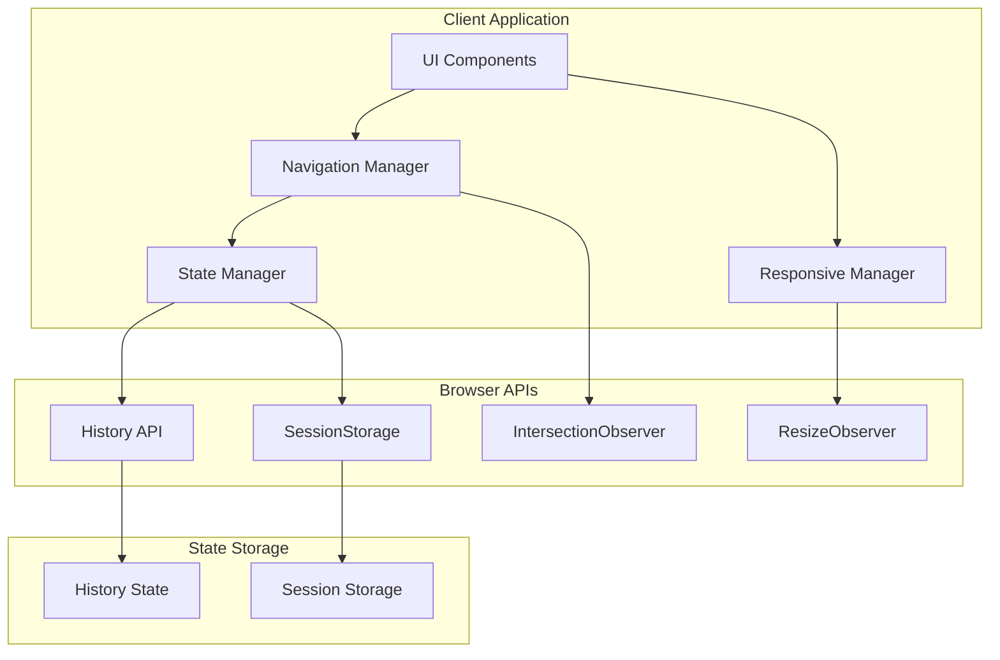
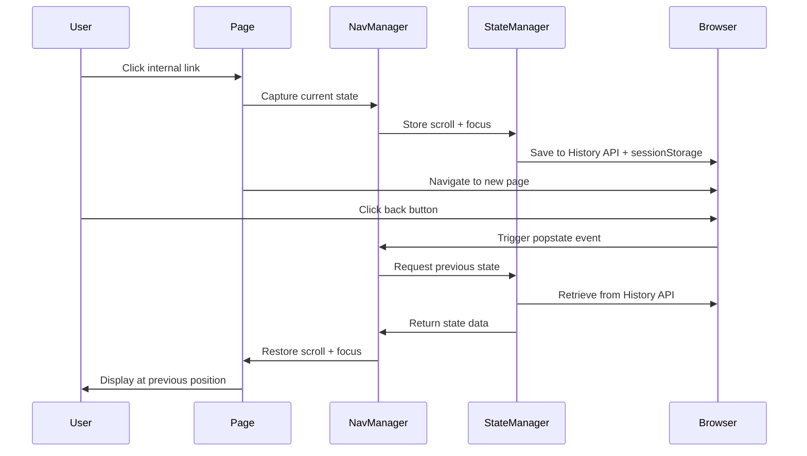

# Design Document: Responsive Design & Intelligent Navigation

## Overview

This design document specifies the technical architecture for implementing a comprehensive responsive design system and intelligent navigation with state preservation for a B2B showcase website built with Next.js (App Router), React, TypeScript, and Tailwind CSS.

The system consists of two major subsystems:

1. **Responsive Design System**: A mobile-first, breakpoint-based layout system that adapts all UI components, typography, and images across device sizes while maintaining accessibility standards.

2. **Intelligent Navigation Manager**: A client-side state management system that captures and restores scroll position, section context, and focus state during browser navigation, providing an app-like experience without unexpected jumps.

### Key Design Principles

- **Progressive Enhancement**: Core functionality works without JavaScript; enhancements layer on top
- **Performance First**: Minimize layout shifts, optimize for Core Web Vitals (LCP, CLS, FID)
- **Accessibility by Default**: WCAG 2.1 AA compliance, keyboard navigation, screen reader support
- **Mobile-First**: Design and implement for mobile, then enhance for larger screens
- **Privacy Conscious**: No PII storage, GDPR compliant, session-only persistence

## Architecture

### High-Level System Architecture



### Component Interaction Flow



### Subsystem Breakdown

#### 1. Responsive Design System

**Purpose**: Provide consistent, accessible, and performant layouts across all device sizes.

**Components**:
- Breakpoint Manager: Detects and responds to viewport changes
- Grid System: Provides layout structure with responsive columns and gutters
- Typography System: Scales text appropriately across breakpoints
- Component Adapters: Transforms UI components for different screen sizes
- Image Manager: Serves optimized images based on viewport and pixel density

#### 2. Navigation Manager

**Purpose**: Capture and restore user navigation context including scroll position, section location, and focus state.

**Components**:
- State Capture Service: Records navigation state before transitions
- State Restoration Service: Restores navigation state after transitions
- Priority Resolver: Determines restoration strategy (hash > section > scroll)
- Layout Stabilizer: Handles dynamic content and prevents layout shifts
- Focus Manager: Preserves and restores keyboard focus

#### 3. State Manager

**Purpose**: Persist and retrieve navigation state using browser storage APIs.

**Components**:
- Storage Adapter: Abstracts History API and sessionStorage
- State Serializer: Converts state objects to storable format
- Cache Manager: Implements FIFO eviction for 50-entry limit
- Key Generator: Creates unique state keys from pathname + search params

## Components and Interfaces

### Responsive Design System Components

#### Breakpoint Configuration


**Interface**: BreakpointConfig

```typescript
interface BreakpointConfig {
  mobile: {
    minWidth: 0,
    maxWidth: 639,
    containerMaxWidth: "100%",
    containerPadding: 16,
    columns: 4,
    gap: 16
  },
  tablet: {
    minWidth: 640,
    maxWidth: 767,
    containerMaxWidth: 720,
    containerPadding: 24,
    columns: 8,
    gap: 24
  },
  desktop: {
    minWidth: 768,
    maxWidth: 1023,
    containerMaxWidth: 960,
    containerPadding: 32,
    columns: 12,
    gap: 32
  },
  largeDesktop: {
    minWidth: 1024,
    maxWidth: Infinity,
    containerMaxWidth: 1200,
    containerPadding: 32,
    columns: 12,
    gap: 32
  }
}
```

**Behavior**:
- Breakpoints trigger at specified minWidth thresholds
- Container never extends to viewport edges (always maintains padding)
- Column count and gaps scale with breakpoint
- Tailwind CSS media queries use these exact values

#### Typography Scale

**Interface**: TypographyScale

```typescript
interface TypographyScale {
  mobile: {
    base: 14,
    h1: 32,
    h2: 24,
    h3: 20,
    h4: 18,
    h5: 16,
    h6: 14,
    lineHeight: { body: 1.5, heading: 1.2 },
    letterSpacing: { heading: -0.02 }
  },
  desktop: {
    base: 16,
    h1: 48,
    h2: 36,
    h3: 28,
    h4: 24,
    h5: 20,
    h6: 16,
    lineHeight: { body: 1.5, heading: 1.2 },
    letterSpacing: { heading: -0.03 }
  }
}
```

**Behavior**:
- Font sizes scale smoothly between mobile and desktop using clamp()
- Minimum text size is 14px at default zoom
- Line heights remain constant across breakpoints
- Letter spacing tightens slightly on desktop for better visual hierarchy
- System respects user zoom settings (uses relative units where appropriate)

#### Component Adaptation Rules

**Mobile Menu Component**


**Interface**: MobileMenuState

```typescript
interface MobileMenuState {
  isOpen: boolean;
  focusTrapActive: boolean;
  previousFocusElement: HTMLElement | null;
  animationDuration: 300; // ms
}
```

**Behavior**:
- Displays below 768px breakpoint
- Opens with slide-in animation (transform: translateX)
- Traps focus within menu when open using focus-trap library or custom implementation
- Prevents body scroll when open (overflow: hidden on body)
- Closes on: link click, ESC key, outside click, or close button
- Returns focus to hamburger button on close
- Announces state changes to screen readers via aria-live

**Card Grid Component**

**Adaptation Rules**:
- Mobile (< 640px): 1 column, full width minus padding
- Tablet (640-767px): 2 columns with 24px gap
- Desktop (768-1023px): 3 columns with 32px gap
- Large Desktop (≥1024px): 4 columns with 32px gap

**Hero Section Component**

**Adaptation Rules**:
- Mobile: Vertical stack (image above text), full-width image
- Tablet: Vertical stack with constrained image width
- Desktop: Horizontal layout (50/50 split or 60/40)
- Image aspect ratio: 16:9 maintained across all breakpoints
- Text content: Center-aligned on mobile, left-aligned on desktop

#### Image Optimization Strategy

**Interface**: ImageConfig

```typescript
interface ImageConfig {
  src: string;
  alt: string;
  aspectRatio: "16:9" | "4:3" | "1:1";
  priority: boolean; // true for hero images
  sizes: string; // responsive sizes attribute
  quality: number; // 75-85 for balance
}
```

**Behavior**:
- Use Next.js Image component for automatic optimization
- Serve WebP with JPEG fallback
- Generate srcset for 1x, 2x, 3x pixel densities
- Apply lazy loading (loading="lazy") for non-critical images
- Apply priority loading (fetchpriority="high") for hero images
- Use placeholder backgrounds to prevent CLS
- Sizes attribute: "(max-width: 640px) 100vw, (max-width: 1024px) 50vw, 33vw"

### Navigation Manager Components

#### Navigation State Interface


**Interface**: NavigationState

```typescript
interface NavigationState {
  key: string; // pathname + search params
  scrollY: number;
  scrollX: number;
  timestamp: number;
  sectionId?: string; // optional section identifier
  focusedElementId?: string; // optional focused element
  route: string; // full pathname
  hash?: string; // URL hash if present
}
```

**State Key Generation**:
```
key = pathname + (search ? `?${search}` : '')
Example: "/products?category=electronics"
```

#### State Capture Service

**Interface**: StateCaptureService

```typescript
interface StateCaptureService {
  captureCurrentState(): NavigationState;
  shouldCaptureState(event: NavigationEvent): boolean;
  debounceScroll(callback: Function, delay: 150): Function;
}
```

**Behavior**:
- Captures state on internal link clicks before navigation
- Debounces scroll position capture (max 1 write per 150ms)
- Records current scroll position (window.scrollY, window.scrollX)
- Identifies current section using IntersectionObserver
- Records focused element if it has an ID
- Generates state key from current URL
- Adds timestamp for debugging and potential expiration

**Section Detection Algorithm**:
1. Use IntersectionObserver to track visible sections
2. Section is "current" if >50% visible in viewport
3. Priority: highest section in viewport if multiple visible
4. Store section ID (data-section attribute or element ID)

#### State Restoration Service

**Interface**: StateRestorationService

```typescript
interface StateRestorationService {
  restoreState(state: NavigationState): Promise<void>;
  determinePriority(state: NavigationState, currentHash: string): RestorationType;
  performTwoPassRestoration(state: NavigationState): Promise<void>;
}

enum RestorationType {
  HASH = "hash",
  SECTION = "section",
  SCROLL = "scroll",
  TOP = "top"
}
```

**Priority Resolution Algorithm**:


```
1. IF URL contains hash fragment:
   - Return HASH priority
   - Target: element with matching ID
   
2. ELSE IF state contains sectionId AND section exists:
   - Return SECTION priority
   - Target: element with matching section ID
   
3. ELSE IF state contains scrollY:
   - Return SCROLL priority
   - Target: exact scroll position
   
4. ELSE:
   - Return TOP priority
   - Target: scroll to top (0, 0)
```

**Two-Pass Restoration Algorithm**:

```
Pass 1 (Immediate - 0-50ms):
  1. Determine restoration type (hash/section/scroll/top)
  2. Calculate target position
  3. Apply scroll immediately (instant or smooth based on prefers-reduced-motion)
  4. Start layout stabilization observer

Pass 2 (Correction - after layout stabilization):
  1. Monitor for layout changes using ResizeObserver
  2. If content height changes significantly (>100px):
     - Recalculate target position
     - Adjust scroll to maintain visual context
  3. Timeout after 1000ms if layout doesn't stabilize
  4. Complete restoration and clean up observers
```

**Scroll Offset Calculation**:

```
For hash or section restoration:
  offset = getHeaderHeight() + 16px margin
  targetY = element.offsetTop - offset

For scroll restoration:
  targetY = state.scrollY (no offset needed)
```

**Header Height Detection**:
```
1. Query for sticky/fixed header element
2. Use getBoundingClientRect().height
3. Cache value and update on resize
4. Default to 80px if header not found
```

#### Focus Restoration Manager

**Interface**: FocusManager

```typescript
interface FocusManager {
  captureFocus(): string | null;
  restoreFocus(elementId: string): boolean;
  ensureVisible(element: HTMLElement): void;
}
```

**Behavior**:
- Captures document.activeElement.id before navigation
- Restores focus only if element still exists
- Ensures focused element is visible (scrollIntoView if needed)
- Does not restore focus if user has already interacted with page
- Respects focus-visible for keyboard vs mouse users

### State Manager Components

#### Storage Adapter


**Interface**: StorageAdapter

```typescript
interface StorageAdapter {
  saveToHistory(state: NavigationState): void;
  saveToSession(key: string, state: NavigationState): void;
  getFromHistory(): NavigationState | null;
  getFromSession(key: string): NavigationState | null;
  clearOldEntries(): void;
}
```

**Storage Strategy**:

**History API State** (Primary):
- Used for immediate back/forward navigation
- Stored via history.replaceState() before navigation
- Retrieved via history.state on popstate event
- Advantage: Instant access, no serialization needed
- Limitation: Lost on page refresh

**SessionStorage** (Fallback):
- Used for page refresh scenarios
- Key format: `nav_state_${pathname}${search}`
- Value: JSON serialized NavigationState
- Maximum 50 entries with FIFO eviction
- Cleared when browser tab closes

**FIFO Cache Management**:
```
1. On new entry:
   - Check current entry count
   - If >= 50:
     - Find oldest entry by timestamp
     - Remove oldest entry
   - Add new entry

2. On update (same key):
   - Update existing entry
   - Update timestamp
   - Do not increment count
```

#### State Serialization

**Interface**: StateSerializer

```typescript
interface StateSerializer {
  serialize(state: NavigationState): string;
  deserialize(data: string): NavigationState | null;
  validate(state: unknown): state is NavigationState;
}
```

**Serialization Format**:
```json
{
  "key": "/products?category=electronics",
  "scrollY": 1250,
  "scrollX": 0,
  "timestamp": 1704067200000,
  "sectionId": "featured-products",
  "focusedElementId": "product-card-42",
  "route": "/products",
  "hash": ""
}
```

**Validation Rules**:
- key must be non-empty string
- scrollY and scrollX must be non-negative numbers
- timestamp must be valid Unix timestamp
- Optional fields can be undefined or null
- Reject malformed or tampered data

## Data Models

### NavigationState Model


**Purpose**: Represents the complete navigation context for a page view.

**Fields**:
- `key` (string, required): Unique identifier composed of pathname + search params
- `scrollY` (number, required): Vertical scroll position in pixels
- `scrollX` (number, required): Horizontal scroll position in pixels (usually 0)
- `timestamp` (number, required): Unix timestamp when state was captured
- `sectionId` (string, optional): ID of the section user was viewing
- `focusedElementId` (string, optional): ID of the element that had focus
- `route` (string, required): Full pathname without query params
- `hash` (string, optional): URL hash fragment if present

**Constraints**:
- Maximum size: ~500 bytes when serialized
- Timestamp used for debugging, not expiration (state persists for session)
- No PII or sensitive data stored
- State is session-scoped (cleared on tab close)

### BreakpointState Model

**Purpose**: Represents the current responsive breakpoint and associated layout properties.

**Fields**:
- `current` (string): Current breakpoint name (mobile|tablet|desktop|largeDesktop)
- `width` (number): Current viewport width in pixels
- `height` (number): Current viewport height in pixels
- `containerMaxWidth` (number): Maximum container width for current breakpoint
- `columns` (number): Number of grid columns for current breakpoint
- `gap` (number): Grid gap size in pixels

**Behavior**:
- Updated on window resize (debounced to 100ms)
- Triggers re-render of responsive components
- Accessible via React context or custom hook

### MobileMenuState Model

**Purpose**: Represents the state of the mobile navigation menu.

**Fields**:
- `isOpen` (boolean): Whether menu is currently open
- `focusTrapActive` (boolean): Whether focus trap is engaged
- `previousFocusElement` (HTMLElement | null): Element to return focus to on close
- `animationDuration` (number): Duration of open/close animation in ms

**State Transitions**:
```
CLOSED -> OPENING (user clicks hamburger)
OPENING -> OPEN (animation completes)
OPEN -> CLOSING (user clicks link/close/ESC/outside)
CLOSING -> CLOSED (animation completes)
```

## Correctness Properties


*A property is a characteristic or behavior that should hold true across all valid executions of a system—essentially, a formal statement about what the system should do. Properties serve as the bridge between human-readable specifications and machine-verifiable correctness guarantees.*

### Property Reflection

After analyzing all acceptance criteria, I identified several areas of redundancy:

**Redundancies Eliminated**:
1. Requirements 1.6 and 17.4 both test grid gaps - combined into single property
2. Requirements 5.1 and 18.2 both test menu animation duration - combined
3. Requirements 7.6, 12.3, and 18.5 all test prefers-reduced-motion - combined
4. Requirements 12.2 and 18.4 both test smooth scroll duration - combined
5. Multiple requirements test that state includes specific fields - combined into comprehensive state structure property

**Properties Combined for Comprehensiveness**:
1. Container width and padding (1.3, 1.4, 1.5) - combined into single container constraint property
2. Typography scaling (2.1, 2.2, 2.6) - combined into typography scale property
3. Component adaptation across breakpoints (3.1-3.5) - combined into component responsiveness property
4. Focus restoration for different element types (19.1, 19.2) - combined into general focus restoration property

### Core Correctness Properties

**Property 1: Container Constraints Across Breakpoints**

*For any* viewport width, the container element should have a maximum width appropriate to the current breakpoint, maintain horizontal padding that never allows content to touch viewport edges, and enforce consistent column gaps.

**Validates: Requirements 1.3, 1.4, 1.5, 1.6**

**Property 2: Responsive Layout Transitions**

*For any* viewport width change that crosses a breakpoint threshold, all layout rules (container width, padding, gaps, columns) should update reactively without requiring page reload.

**Validates: Requirements 1.2**

**Property 3: Typography Hierarchy Preservation**

*For any* breakpoint, heading sizes should maintain strict hierarchy (h1 > h2 > h3 > h4 > h5 > h6) and all text should meet minimum size requirements (≥14px) with appropriate line heights (body ≥1.5, headings ≥1.2).

**Validates: Requirements 2.2, 2.3, 2.5**

**Property 4: Font Loading Without Layout Shift**

*For any* page load, font loading should not cause FOIT (Flash of Invisible Text) and should maintain CLS below 0.1 during the font swap period.

**Validates: Requirements 2.7**

**Property 5: Component Responsive Adaptation**

*For any* UI component (navigation, cards, hero, forms, footer), the component should render with layout appropriate to the current breakpoint (mobile: vertical/stacked, tablet: intermediate, desktop: horizontal/grid).

**Validates: Requirements 3.1, 3.2, 3.3, 3.4, 3.5**

**Property 6: Image Optimization and Lazy Loading**

*For any* image element, non-critical images should have lazy loading enabled, hero images should have priority loading, and all images should serve appropriately sized sources based on viewport width and device pixel ratio.

**Validates: Requirements 4.1, 4.2, 4.3**

**Property 7: Image Aspect Ratio Preservation**

*For any* image across all viewport sizes, the aspect ratio should remain constant (16:9 for heroes, 4:3 for products, 1:1 for team photos) and placeholders should prevent layout shift during loading.

**Validates: Requirements 4.4, 4.5**

**Property 8: Mobile Menu Focus Trap**

*For any* state where the mobile menu is open, keyboard focus should be constrained within the menu, tab navigation should cycle through menu items only, and ESC key should close the menu and return focus to the hamburger button.

**Validates: Requirements 5.2, 5.4**

**Property 9: Mobile Menu Interaction Closure**

*For any* user interaction (link click, outside click, ESC key), the mobile menu should close, complete its animation within 300ms, and restore body scroll capability.

**Validates: Requirements 5.1, 5.3, 5.6, 18.2**

**Property 10: Body Scroll Prevention When Menu Open**

*For any* state where the mobile menu is open, the body element should have scroll disabled (overflow: hidden) while the menu itself remains scrollable.

**Validates: Requirements 5.5**

**Property 11: Accessibility Contrast Requirements**

*For any* text element, the contrast ratio between text and background should be at least 4.5:1 for normal text and 3:1 for large text (≥18px or ≥14px bold).

**Validates: Requirements 6.1**

**Property 12: Touch Target Minimum Size**

*For any* interactive element (button, link, input, checkbox), the touch target size should be at least 44x44 pixels to ensure mobile usability.

**Validates: Requirements 6.2**

**Property 13: Keyboard Navigation Completeness**

*For any* interactive element, it should be reachable via keyboard navigation (Tab key), display a visible focus indicator when focused, and support appropriate keyboard actions (Enter, Space, ESC).

**Validates: Requirements 6.3, 6.6**

**Property 14: ARIA Label Presence**

*For any* navigation element or interactive component without visible text, an appropriate ARIA label (aria-label or aria-labelledby) should be present to provide context for screen readers.

**Validates: Requirements 6.4**

**Property 15: State Capture Before Navigation**

*For any* internal link click or programmatic navigation, the system should capture the current scroll state (scrollY, scrollX, timestamp, route, optional section ID, optional focused element ID) before the navigation occurs.

**Validates: Requirements 7.1, 11.1, 11.5**

**Property 16: State Restoration Timing**

*For any* back or forward browser navigation, scroll restoration should initiate within 150ms of the popstate event.

**Validates: Requirements 7.2, 12.1**

**Property 17: Scroll Restoration Accuracy**

*For any* scroll restoration operation, the final scroll position should be within 50 pixels of the stored scrollY value, unless section-based or hash-based restoration takes priority.

**Validates: Requirements 7.3**

**Property 18: Navigation State Structure**

*For any* stored navigation state, it should include required fields (key, scrollY, scrollX, timestamp, route) and optional fields (sectionId, focusedElementId, hash), with all values properly typed and validated.

**Validates: Requirements 7.4, 10.5, 19.4**

**Property 19: Motion Preference Respect**

*For any* scroll restoration or animation, if the user has prefers-reduced-motion enabled, the system should perform instant transitions without animation; otherwise, smooth scroll with 400ms duration should be used.

**Validates: Requirements 7.6, 12.2, 12.3, 18.3, 18.4, 18.5**

**Property 20: Section-Based Restoration Priority**

*For any* navigation state that includes a section ID, if that section still exists on the page, the system should scroll to that section with offset equal to header height plus 16px, taking priority over pixel-perfect scroll restoration.

**Validates: Requirements 8.2, 8.3, 8.6**

**Property 21: Section Restoration Fallback**

*For any* navigation state with a section ID, if that section no longer exists on the page, the system should fall back to the stored scrollY position.

**Validates: Requirements 8.5**

**Property 22: Hash Navigation Priority**

*For any* URL containing a hash fragment, the system should scroll to the element with matching ID, taking priority over any stored scroll state, with offset equal to header height plus 16px.

**Validates: Requirements 9.1, 9.2**

**Property 23: Hash Navigation Fallback**

*For any* URL with a hash fragment, if no element with matching ID exists, the system should fall back to stored scroll state if available, or scroll to top if no state exists.

**Validates: Requirements 9.3**

**Property 24: Two-Pass Restoration Strategy**

*For any* scroll restoration operation, the system should perform an immediate scroll attempt (pass 1), then monitor for layout changes using ResizeObserver, and adjust scroll position if content height changes significantly (pass 2), with a 1000ms timeout.

**Validates: Requirements 9.4, 9.5, 12.6, 15.4**

**Property 25: State Key Generation**

*For any* URL, the state key should be generated by concatenating pathname with search parameters (if present), ensuring that different query parameters create different state entries.

**Validates: Requirements 10.3**

**Property 26: State Key Update Strategy**

*For any* navigation to a URL with an existing state key, the system should update the existing entry with new scroll position and timestamp rather than creating a duplicate entry.

**Validates: Requirements 10.4**

**Property 27: Storage Limit with FIFO Eviction**

*For any* state storage operation, if sessionStorage contains 50 or more entries, the system should remove the entry with the oldest timestamp before adding the new entry.

**Validates: Requirements 10.1, 10.7**

**Property 28: PII Exclusion from Storage**

*For any* data stored in navigation state or form preservation, it should not contain personally identifiable information including name, email, phone, password, credit card numbers, or identification numbers.

**Validates: Requirements 10.6, 14.3**

**Property 29: Dual Storage Strategy**

*For any* navigation state, it should be stored in both History API state (for immediate back/forward) and sessionStorage (for page refresh), with History API taking priority when available.

**Validates: Requirements 10.2, 11.2**

**Property 30: Refresh State Restoration**

*For any* page refresh, the system should attempt to restore scroll position from sessionStorage using the current URL's state key.

**Validates: Requirements 11.3**

**Property 31: Same-Page Navigation Behavior**

*For any* navigation to a hash target on the current page, the system should perform smooth scroll to that section without capturing or restoring state.

**Validates: Requirements 11.6**

**Property 32: Layout Shift Prevention**

*For any* scroll restoration operation, the Cumulative Layout Shift (CLS) metric should remain below 0.1 throughout the restoration process.

**Validates: Requirements 12.4**

**Property 33: Scroll Capture Debouncing**

*For any* scroll event sequence, scroll position should be captured at most once every 150ms to prevent excessive storage writes.

**Validates: Requirements 12.5**

**Property 34: History API Fallback**

*For any* browser that does not support History API state, the system should fall back to using only sessionStorage for state persistence, maintaining all functionality.

**Validates: Requirements 13.3**

**Property 35: Document-Based Scroll Calculation**

*For any* scroll position calculation, the system should use document.scrollingElement.scrollTop rather than viewport height units to ensure consistency across mobile browsers.

**Validates: Requirements 13.4**

**Property 36: Mobile Address Bar Stability**

*For any* mobile browser address bar show/hide transition, the scroll position should remain stable and not jump unexpectedly.

**Validates: Requirements 13.6**

**Property 37: Form Data Expiration**

*For any* stored form data, if the timestamp is older than 30 minutes, the system should discard the data and not attempt restoration.

**Validates: Requirements 14.4**

**Property 38: Form Data Clearance on Submit**

*For any* successful form submission, the system should immediately clear any stored draft data for that specific form.

**Validates: Requirements 14.5**

**Property 39: Graceful Degradation on Storage Failure**

*For any* storage operation failure (sessionStorage full, unavailable, or quota exceeded), the system should continue functioning with scroll restoration disabled, without throwing errors to the user.

**Validates: Requirements 15.2, 15.3, 21.3**

**Property 40: Concurrent Navigation Handling**

*For any* sequence of rapid navigation events, state operations should be queued and processed sequentially to prevent race conditions and data corruption.

**Validates: Requirements 15.5**

**Property 41: Animation Performance Constraints**

*For any* CSS animation or transition, only transform and opacity properties should be animated to maintain 60fps performance.

**Validates: Requirements 18.1, 18.6**

**Property 42: Focus Restoration on Back Navigation**

*For any* back navigation where the previous state includes a focused element ID, if that element still exists on the page, focus should be restored to it and the element should be scrolled into view if necessary.

**Validates: Requirements 19.1, 19.2, 19.5**

**Property 43: Focus Restoration Fallback**

*For any* back navigation where the previously focused element no longer exists, the system should not set focus and should allow natural focus flow (typically to body or first focusable element).

**Validates: Requirements 19.3**

**Property 44: Locale-Based Message Adaptation**

*For any* error message, ARIA label, or placeholder text, the content should be displayed in the current locale language (French for fr locale).

**Validates: Requirements 20.1, 20.2, 20.3, 20.4**

**Property 45: Silent Error Logging**

*For any* state operation error, the error should be logged to the console (in development mode) or error tracking service (in production) without displaying any error message to the user.

**Validates: Requirements 21.2**

## Error Handling


### Error Categories and Handling Strategies

#### 1. Storage Errors

**Scenarios**:
- sessionStorage quota exceeded
- sessionStorage unavailable (private browsing)
- JSON serialization failure
- History API not supported

**Handling Strategy**:
- Catch all storage operations in try-catch blocks
- Log error to console (dev) or monitoring service (prod)
- Disable state preservation for current session
- Continue normal navigation without restoration
- Display no error message to user (graceful degradation)

**Example Flow**:
```
try {
  sessionStorage.setItem(key, JSON.stringify(state))
} catch (error) {
  logError('Storage failed', error)
  disableStatePreservation()
  // Continue without state preservation
}
```

#### 2. Restoration Errors

**Scenarios**:
- Stored state is corrupted or invalid
- Target section/element no longer exists
- Scroll position exceeds page height
- Layout stabilization timeout

**Handling Strategy**:
- Validate state structure before restoration
- Fall back through priority chain: hash → section → scroll → top
- If all restoration attempts fail, scroll to top
- Log failure for debugging
- Never throw error to user

**Fallback Chain**:
```
1. Try hash target (if present)
2. Try section target (if present and exists)
3. Try scroll position (if valid)
4. Default to scroll top (0, 0)
```

#### 3. Focus Restoration Errors

**Scenarios**:
- Focused element no longer exists
- Element is not focusable
- Element is hidden or disabled

**Handling Strategy**:
- Check element existence before focus attempt
- Verify element is focusable (not disabled, not hidden)
- If restoration fails, allow natural focus flow
- Do not force focus on inappropriate elements

#### 4. Animation Errors

**Scenarios**:
- Smooth scroll not supported
- Animation interrupted by user
- Performance degradation

**Handling Strategy**:
- Feature detect smooth scroll support
- Fall back to instant scroll if unsupported
- Respect prefers-reduced-motion
- Allow user interaction to interrupt animations

#### 5. Network and Loading Errors

**Scenarios**:
- Images fail to load
- Dynamic content fails to load
- Navigation interrupted

**Handling Strategy**:
- Use image placeholders to prevent CLS
- Set timeout for layout stabilization (1000ms)
- Complete restoration with best available position
- Don't wait indefinitely for content

### Error Logging Strategy

**Development Mode**:
```typescript
interface DebugLog {
  timestamp: number;
  action: 'capture' | 'restore' | 'error';
  stateKey: string;
  scrollY: number;
  details: string;
}
```

**Production Mode**:
- Log only errors to monitoring service
- Include error type, message, and context
- Do not log PII or sensitive data
- Track error frequency for monitoring

## Testing Strategy

### Unit Testing Approach

**Responsive Design System Tests**:
- Test breakpoint detection logic
- Test container width calculations at each breakpoint
- Test typography scale calculations
- Test component adaptation rules
- Test image optimization logic
- Test mobile menu state transitions

**Navigation Manager Tests**:
- Test state capture on navigation
- Test state key generation
- Test priority resolution algorithm
- Test two-pass restoration logic
- Test focus capture and restoration
- Test storage adapter with mocked APIs

**State Manager Tests**:
- Test serialization and deserialization
- Test FIFO eviction algorithm
- Test state validation
- Test storage fallback mechanisms
- Test concurrent operation queuing

### Property-Based Testing Approach

**Configuration**:
- Use fast-check library for TypeScript/JavaScript
- Minimum 100 iterations per property test
- Each test references its design property number
- Tag format: `Feature: responsive-intelligent-navigation, Property N: [property text]`

**Example Property Test Structure**:
```typescript
// Feature: responsive-intelligent-navigation, Property 27: Storage Limit with FIFO Eviction
test('FIFO eviction removes oldest entries when limit exceeded', () => {
  fc.assert(
    fc.property(
      fc.array(fc.record({
        key: fc.string(),
        scrollY: fc.nat(),
        timestamp: fc.integer()
      }), { minLength: 51, maxLength: 100 }),
      (states) => {
        // Test that adding 51+ states keeps only newest 50
        // Verify oldest by timestamp is removed
      }
    ),
    { numRuns: 100 }
  )
})
```

**Key Properties to Test**:
- Container constraints hold across all viewport widths
- Typography hierarchy maintained at all breakpoints
- State restoration accuracy within tolerance
- FIFO eviction maintains correct order
- Priority resolution follows correct precedence
- Two-pass restoration adjusts for layout changes
- Debouncing limits write frequency
- PII never appears in stored data

### End-to-End Testing Approach

**Test Scenarios**:

1. **Basic Navigation Flow**:
   - Navigate from Home to Products
   - Scroll to position 1000px
   - Click back button
   - Verify scroll position restored within 50px

2. **Section-Based Restoration**:
   - Navigate from Home to Quality page via "See certifications" CTA
   - Click back button
   - Verify return to certifications section on Home

3. **Hash Navigation Priority**:
   - Navigate to /about#team
   - Verify scroll to team section
   - Navigate away and back
   - Verify hash takes priority over stored scroll

4. **Mobile Menu Interaction**:
   - Open mobile menu on mobile viewport
   - Verify focus trap active
   - Press ESC key
   - Verify menu closes and focus returns to hamburger

5. **Responsive Breakpoint Transitions**:
   - Load page at desktop width
   - Resize to mobile width
   - Verify mobile menu appears
   - Verify layout adapts correctly

6. **Form State Preservation** (if implemented):
   - Fill out contact form
   - Navigate away
   - Navigate back
   - Verify non-PII fields restored

**Cross-Browser Testing Matrix**:
- iOS Safari 14+ (iPhone 12, 13, 14)
- Chrome Mobile 90+ (Android)
- Desktop Chrome (latest)
- Desktop Firefox (latest)
- Desktop Safari (latest)

**Accessibility Testing**:
- Keyboard navigation through all interactive elements
- Screen reader announcement verification (NVDA, JAWS, VoiceOver)
- Focus indicator visibility
- ARIA label presence and correctness
- Color contrast verification (automated + manual)
- Touch target size verification on mobile devices

### Performance Testing

**Core Web Vitals Targets**:
- LCP (Largest Contentful Paint): < 2.5s
- FID (First Input Delay): < 100ms
- CLS (Cumulative Layout Shift): < 0.1

**Specific Measurements**:
- Scroll restoration initiation time: < 150ms
- Scroll restoration completion time: < 600ms (with smooth scroll)
- Mobile menu animation duration: 300ms
- Layout stabilization timeout: 1000ms
- Debounce interval: 150ms

**Performance Monitoring**:
- Use Performance Observer API to measure
- Log metrics in development mode
- Send metrics to monitoring service in production
- Alert on regression beyond thresholds

### Test Coverage Goals

**Unit Tests**:
- 80%+ code coverage for core logic
- 100% coverage for error handling paths
- All edge cases explicitly tested

**Property Tests**:
- All 45 correctness properties implemented
- Minimum 100 iterations per property
- Edge case generators for boundary conditions

**E2E Tests**:
- All major user flows covered
- All device/browser combinations tested
- Accessibility requirements verified

**Visual Regression Tests**:
- Screenshot comparison at each breakpoint
- Component adaptation verification
- Layout consistency across browsers
