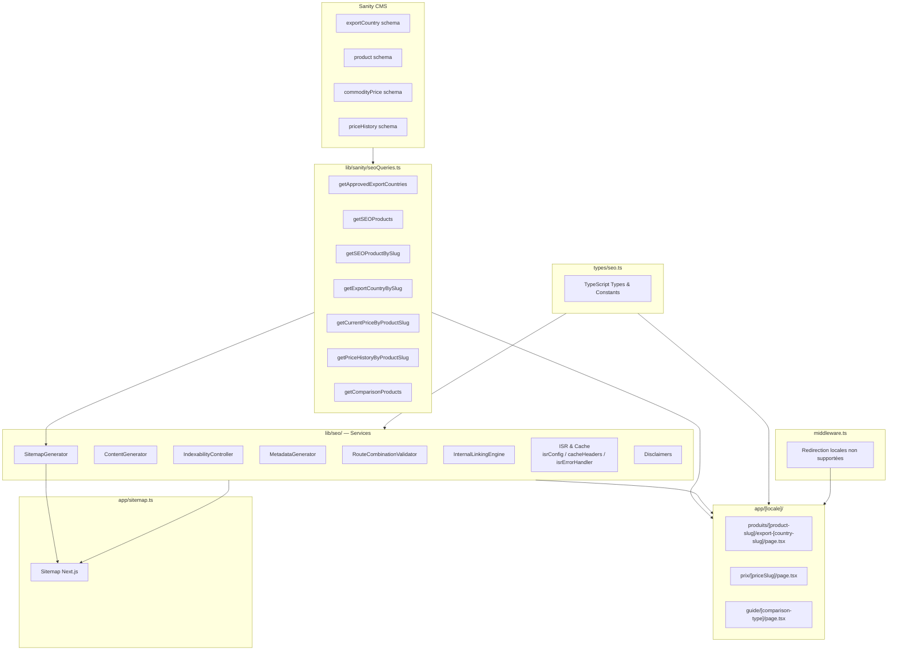
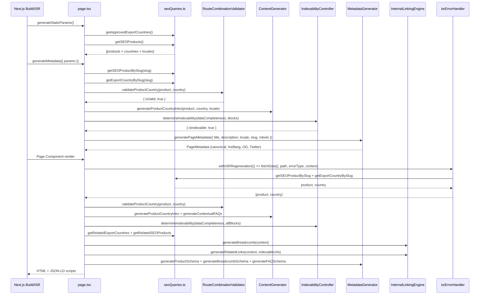
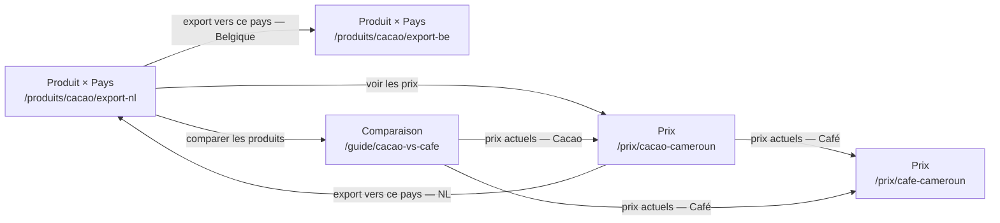
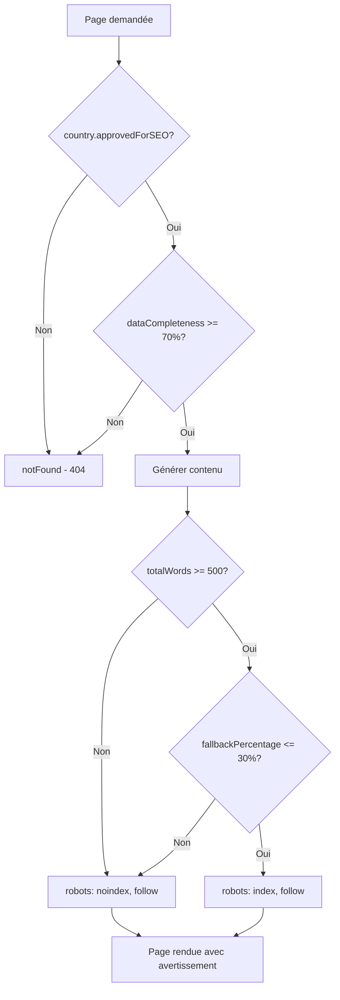

# Architecture — SEO Programmatique Afrexia (V1)

## Introduction

Ce document décrit l'architecture du système de SEO programmatique V1 d'Afrexia.
L'objectif est de générer automatiquement des pages statiques optimisées pour le référencement
à partir des données Sanity CMS, couvrant trois types de routes :

- **Produit × Pays d'export** — `/[locale]/produits/[product-slug]/export-[country-slug]`
- **Prix en temps réel** — `/[locale]/prix/[product-slug]-cameroun`
- **Comparaisons / Guides** — `/[locale]/guide/[product-a]-vs-[product-b]`

Le système supporte 5 locales : `fr`, `en`, `es`, `de`, `ru`.

---

## Vue d'ensemble

### Diagramme d'Architecture



---

## Composants et Services

### 1. Types TypeScript (`types/seo.ts`)

Fichier central définissant tous les types et constantes du système.

**Types principaux :**

| Type | Description |
|------|-------------|
| `Locale` | `'fr' \| 'en' \| 'es' \| 'de' \| 'ru'` |
| `LocalizedString` | Objet avec traductions pour toutes les locales |
| `ExportCountry` | Entité pays d'export (Sanity) |
| `Product` | Entité produit (Sanity) |
| `ContentBlock` | Bloc de contenu avec tracking de source |
| `PageMetadata` | Métadonnées SEO complètes |
| `IndexabilityDecision` | Résultat de décision d'indexabilité |
| `SitemapEntry` | Entrée de sitemap |
| `InternalLink` | Lien interne avec texte d'ancre |
| `BreadcrumbItem` | Élément de fil d'Ariane |

**Constantes importantes :**

```typescript
DEFAULT_QUALITY_THRESHOLD = {
  minDataCompleteness: 70,   // % minimum de complétude des données
  minContentLength: 500,     // mots minimum par page
  maxFallbackPercentage: 30, // % maximum de contenu template
}

SUPPORTED_LOCALES = ['fr', 'en', 'es', 'de', 'ru']
DEFAULT_LOCALE = 'fr'

ISR_REVALIDATION = {
  PRICE_PAGES: 86400,          // 24h
  PRODUCT_COUNTRY_PAGES: 604800, // 7 jours
  COMPARISON_PAGES: 604800,    // 7 jours
  ...
}
```

---

### 2. RouteCombinationValidator (`lib/seo/routeCombinationValidator.ts`)

**Responsabilité :** Valider les combinaisons produit × pays avant génération de page.

**Règles de validation :**
- `country.approvedForSEO === true`
- `country.dataCompleteness >= 70`

**Fonctions exportées :**

| Fonction | Description |
|----------|-------------|
| `validateProductCountry(product, country)` | Retourne `RouteValidationResult` |
| `logRejectedCombination(productSlug, countrySlug, reason)` | Log JSON structuré |
| `generateValidationReport(combinations[])` | Rapport de validation en masse |

**Exemple de résultat :**
```typescript
// Valide
{ isValid: true, dataCompleteness: 85, approvedForSEO: true }

// Invalide
{ isValid: false, reason: 'Country not approved for SEO', dataCompleteness: 45 }
```

---

### 3. ContentGenerator (`lib/seo/contentGenerator.ts`)

**Responsabilité :** Générer du contenu unique et multilingue pour les pages SEO programmatiques.

**Fonctions principales :**

| Fonction | Description |
|----------|-------------|
| `generateProductCountryIntro(product, country, locale)` | Intro produit×pays (5 variations de templates) |
| `generateContextualFAQs(product, country, locale)` | 3–5 FAQs contextuelles |
| `generateComparisonContent(productA, productB, locale)` | Contenu complet de comparaison |
| `applyLanguageFallback(localizedString, locale)` | Fallback EN → FR si locale manquante |
| `markContentSource(content, sourceType, locale)` | Crée un `ContentBlock` avec tracking |
| `calculateContentLength(blocks[])` | Compte total de mots |
| `meetsMinimumLength(blocks[], minWords)` | Vérifie seuil 500 mots |
| `calculateFallbackPercentage(blocks[])` | % de blocs template |
| `logContentDistribution(blocks[], pageId)` | Log audit de distribution |
| `generateDisclaimer(type, locale)` | Disclaimer localisé (prix/délai/logistique) |

**Types de sources de contenu (`ContentSourceType`) :**
- `'sanity'` — données directement issues du CMS
- `'calculated'` — données calculées (tendances, statistiques)
- `'template'` — contenu généré par template
- `'editorial'` — contenu éditorial manuel

**Variations de templates :** 5 templates d'introduction par locale (fr, en, es, de, ru).
La sélection est déterministe basée sur un hash `product.slug + country.slug`.

---

### 4. IndexabilityController (`lib/seo/indexabilityController.ts`)

**Responsabilité :** Décider si une page doit être indexée par les moteurs de recherche.

**Seuils de qualité (constants) :**
```typescript
QUALITY_THRESHOLD = {
  minDataCompleteness: 70,   // %
  minContentLength: 500,     // mots
  maxFallbackPercentage: 30, // %
}
```

**Fonctions exportées :**

| Fonction | Description |
|----------|-------------|
| `determineIndexability(dataCompleteness, contentBlocks, threshold?)` | Retourne `IndexabilityDecision` |
| `generateRobotsMetaTag(decision)` | `'index, follow'` ou `'noindex, follow'` |
| `generateIndexabilityReport(decisions: Map)` | Rapport agrégé pour audit |

**Logique de décision :**
1. `dataCompleteness >= 70%` → sinon noindex
2. `totalWords >= 500` → sinon noindex
3. `fallbackPercentage <= 30%` → sinon noindex

Les pages noindex conservent `follow` pour permettre la circulation du PageRank.

---

### 5. MetadataGenerator (`lib/seo/metadataGenerator.ts`)

**Responsabilité :** Générer les métadonnées SEO et les données structurées schema.org.

**Fonctions exportées :**

| Fonction | Description |
|----------|-------------|
| `generatePageMetadata(params)` | Titre, description, canonical, hreflang, OG, Twitter, robots |
| `generateProductSchema(params)` | Schema.org `Product` avec `Offer` imbriqué |
| `generateBreadcrumbSchema(items[])` | Schema.org `BreadcrumbList` |
| `generateFAQSchema(faqs[])` | Schema.org `FAQPage` |
| `optimizeTitle(title, min?, max?)` | Optimise à 50–60 caractères |
| `optimizeDescription(desc, min?, max?)` | Optimise à 150–160 caractères |

**Hreflang :** Généré pour les 5 locales + `x-default` pointant vers `/fr/`.

**Exemple de sortie `generatePageMetadata` :**
```typescript
{
  title: "Exporter Cacao vers Pays-Bas | Afrexia",
  description: "Découvrez comment exporter du cacao camerounais...",
  canonical: "https://afrexia.com/fr/produits/cacao/export-netherlands",
  hreflang: {
    fr: "https://afrexia.com/fr/...",
    en: "https://afrexia.com/en/...",
    "x-default": "https://afrexia.com/fr/..."
  },
  robots: "index, follow"
}
```

---

### 6. SitemapGenerator (`lib/seo/sitemapGenerator.ts`)

**Responsabilité :** Générer les entrées de sitemap XML pour toutes les pages SEO programmatiques V1.

**Fonctions exportées :**

| Fonction | Description |
|----------|-------------|
| `generateProductCountryEntries()` | Entrées pour toutes les combinaisons produit×pays approuvées |
| `generatePriceEntries()` | Entrées pour toutes les pages prix |
| `generateComparisonEntries()` | Entrées pour toutes les paires de comparaison |
| `generateSitemap()` | Agrège les 3 sections en `SitemapSection[]` |
| `entriesToXML(sections[])` | Sérialise en XML valide (sitemaps.org) |

**Priorités et fréquences :**

| Type de page | Priorité | Fréquence |
|-------------|----------|-----------|
| Produit × Pays | 0.8 | weekly |
| Prix | 0.7 | daily |
| Comparaison | 0.7 | weekly |

**Intégration dans `app/sitemap.ts` :** Le sitemap Next.js appelle `generateSitemap()` et fusionne les entrées programmatiques avec les pages statiques et les contenus blog/produits.

---

### 7. InternalLinkingEngine (`lib/seo/internalLinkingEngine.ts`)

**Responsabilité :** Générer les liens internes et le fil d'Ariane pour chaque page.

**Fonctions exportées :**

| Fonction | Description |
|----------|-------------|
| `generateBreadcrumb(context)` | Fil d'Ariane selon le type de page |
| `generateRelatedLinks(context, indexableUrls?)` | 4–6 liens internes pertinents |
| `varyAnchorText(pool[], seed)` | Sélection déterministe d'un texte d'ancre varié |

**Stratégie de liens par type de page :**

- **product-country** : page prix du même produit + autres pays + comparaisons
- **price** : pages produit×pays + pages prix d'autres produits + comparaisons
- **comparison** : pages prix des deux produits + autres comparaisons

**Variation des textes d'ancre :** 5 variantes par locale et par type de lien (produit, prix, pays, comparaison) pour éviter la sur-optimisation. La sélection est déterministe via hash de l'URL.

**Structure du fil d'Ariane :**
- `product-country` : Accueil > Produits > [Produit] > Export [Pays]
- `price` : Accueil > Prix > [Produit]
- `comparison` : Accueil > Guides > [ProduitA] vs [ProduitB]

---

### 8. ISR & Cache (`lib/seo/isrConfig.ts`, `lib/seo/cacheHeaders.ts`, `lib/seo/isrErrorHandler.ts`)

#### isrConfig.ts

Définit les constantes de revalidation ISR et les utilitaires de détection de type de page.

```typescript
ISR_REVALIDATION = {
  PRICE_PAGES: 86400,           // 24h
  PRODUCT_COUNTRY_PAGES: 604800, // 7 jours
  COMPARISON_PAGES: 604800,     // 7 jours
  CERTIFICATION_PAGES: 604800,  // 7 jours
  PORT_PAGES: 604800,           // 7 jours
  SEASON_PAGES: 31536000,       // 1 an
  INCOTERM_PAGES: 604800,       // 7 jours
  CONTAINER_PAGES: 604800,      // 7 jours
}
```

Fonctions : `getRevalidationTime(pageType)`, `getPageTypeFromPath(path)`, `getRevalidationFromPath(path)`.

#### cacheHeaders.ts

Génère les en-têtes HTTP de cache pour la stratégie stale-while-revalidate.

```
Cache-Control: public, s-maxage=86400, stale-while-revalidate=43200
Vary: Accept-Encoding, Accept-Language
ETag: W/"abc123"
```

Fonctions : `generateCacheControl()`, `generateETag()`, `generateCacheHeaders()`, `applyCacheHeaders()`, `hasMatchingETag()`, `createCachedResponse()`.

#### isrErrorHandler.ts

Gère les erreurs lors de la régénération ISR. En cas d'erreur, Next.js sert automatiquement la dernière version en cache.

**Types d'erreurs (`ISRErrorType`) :**
- `DATA_FETCH_ERROR` — échec de récupération Sanity
- `CONTENT_GENERATION_ERROR` — échec de génération de contenu
- `VALIDATION_ERROR` — données insuffisantes
- `UNKNOWN_ERROR` — erreur inconnue

**Fonctions :**

| Fonction | Description |
|----------|-------------|
| `handleISRError(error, options?)` | Log + Sentry (production) |
| `createISRError(err, path, type?, context?)` | Crée un `ISRError` depuis une exception |
| `withISRErrorHandling(fn, path, errorType)` | Wrapper async avec gestion d'erreur |
| `withISRRegeneration(fn, path, errorType?, context?)` | Wrapper complet avec log succès/échec |
| `logISRSuccess(path, duration, context?)` | Log succès (dev uniquement) |

**Contexte de régénération :** Chaque erreur capture `locale`, `pageType`, `productSlug`, `countrySlug`, `revalidateSeconds` pour faciliter le débogage.

---

### 9. Disclaimers (`lib/seo/disclaimers.ts`)

**Responsabilité :** Fournir des avertissements localisés pour les données estimées.

**Types de disclaimers :**

| Type | Exemple (FR) |
|------|-------------|
| `price` | "Prix indicatif, contactez-nous pour un devis précis." |
| `delay` | "Délais indicatifs, variables selon les conditions." |
| `logistics` | "Coûts estimatifs, sujets à variation." |

Disponibles dans les 5 locales. Utilisés dans les pages prix et produit×pays.

---

### 10. Sanity Schemas (`sanity/schemas/exportCountry.ts`)

**Responsabilité :** Définir la structure des données pays d'export dans Sanity CMS.

**Champs principaux :**

| Champ | Type | Description |
|-------|------|-------------|
| `name` | `LocalizedString` | Nom du pays (fr/en requis) |
| `slug` | `slug` | Identifiant URL (généré depuis `name.en`) |
| `code` | `string` | Code ISO 3166-1 alpha-2 (ex: NL) |
| `flag` | `string` | Emoji drapeau |
| `description` | `LocalizedString` | Description multilingue |
| `targetMarkets` | `string[]` | Industries cibles |
| `mainPorts` | `reference[]` | Ports de destination (→ `destinationPort`) |
| `requiredCertifications` | `reference[]` | Certifications requises (→ `certification`) |
| `customsInfo` | `LocalizedString` | Informations douanières |
| `averageTransitTime` | `{ days, note }` | Délai de transit moyen |
| `dataCompleteness` | `number` (0–100) | Score de complétude des données |
| `approvedForSEO` | `boolean` | Validation métier pour génération de pages |

**Critères d'activation SEO :** `approvedForSEO === true` ET `dataCompleteness >= 70`.

---

### 11. Sanity Queries (`lib/sanity/seoQueries.ts`)

**Responsabilité :** Centraliser toutes les requêtes GROQ pour les pages SEO programmatiques.

**Fonctions de requête :**

| Fonction | Usage | Cache |
|----------|-------|-------|
| `getApprovedExportCountries()` | `generateStaticParams` produit×pays | 7 jours |
| `getSEOProducts()` | `generateStaticParams` toutes routes | 7 jours |
| `getSEOProductBySlug(slug)` | Données produit pour une page | 7 jours |
| `getExportCountryBySlug(slug)` | Données pays pour une page | 7 jours |
| `getRelatedExportCountries(excludeSlug)` | Liens internes | 7 jours |
| `getRelatedSEOProducts(excludeSlug)` | Liens internes | 7 jours |
| `getCurrentPriceByProductSlug(slug)` | Prix actuel | 24h |
| `getPriceHistoryByProductSlug(slug, limit)` | Historique 30 jours | 24h |
| `getComparisonProducts(slugA, slugB)` | Données comparaison | 7 jours |
| `getComparisonStaticParams()` | Paires pour `generateStaticParams` | 7 jours |

**Stratégie de cache Sanity :** Toutes les requêtes utilisent `{ next: { revalidate: N } }` aligné sur les constantes ISR.

---

## Routes Programmatiques

### Structure des Routes

```
app/
└── [locale]/
    ├── produits/
    │   └── [product-slug]/
    │       └── export-[country-slug]/
    │           └── page.tsx          ← Route Produit × Pays
    ├── prix/
    │   └── [priceSlug]/
    │       └── page.tsx              ← Route Prix (pattern: [slug]-cameroun)
    └── guide/
        └── [comparison-type]/
            └── page.tsx              ← Route Comparaison (pattern: [a]-vs-[b])
```

**Locales supportées :** `fr`, `en`, `es`, `de`, `ru`

**Exemples d'URLs :**
- `/fr/produits/cacao/export-netherlands`
- `/en/prix/cafe-arabica-cameroun`
- `/de/guide/cacao-vs-cafe-arabica`

### Parsing des slugs de comparaison

Deux patterns supportés dans `parseComparisonSlug()` :

| Pattern | Exemple | Type |
|---------|---------|------|
| `[produit-a]-vs-[produit-b]` | `cacao-vs-cafe-arabica` | `product-vs-product` |
| `[produit]-[origine-a]-vs-[origine-b]` | `cacao-cameroun-vs-ghana` | `origin-vs-origin` |

### Flux de Génération de Page (Route Produit × Pays)



---

## Modèles de Données

### Types Principaux

#### ExportCountry

```typescript
interface ExportCountry {
  _id: string;
  _type: 'exportCountry';
  name: LocalizedString;          // { fr, en, es?, de?, ru? }
  slug: { current: string };
  code: string;                   // ISO 3166-1 alpha-2
  flag?: string;                  // Emoji
  description?: LocalizedString;
  targetMarkets?: string[];
  mainPorts?: DestinationPort[];
  requiredCertifications?: Certification[];
  customsInfo?: LocalizedString;
  averageTransitTime?: { days: number; note?: LocalizedString };
  dataCompleteness: number;       // 0–100
  approvedForSEO: boolean;
}
```

#### Product (SEO)

```typescript
interface Product {
  _id: string;
  _type: 'product';
  name: LocalizedString;
  slug: { current: string };      // slug français
  description?: LocalizedString;
  certifications?: Certification[];
}
```

#### ContentBlock

```typescript
interface ContentBlock {
  content: string;
  sourceType: 'sanity' | 'calculated' | 'template' | 'editorial';
  locale: Locale;
  wordCount: number;
}
```

#### PageMetadata

```typescript
interface PageMetadata {
  title: string;                  // 50–60 chars
  description: string;            // 150–160 chars
  canonical: string;
  hreflang: Record<Locale | 'x-default', string>;
  openGraph: { title, description, url, image? };
  twitter: { card, title, description, image? };
  robots: 'index, follow' | 'noindex, follow';
}
```

#### Prix (Sanity)

```typescript
interface CurrentPriceData {
  product: string;
  price: number;
  unit: string;
  trend: 'up' | 'down' | 'stable';
  change: number;
  source: string;
  lastUpdated: string;
}

interface PriceHistoryPoint {
  price: number;
  unit: string;
  trend: 'up' | 'down' | 'stable';
  change: number;
  source: string;
  recordedAt: string;
}
```

---

## Stratégie ISR

### Principe

Le système utilise l'ISR (Incremental Static Regeneration) de Next.js :
1. Les pages sont générées statiquement au build (`generateStaticParams`)
2. Après expiration du délai de revalidation, la prochaine requête déclenche une régénération en arrière-plan
3. Pendant la régénération, l'ancienne version est servie (stale-while-revalidate)
4. En cas d'erreur de régénération, la dernière version en cache est servie automatiquement

### Délais de Revalidation

| Type de page | Route | Délai | Justification |
|-------------|-------|-------|---------------|
| Prix | `/prix/[slug]-cameroun` | 24h | Données de prix fréquemment mises à jour |
| Produit × Pays | `/produits/[slug]/export-[slug]` | 7 jours | Données stables |
| Comparaison | `/guide/[a]-vs-[b]` | 7 jours | Contenu stable |
| Certifications | `/certifications/...` | 7 jours | Données stables |
| Ports | `/logistique/...` | 7 jours | Données stables |
| Saisons | `/recolte/...` | 1 an | Données annuelles |

### Gestion des Erreurs ISR

```typescript
// Pattern utilisé dans chaque page
const data = await withISRRegeneration(
  () => fetchData(params),
  `/${locale}/produits/${productSlug}/export-${countrySlug}`,
  ISRErrorType.DATA_FETCH_ERROR,
  {
    locale,
    pageType: 'PRODUCT_COUNTRY_PAGES',
    productSlug,
    countrySlug,
    revalidateSeconds: 604800,
  }
);
// Si fetchData() lève une exception :
// 1. L'erreur est loggée avec contexte complet
// 2. En production : envoyée à Sentry
// 3. L'exception est re-levée → Next.js sert le cache
```

### En-têtes de Cache HTTP

```
Cache-Control: public, s-maxage=86400, stale-while-revalidate=43200
Vary: Accept-Encoding, Accept-Language
ETag: W/"abc123def"
```

Le `stale-while-revalidate` est fixé à la moitié du `s-maxage` par défaut.

---

## Maillage Interne

### Stratégie

Chaque page génère 4 à 6 liens internes pertinents via `InternalLinkingEngine.generateRelatedLinks()`.



### Priorité des Liens

Les pages indexables sont prioritaires dans la sélection des liens (triées en premier).
Les pages non-indexables peuvent apparaître si le quota de 4 liens n'est pas atteint.

### Variation des Textes d'Ancre

5 variantes par locale et par type de lien. Sélection déterministe via hash de l'URL pour :
- Cohérence entre les rendus
- Diversité entre les différentes pages

---

## Contrôle Qualité et Indexabilité

### Pipeline de Décision



### Audit de Distribution de Contenu

`logContentDistribution()` est appelé sur chaque page pour tracer la répartition :
```
[ContentGenerator] Content distribution for "cacao/export-netherlands":
sanity=40% (2), calculated=20% (1), template=40% (2), editorial=0% (0)
```

---

## Support Multilingue

### Locales Supportées

| Code | Langue | Statut |
|------|--------|--------|
| `fr` | Français | Requis (locale par défaut) |
| `en` | Anglais | Requis (fallback) |
| `es` | Espagnol | Optionnel |
| `de` | Allemand | Optionnel |
| `ru` | Russe | Optionnel |

### Stratégie de Fallback

`applyLanguageFallback(localizedString, locale)` :
1. Tente la locale demandée
2. Fallback vers `en` si manquant (avec warning console)
3. Fallback vers `fr` si `en` aussi manquant (toujours présent)

### Middleware de Redirection

`middleware.ts` redirige les locales non supportées vers `/fr/` (301 permanent).

```typescript
// Exemple : /zh/produits/... → /fr/produits/... (301)
if (/^[a-z]{2,3}(-[A-Z]{2})?$/.test(potentialLocale) &&
    !SUPPORTED_LOCALES.includes(potentialLocale)) {
  return NextResponse.redirect(newUrl, { status: 301 });
}
```

### Hreflang

Chaque page génère des balises hreflang pour les 5 locales + `x-default` → `/fr/`.
Cela permet aux moteurs de recherche de servir la bonne version linguistique.

---

## Structure des Fichiers

```
lib/
└── seo/
    ├── contentGenerator.ts        # Génération de contenu multilingue
    ├── routeCombinationValidator.ts # Validation produit × pays
    ├── indexabilityController.ts  # Contrôle d'indexabilité
    ├── metadataGenerator.ts       # Métadonnées SEO + schema.org
    ├── sitemapGenerator.ts        # Génération sitemap XML
    ├── internalLinkingEngine.ts   # Maillage interne + breadcrumb
    ├── isrConfig.ts               # Constantes ISR
    ├── cacheHeaders.ts            # En-têtes HTTP de cache
    ├── isrErrorHandler.ts         # Gestion erreurs ISR
    ├── disclaimers.ts             # Avertissements localisés
    ├── templates/                 # Templates de contenu
    │   ├── productCountryTemplates.ts
    │   ├── faqTemplates.ts
    │   └── contentStructureVariations.ts
    ├── __tests__/                 # Tests unitaires co-localisés
    ├── examples/                  # Exemples d'utilisation ISR
    ├── README.md                  # Documentation API
    └── ISR_STRATEGY.md            # Stratégie ISR détaillée

lib/sanity/
└── seoQueries.ts                  # Requêtes GROQ pour pages SEO

types/
└── seo.ts                         # Types TypeScript centraux

sanity/schemas/
└── exportCountry.ts               # Schéma Sanity pays d'export

app/[locale]/
├── produits/[product-slug]/export-[country-slug]/page.tsx
├── prix/[priceSlug]/page.tsx
└── guide/[comparison-type]/page.tsx

app/
├── sitemap.ts                     # Sitemap Next.js (statique + programmatique)
└── robots.ts                      # Fichier robots.txt

middleware.ts                      # Redirection locales non supportées
```

---

## Tests

### Organisation des Tests

```
__tests__/
├── unit/                          # Tests unitaires par service
│   ├── indexabilityController.test.ts
│   ├── internalLinkingEngine.test.ts
│   ├── metadataGenerator.test.ts
│   ├── sitemapGenerator.test.ts
│   ├── contentQualityValidation.test.ts
│   └── routes/
│       ├── productCountryPage.test.ts
│       ├── pricePage.test.ts
│       ├── comparisonPage.test.ts
│       └── notFoundPage.test.ts
├── integration/                   # Tests d'intégration
│   ├── productCountryPage.integration.test.ts
│   ├── pricePage.integration.test.ts
│   ├── comparisonPage.integration.test.ts
│   └── sitemapGeneration.integration.test.ts
└── properties/                    # Tests basés sur les propriétés (fast-check)
    ├── contentGenerator.properties.test.ts
    ├── routeCombinationValidator.properties.test.ts
    ├── indexabilityController.properties.test.ts
    ├── metadataGenerator.properties.test.ts
    ├── sitemapGenerator.properties.test.ts
    ├── internalLinkingEngine.properties.test.ts
    ├── dataFreshness.properties.test.ts
    └── routes.properties.test.ts

lib/seo/__tests__/                 # Tests co-localisés avec les modules
├── isrConfig.test.ts
├── cacheHeaders.test.ts
├── isrErrorHandler.test.ts
├── contentGenerator.test.ts
└── routeCombinationValidator.test.ts
```

---

## Références

- [Requirements V1](.kiro/specs/programmatic-seo-implementation/requirements.md)
- [Design Document](.kiro/specs/programmatic-seo-implementation/design.md)
- [ISR Strategy](lib/seo/ISR_STRATEGY.md)
- [SEO Library README](lib/seo/README.md)
- [Business Combinations](scripts/BUSINESS-COMBINATIONS.md)
- [Next.js ISR Documentation](https://nextjs.org/docs/app/building-your-application/data-fetching/incremental-static-regeneration)
